# Hub4Learners — Mermaid Diagrams
### Use Case · Class · Sequence — Per Table / Functionality

---

## Table of Contents

1. [User — Authentication & Profile](#1-user--authentication--profile)
2. [Category — Course Categorization](#2-category--course-categorization)
3. [Course — Course Management](#3-course--course-management)
4. [CourseSection — Section Management](#4-coursesection--section-management)
5. [CourseMaterial — Material Uploads](#5-coursematerial--material-uploads)
6. [Enrollment — Student Enrollment](#6-enrollment--student-enrollment)
7. [UpgradeRequest — Role Upgrade](#7-upgraderequest--role-upgrade)
8. [ChatRequest — Chat Initiation](#8-chatrequest--chat-initiation)
9. [Message — Chat Messaging](#9-message--chat-messaging)

---

## 1. User — Authentication & Profile

### Use Case Diagram

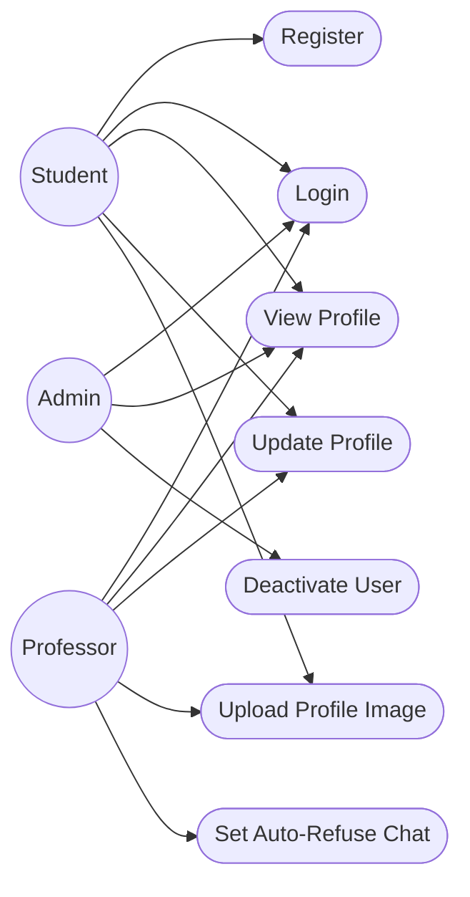
```mermaid
graph LR
    S((Student))
    P((Professor))
    A((Admin))

    UC1([Register])
    UC2([Login])
    UC3([View Profile])
    UC4([Update Profile])
    UC5([Upload Profile Image])
    UC6([Deactivate User])
    UC7([Set Auto-Refuse Chat])

    S --> UC1
    S --> UC2
    S --> UC3
    S --> UC4
    S --> UC5

    P --> UC2
    P --> UC3
    P --> UC4
    P --> UC5
    P --> UC7

    A --> UC2
    A --> UC3
    A --> UC6
```

---

### Class Diagram

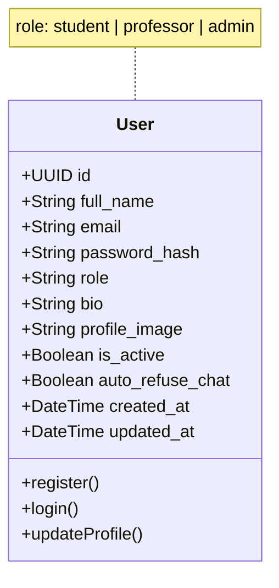
```mermaid
classDiagram
    class User {
        +UUID id
        +String full_name
        +String email
        +String password_hash
        +String role
        +String bio
        +String profile_image
        +Boolean is_active
        +Boolean auto_refuse_chat
        +DateTime created_at
        +DateTime updated_at
        +register()
        +login()
        +updateProfile()
    }
    note for User "role: student | professor | admin"
```

---

### Sequence Diagram — Register

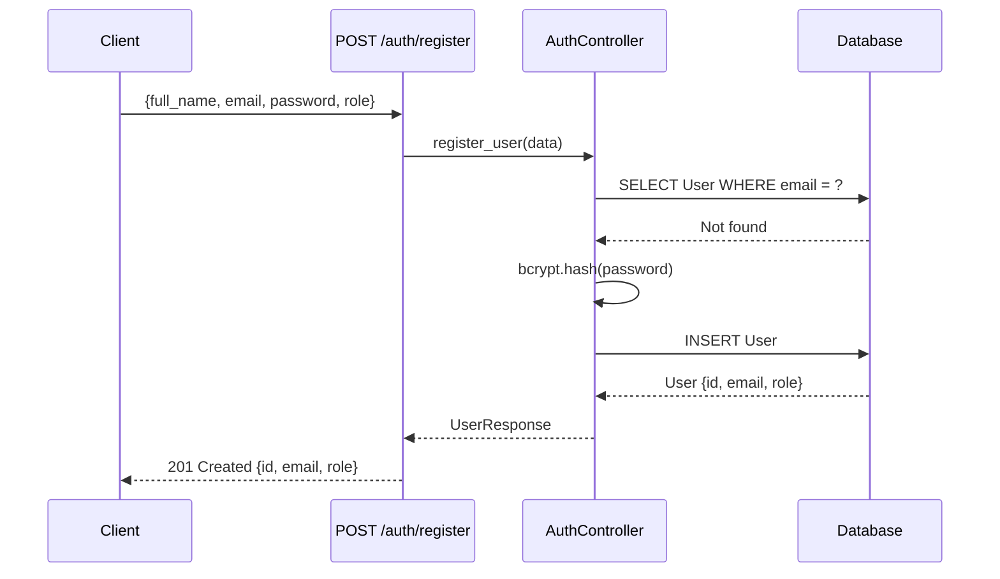
```mermaid
sequenceDiagram
    participant C as Client
    participant API as POST /auth/register
    participant Ctrl as AuthController
    participant DB as Database

    C->>API: {full_name, email, password, role}
    API->>Ctrl: register_user(data)
    Ctrl->>DB: SELECT User WHERE email = ?
    DB-->>Ctrl: Not found
    Ctrl->>Ctrl: bcrypt.hash(password)
    Ctrl->>DB: INSERT User
    DB-->>Ctrl: User {id, email, role}
    Ctrl-->>API: UserResponse
    API-->>C: 201 Created {id, email, role}
```

---

### Sequence Diagram — Login

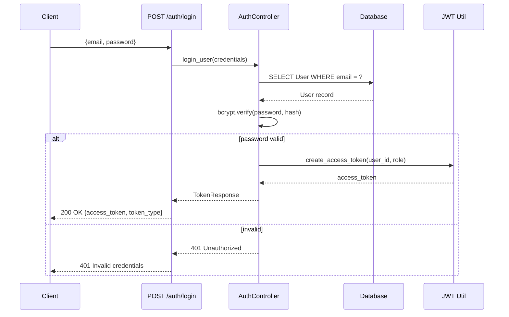
```mermaid
sequenceDiagram
    participant C as Client
    participant API as POST /auth/login
    participant Ctrl as AuthController
    participant DB as Database
    participant JWT as JWT Util

    C->>API: {email, password}
    API->>Ctrl: login_user(credentials)
    Ctrl->>DB: SELECT User WHERE email = ?
    DB-->>Ctrl: User record
    Ctrl->>Ctrl: bcrypt.verify(password, hash)
    alt password valid
        Ctrl->>JWT: create_access_token(user_id, role)
        JWT-->>Ctrl: access_token
        Ctrl-->>API: TokenResponse
        API-->>C: 200 OK {access_token, token_type}
    else invalid
        Ctrl-->>API: 401 Unauthorized
        API-->>C: 401 Invalid credentials
    end
```

---

## 2. Category — Course Categorization

### Use Case Diagram

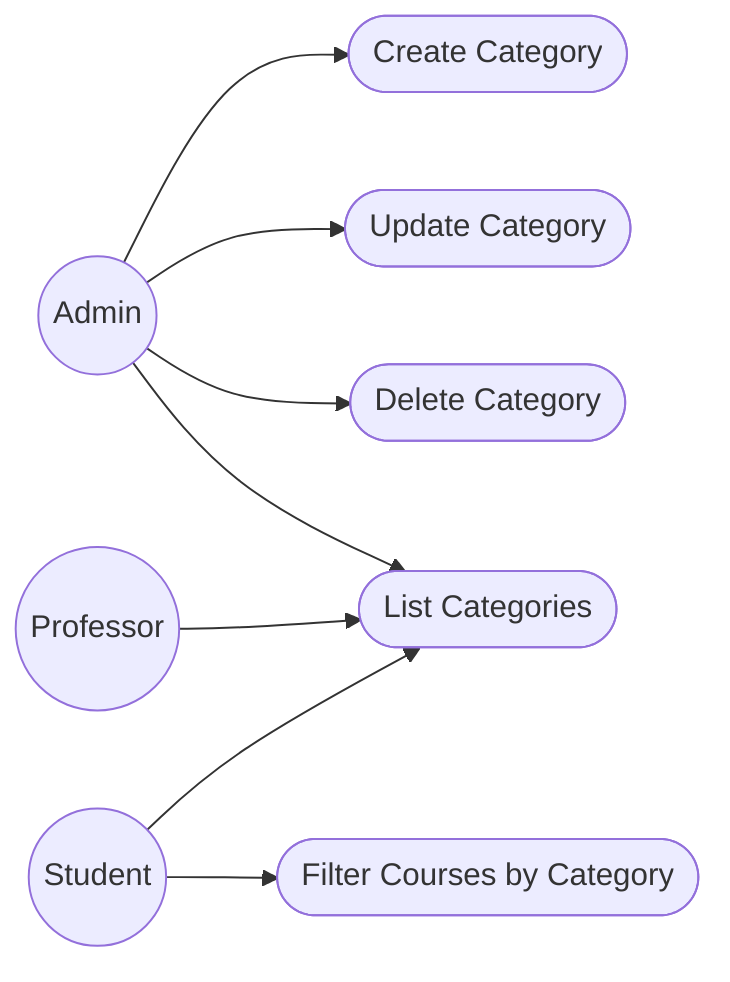
```mermaid
graph LR
    A((Admin))
    P((Professor))
    S((Student))

    UC1([Create Category])
    UC2([Update Category])
    UC3([Delete Category])
    UC4([List Categories])
    UC5([Filter Courses by Category])

    A --> UC1
    A --> UC2
    A --> UC3
    A --> UC4
    P --> UC4
    S --> UC4
    S --> UC5
```

---

### Class Diagram

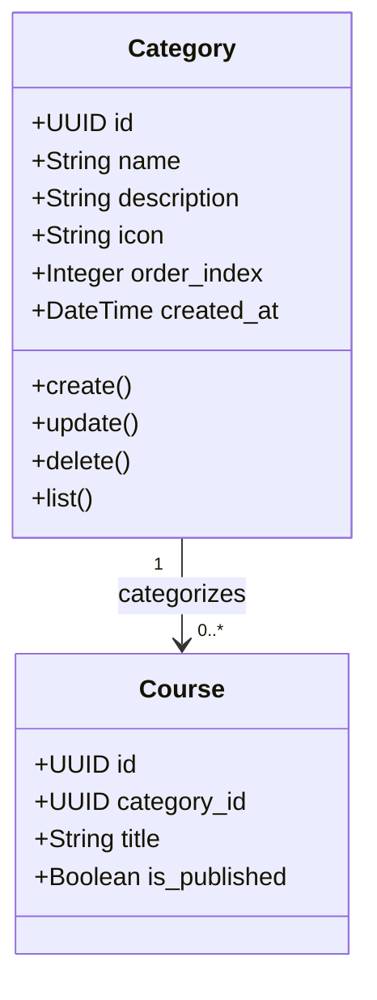
```mermaid
classDiagram
    class Category {
        +UUID id
        +String name
        +String description
        +String icon
        +Integer order_index
        +DateTime created_at
        +create()
        +update()
        +delete()
        +list()
    }
    class Course {
        +UUID id
        +UUID category_id
        +String title
        +Boolean is_published
    }

    Category "1" --> "0..*" Course : categorizes
```

---

### Sequence Diagram — Create Category

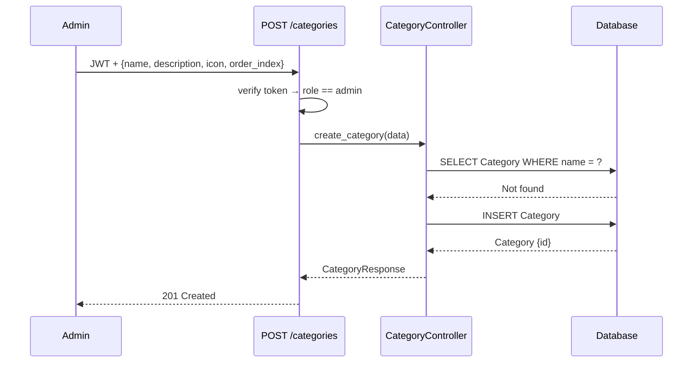
```mermaid
sequenceDiagram
    participant A as Admin
    participant API as POST /categories
    participant Ctrl as CategoryController
    participant DB as Database

    A->>API: JWT + {name, description, icon, order_index}
    API->>API: verify token → role == admin
    API->>Ctrl: create_category(data)
    Ctrl->>DB: SELECT Category WHERE name = ?
    DB-->>Ctrl: Not found
    Ctrl->>DB: INSERT Category
    DB-->>Ctrl: Category {id}
    Ctrl-->>API: CategoryResponse
    API-->>A: 201 Created
```

---

## 3. Course — Course Management

### Use Case Diagram

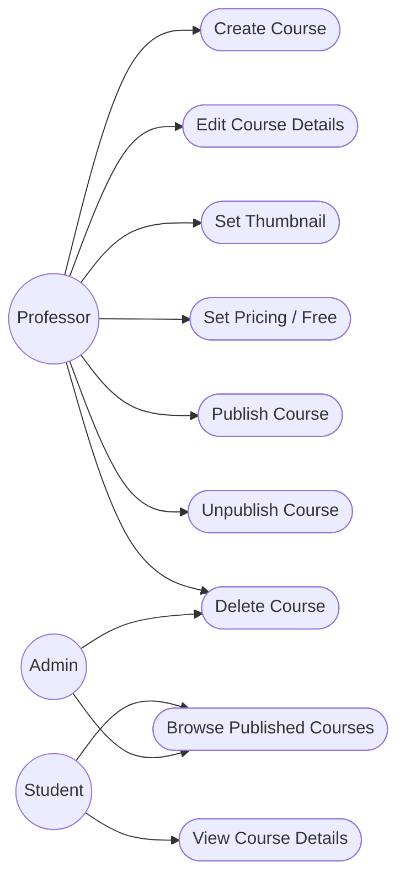
```mermaid
graph LR
    P((Professor))
    S((Student))
    A((Admin))

    UC1([Create Course])
    UC2([Edit Course Details])
    UC3([Set Thumbnail])
    UC4([Set Pricing / Free])
    UC5([Publish Course])
    UC6([Unpublish Course])
    UC7([Browse Published Courses])
    UC8([View Course Details])
    UC9([Delete Course])

    P --> UC1
    P --> UC2
    P --> UC3
    P --> UC4
    P --> UC5
    P --> UC6
    P --> UC9
    S --> UC7
    S --> UC8
    A --> UC7
    A --> UC9
```

---

### Class Diagram

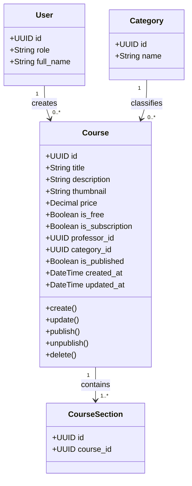
```mermaid
classDiagram
    class Course {
        +UUID id
        +String title
        +String description
        +String thumbnail
        +Decimal price
        +Boolean is_free
        +Boolean is_subscription
        +UUID professor_id
        +UUID category_id
        +Boolean is_published
        +DateTime created_at
        +DateTime updated_at
        +create()
        +update()
        +publish()
        +unpublish()
        +delete()
    }
    class User {
        +UUID id
        +String role
        +String full_name
    }
    class Category {
        +UUID id
        +String name
    }
    class CourseSection {
        +UUID id
        +UUID course_id
    }

    User "1" --> "0..*" Course : creates
    Category "1" --> "0..*" Course : classifies
    Course "1" --> "1..*" CourseSection : contains
```

---

### Sequence Diagram — Create and Publish Course

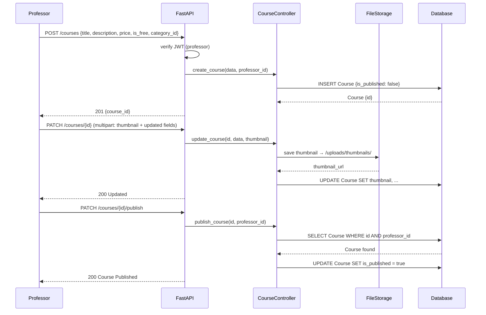
```mermaid
sequenceDiagram
    participant P as Professor
    participant API as FastAPI
    participant Ctrl as CourseController
    participant FS as FileStorage
    participant DB as Database

    P->>API: POST /courses {title, description, price, is_free, category_id}
    API->>API: verify JWT (professor)
    API->>Ctrl: create_course(data, professor_id)
    Ctrl->>DB: INSERT Course {is_published: false}
    DB-->>Ctrl: Course {id}
    API-->>P: 201 {course_id}

    P->>API: PATCH /courses/{id} (multipart: thumbnail + updated fields)
    API->>Ctrl: update_course(id, data, thumbnail)
    Ctrl->>FS: save thumbnail → /uploads/thumbnails/
    FS-->>Ctrl: thumbnail_url
    Ctrl->>DB: UPDATE Course SET thumbnail, ...
    API-->>P: 200 Updated

    P->>API: PATCH /courses/{id}/publish
    API->>Ctrl: publish_course(id, professor_id)
    Ctrl->>DB: SELECT Course WHERE id AND professor_id
    DB-->>Ctrl: Course found
    Ctrl->>DB: UPDATE Course SET is_published = true
    API-->>P: 200 Course Published
```

---

## 4. CourseSection — Section Management

### Use Case Diagram

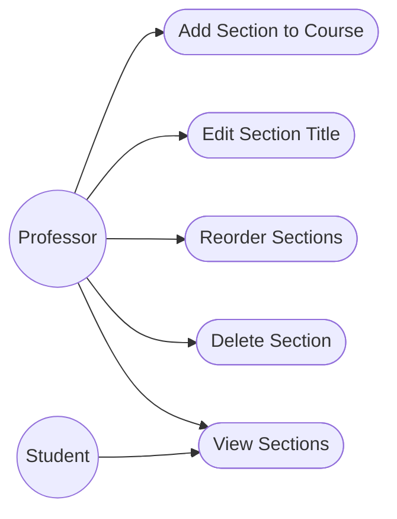
```mermaid
graph LR
    P((Professor))
    S((Student))

    UC1([Add Section to Course])
    UC2([Edit Section Title])
    UC3([Reorder Sections])
    UC4([Delete Section])
    UC5([View Sections])

    P --> UC1
    P --> UC2
    P --> UC3
    P --> UC4
    P --> UC5
    S --> UC5
```

---

### Class Diagram

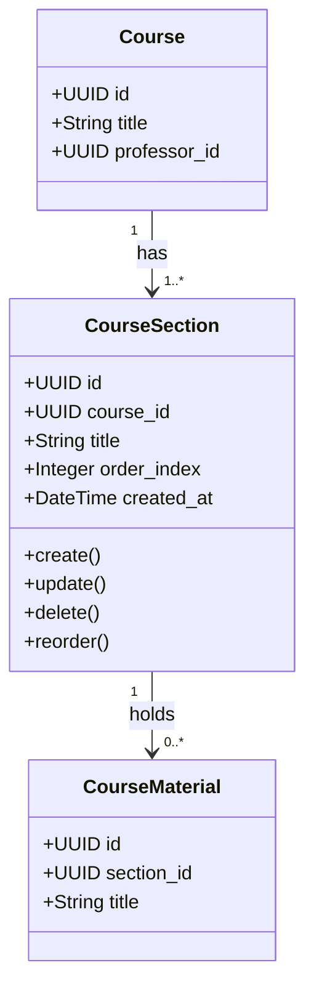
```mermaid
classDiagram
    class CourseSection {
        +UUID id
        +UUID course_id
        +String title
        +Integer order_index
        +DateTime created_at
        +create()
        +update()
        +delete()
        +reorder()
    }
    class Course {
        +UUID id
        +String title
        +UUID professor_id
    }
    class CourseMaterial {
        +UUID id
        +UUID section_id
        +String title
    }

    Course "1" --> "1..*" CourseSection : has
    CourseSection "1" --> "0..*" CourseMaterial : holds
```

---

### Sequence Diagram — Add Section

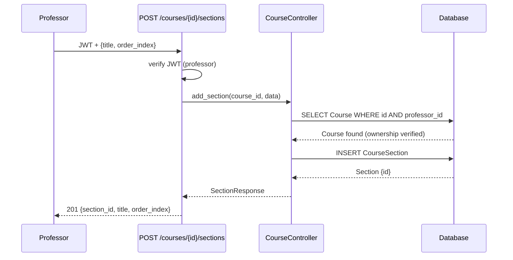
```mermaid
sequenceDiagram
    participant P as Professor
    participant API as POST /courses/{id}/sections
    participant Ctrl as CourseController
    participant DB as Database

    P->>API: JWT + {title, order_index}
    API->>API: verify JWT (professor)
    API->>Ctrl: add_section(course_id, data)
    Ctrl->>DB: SELECT Course WHERE id AND professor_id
    DB-->>Ctrl: Course found (ownership verified)
    Ctrl->>DB: INSERT CourseSection
    DB-->>Ctrl: Section {id}
    Ctrl-->>API: SectionResponse
    API-->>P: 201 {section_id, title, order_index}
```

---

## 5. CourseMaterial — Material Uploads

### Use Case Diagram

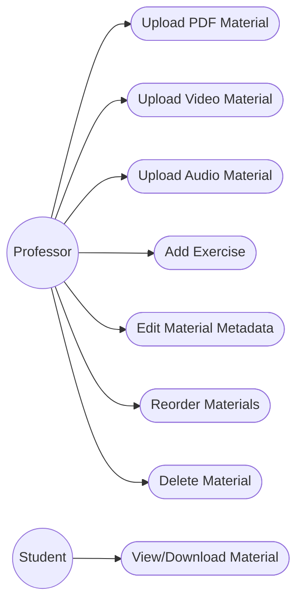
```mermaid
graph LR
    P((Professor))
    S((Student))

    UC1([Upload PDF Material])
    UC2([Upload Video Material])
    UC3([Upload Audio Material])
    UC4([Add Exercise])
    UC5([Edit Material Metadata])
    UC6([Reorder Materials])
    UC7([Delete Material])
    UC8([View/Download Material])

    P --> UC1
    P --> UC2
    P --> UC3
    P --> UC4
    P --> UC5
    P --> UC6
    P --> UC7
    S --> UC8
```

---

### Class Diagram

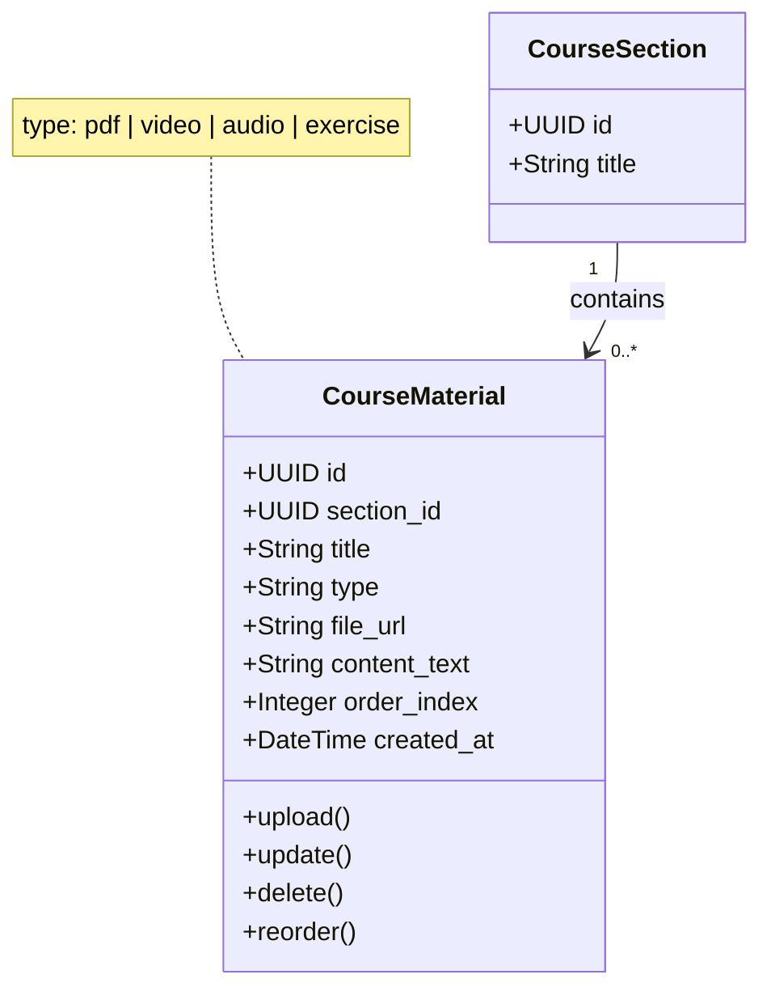
```mermaid
classDiagram
    class CourseMaterial {
        +UUID id
        +UUID section_id
        +String title
        +String type
        +String file_url
        +String content_text
        +Integer order_index
        +DateTime created_at
        +upload()
        +update()
        +delete()
        +reorder()
    }
    class CourseSection {
        +UUID id
        +String title
    }

    CourseSection "1" --> "0..*" CourseMaterial : contains
    note for CourseMaterial "type: pdf | video | audio | exercise"
```

---

### Sequence Diagram — Upload Material

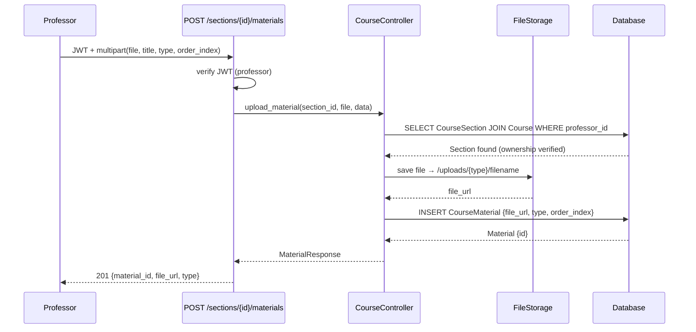
```mermaid
sequenceDiagram
    participant P as Professor
    participant API as POST /sections/{id}/materials
    participant Ctrl as CourseController
    participant FS as FileStorage
    participant DB as Database

    P->>API: JWT + multipart(file, title, type, order_index)
    API->>API: verify JWT (professor)
    API->>Ctrl: upload_material(section_id, file, data)
    Ctrl->>DB: SELECT CourseSection JOIN Course WHERE professor_id
    DB-->>Ctrl: Section found (ownership verified)
    Ctrl->>FS: save file → /uploads/{type}/filename
    FS-->>Ctrl: file_url
    Ctrl->>DB: INSERT CourseMaterial {file_url, type, order_index}
    DB-->>Ctrl: Material {id}
    Ctrl-->>API: MaterialResponse
    API-->>P: 201 {material_id, file_url, type}
```

---

## 6. Enrollment — Student Enrollment

### Use Case Diagram

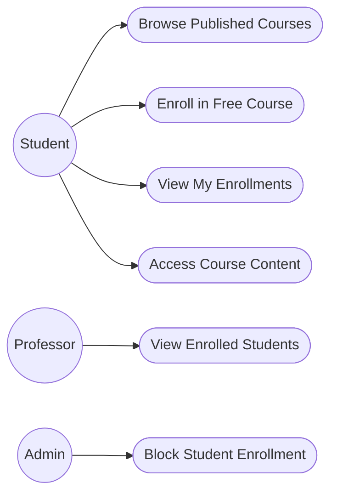
```mermaid
graph LR
    S((Student))
    P((Professor))
    A((Admin))

    UC1([Browse Published Courses])
    UC2([Enroll in Free Course])
    UC3([View My Enrollments])
    UC4([Access Course Content])
    UC5([View Enrolled Students])
    UC6([Block Student Enrollment])

    S --> UC1
    S --> UC2
    S --> UC3
    S --> UC4
    P --> UC5
    A --> UC6
```

---

### Class Diagram

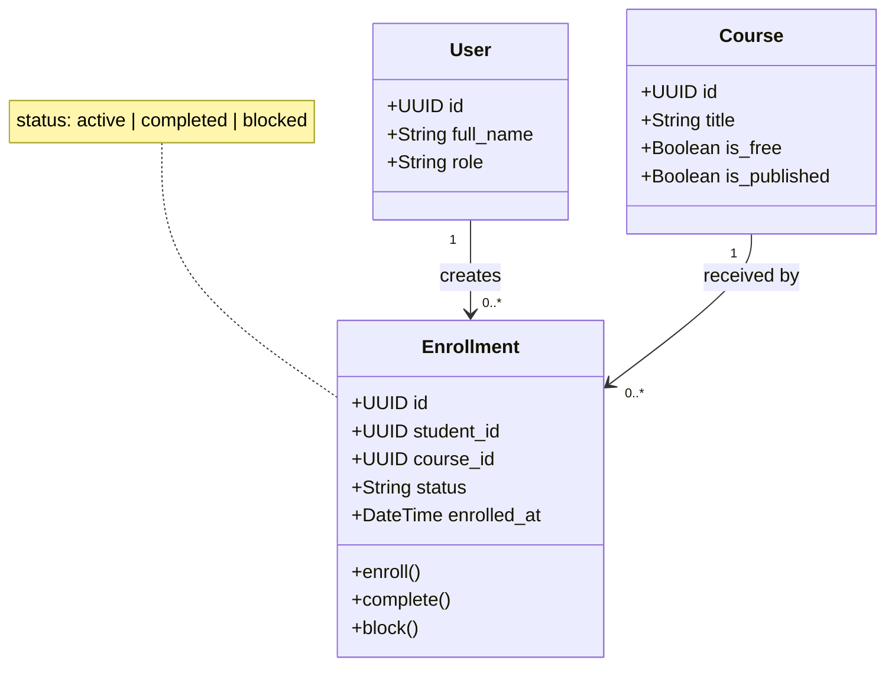
```mermaid
classDiagram
    class Enrollment {
        +UUID id
        +UUID student_id
        +UUID course_id
        +String status
        +DateTime enrolled_at
        +enroll()
        +complete()
        +block()
    }
    class User {
        +UUID id
        +String full_name
        +String role
    }
    class Course {
        +UUID id
        +String title
        +Boolean is_free
        +Boolean is_published
    }

    User "1" --> "0..*" Enrollment : creates
    Course "1" --> "0..*" Enrollment : received by
    note for Enrollment "status: active | completed | blocked"
```

---

### Sequence Diagram — Enroll in Course

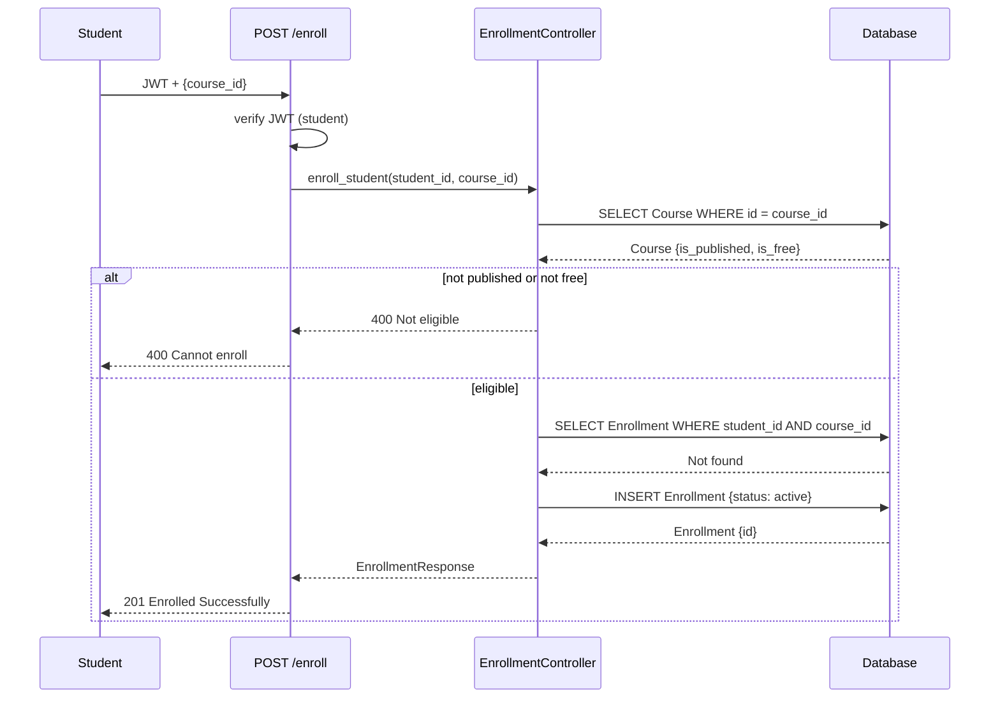
```mermaid
sequenceDiagram
    participant S as Student
    participant API as POST /enroll
    participant Ctrl as EnrollmentController
    participant DB as Database

    S->>API: JWT + {course_id}
    API->>API: verify JWT (student)
    API->>Ctrl: enroll_student(student_id, course_id)
    Ctrl->>DB: SELECT Course WHERE id = course_id
    DB-->>Ctrl: Course {is_published, is_free}
    alt not published or not free
        Ctrl-->>API: 400 Not eligible
        API-->>S: 400 Cannot enroll
    else eligible
        Ctrl->>DB: SELECT Enrollment WHERE student_id AND course_id
        DB-->>Ctrl: Not found
        Ctrl->>DB: INSERT Enrollment {status: active}
        DB-->>Ctrl: Enrollment {id}
        Ctrl-->>API: EnrollmentResponse
        API-->>S: 201 Enrolled Successfully
    end
```

---

## 7. UpgradeRequest — Role Upgrade

### Use Case Diagram

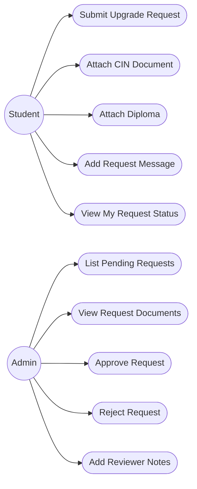
```mermaid
graph LR
    S((Student))
    A((Admin))

    UC1([Submit Upgrade Request])
    UC2([Attach CIN Document])
    UC3([Attach Diploma])
    UC4([Add Request Message])
    UC5([View My Request Status])
    UC6([List Pending Requests])
    UC7([View Request Documents])
    UC8([Approve Request])
    UC9([Reject Request])
    UC10([Add Reviewer Notes])

    S --> UC1
    S --> UC2
    S --> UC3
    S --> UC4
    S --> UC5
    A --> UC6
    A --> UC7
    A --> UC8
    A --> UC9
    A --> UC10
```

---

### Class Diagram

```mermaid
classDiagram
    class UpgradeRequest {
        +UUID id
        +UUID user_id
        +String status
        +String cin_path
        +String diploma_path
        +String message
        +String reviewer_notes
        +DateTime created_at
        +DateTime reviewed_at
        +submit()
        +approve()
        +reject()
    }
    class User {
        +UUID id
        +String role
        +String full_name
    }

    User "1" --> "0..*" UpgradeRequest : submits
    note for UpgradeRequest "status: pending | approved | rejected"
```

---

### Sequence Diagram — Submit & Review Upgrade Request

```mermaid
sequenceDiagram
    participant S as Student
    participant A as Admin
    participant API as FastAPI
    participant Ctrl as UpgradeController
    participant FS as FileStorage
    participant DB as Database

    S->>API: POST /upgrade-requests (multipart: cin, diploma, message)
    API->>API: verify JWT (student)
    API->>Ctrl: create_request(user_id, files, message)
    Ctrl->>DB: SELECT existing pending request for user
    DB-->>Ctrl: None found
    Ctrl->>FS: save CIN → /uploads/documents/
    Ctrl->>FS: save Diploma → /uploads/documents/
    FS-->>Ctrl: cin_path, diploma_path
    Ctrl->>DB: INSERT UpgradeRequest {status: pending}
    DB-->>Ctrl: Request {id}
    API-->>S: 201 Request Submitted

    A->>API: GET /upgrade-requests?status=pending
    API->>API: verify JWT (admin)
    API->>Ctrl: list_requests(status=pending)
    Ctrl->>DB: SELECT UpgradeRequests WHERE status = pending
    DB-->>Ctrl: [request list]
    API-->>A: 200 [requests]

    A->>API: PATCH /upgrade-requests/{id}/review {action: "approve", notes}
    API->>Ctrl: review_request(id, action, notes)
    Ctrl->>DB: UPDATE UpgradeRequest SET status=approved, reviewer_notes, reviewed_at
    Ctrl->>DB: UPDATE User SET role = "professor"
    DB-->>Ctrl: Updated
    API-->>A: 200 Request Reviewed — User promoted to professor
```

---

## 8. ChatRequest — Chat Initiation

### Use Case Diagram

```mermaid
graph LR
    S((Student))
    P((Professor))

    UC1([Send Chat Request to Professor])
    UC2([View My Chat Request Status])
    UC3([Cancel Chat Request])
    UC4([View Incoming Chat Requests])
    UC5([Accept Chat Request])
    UC6([Reject Chat Request])
    UC7([Enable Auto-Refuse All Requests])

    S --> UC1
    S --> UC2
    S --> UC3
    P --> UC4
    P --> UC5
    P --> UC6
    P --> UC7
```

---

### Class Diagram

```mermaid
classDiagram
    class ChatRequest {
        +UUID id
        +UUID student_id
        +UUID professor_id
        +String message
        +String status
        +DateTime created_at
        +DateTime reviewed_at
        +send()
        +accept()
        +reject()
        +autoRefuse()
    }
    class User {
        +UUID id
        +String role
        +Boolean auto_refuse_chat
    }

    User "1 student" --> "0..*" ChatRequest : sends
    User "1 professor" --> "0..*" ChatRequest : receives
    note for ChatRequest "status: pending | accepted | rejected"
```

---

### Sequence Diagram — Send & Respond to Chat Request

```mermaid
sequenceDiagram
    participant S as Student
    participant P as Professor
    participant API as FastAPI
    participant Ctrl as ChatController
    participant DB as Database

    S->>API: POST /chat-requests {professor_id, message}
    API->>API: verify JWT (student)
    API->>Ctrl: create_chat_request(student_id, professor_id, message)
    Ctrl->>DB: SELECT User(professor) WHERE id = professor_id
    DB-->>Ctrl: Professor {auto_refuse_chat}
    alt auto_refuse_chat == true
        Ctrl->>DB: INSERT ChatRequest {status: rejected}
        API-->>S: 201 Request auto-rejected
    else auto_refuse_chat == false
        Ctrl->>DB: INSERT ChatRequest {status: pending}
        API-->>S: 201 Request Sent
    end

    P->>API: GET /chat-requests/incoming
    API->>API: verify JWT (professor)
    API->>Ctrl: get_incoming(professor_id)
    Ctrl->>DB: SELECT ChatRequests WHERE professor_id AND status=pending
    DB-->>Ctrl: [requests]
    API-->>P: 200 [requests]

    P->>API: PATCH /chat-requests/{id}/respond {action: "accept"}
    API->>Ctrl: respond(id, action)
    Ctrl->>DB: UPDATE ChatRequest SET status=accepted, reviewed_at=now
    API-->>P: 200 Accepted
```

---

## 9. Message — Chat Messaging

### Use Case Diagram

```mermaid
graph LR
    S((Student))
    P((Professor))

    UC1([Send Message])
    UC2([View Conversation History])
    UC3([View Message Timestamp])
    UC4([Reply to Message])

    S --> UC1
    S --> UC2
    S --> UC3
    P --> UC4
    P --> UC2
    P --> UC3
```

---

### Class Diagram

```mermaid
classDiagram
    class Message {
        +UUID id
        +UUID chat_request_id
        +UUID sender_id
        +String content
        +DateTime created_at
        +send()
        +list()
    }
    class ChatRequest {
        +UUID id
        +String status
    }
    class User {
        +UUID id
        +String full_name
    }

    ChatRequest "1" --> "0..*" Message : contains
    User "1" --> "0..*" Message : authors
    note for Message "only allowed if ChatRequest.status == accepted"
```

---

### Sequence Diagram — Send and Receive Messages

```mermaid
sequenceDiagram
    participant S as Student
    participant P as Professor
    participant API as FastAPI
    participant Ctrl as ChatController
    participant DB as Database

    S->>API: POST /messages {chat_request_id, content}
    API->>API: verify JWT (student)
    API->>Ctrl: send_message(chat_request_id, sender_id, content)
    Ctrl->>DB: SELECT ChatRequest WHERE id = chat_request_id
    DB-->>Ctrl: ChatRequest {status, student_id, professor_id}
    Ctrl->>Ctrl: verify status == accepted AND sender is participant
    Ctrl->>DB: INSERT Message {chat_request_id, sender_id, content}
    DB-->>Ctrl: Message {id, created_at}
    Ctrl-->>API: MessageResponse
    API-->>S: 201 Message Sent

    P->>API: GET /messages/{chat_request_id}
    API->>API: verify JWT (professor)
    API->>Ctrl: get_messages(chat_request_id, requester_id)
    Ctrl->>DB: SELECT ChatRequest — verify professor is participant
    Ctrl->>DB: SELECT Messages WHERE chat_request_id ORDER BY created_at ASC
    DB-->>Ctrl: [message list]
    Ctrl-->>API: [MessageResponse]
    API-->>P: 200 [messages]

    P->>API: POST /messages {chat_request_id, content}
    API->>Ctrl: send_message(chat_request_id, professor_id, content)
    Ctrl->>DB: INSERT Message
    API-->>P: 201 Message Sent
```

---

*Document generated for PFE project Hub4Learners — April 2026*
