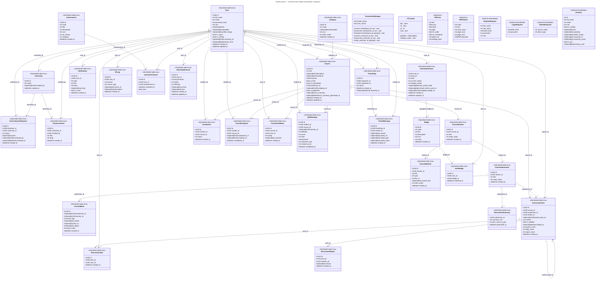
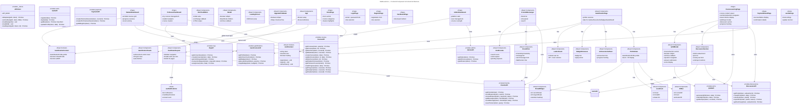

# Hub4Learners — Class Diagram

```mermaid
---
title: Hub4Learners — Backend Data Model (SQLModel / Pydantic)
---
classDiagram

    %% ============================================================
    %%  AUTH & USERS
    %% ============================================================
    class User {
        <<SQLModel table=true>>
        +UUID id
        +str full_name
        +str email
        +str password_hash
        +str role
        +Optional[str] bio
        +Optional[str] speciality
        +Optional[str] profile_image
        +bool is_active
        +bool is_verified
        +Optional[UUID] university_id
        +Optional[datetime] pro_until
        +datetime created_at
        +datetime updated_at
    }

    class University {
        <<SQLModel table=true>>
        +UUID id
        +str name
        +Optional[UUID] created_by
        +datetime created_at
    }

    class UniversityJoinRequest {
        <<SQLModel table=true>>
        +UUID id
        +UUID professor_id
        +UUID university_id
        +str status
        +Optional[str] note
        +Optional[UUID] reviewed_by
        +Optional[datetime] reviewed_at
        +datetime created_at
    }

    class Announcement {
        <<SQLModel table=true>>
        +UUID id
        +UUID university_id
        +UUID created_by
        +str title
        +str body
        +datetime created_at
    }

    %% ============================================================
    %%  CATEGORY & COURSE HIERARCHY
    %% ============================================================
    class Category {
        <<SQLModel table=true>>
        +UUID id
        +str name
        +Optional[str] description
        +str icon
        +int order_index
        +datetime created_at
    }

    class Course {
        <<SQLModel table=true>>
        +UUID id
        +str title
        +Optional[str] description
        +Optional[str] thumbnail
        +Decimal price
        +bool is_free
        +bool is_subscription
        +UUID professor_id
        +Optional[UUID] category_id
        +bool is_published
        +Optional[str] ai_summary
        +Optional[datetime] ai_summary_generated_at
        +datetime created_at
        +datetime updated_at
    }

    class CourseSection {
        <<SQLModel table=true>>
        +UUID id
        +UUID course_id
        +str title
        +int order_index
        +datetime created_at
    }

    class CourseSubsection {
        <<SQLModel table=true>>
        +UUID id
        +UUID section_id
        +str title
        +int order_index
        +datetime created_at
    }

    class LessonBlock {
        <<SQLModel table=true>>
        +UUID id
        +Optional[UUID] subsection_id
        +Optional[UUID] section_id
        +str block_type
        +Optional[str] content
        +Optional[str] file_url
        +Optional[str] caption
        +int order_index
        +datetime created_at
    }

    class CourseMaterial {
        <<SQLModel table=true>>
        +UUID id
        +UUID section_id
        +str title
        +str type
        +str file_url
        +Optional[str] content_text
        +int order_index
        +datetime created_at
    }

    %% ============================================================
    %%  ENROLLMENT & PROGRESS
    %% ============================================================
    class Enrollment {
        <<SQLModel table=true>>
        +UUID id
        +UUID student_id
        +UUID course_id
        +str status
        +datetime enrolled_at
    }

    class CourseProgress {
        <<SQLModel table=true>>
        +UUID id
        +UUID student_id
        +UUID course_id
        +Optional[UUID] subsection_id
        +Optional[UUID] material_id
        +datetime completed_at
    }

    class CourseFeedback {
        <<SQLModel table=true>>
        +UUID id
        +UUID course_id
        +UUID user_id
        +int rating
        +Optional[str] comment
        +datetime created_at
    }

    class QCMAttempt {
        <<SQLModel table=true>>
        +UUID id
        +UUID student_id
        +UUID course_id
        +Optional[UUID] section_id
        +str difficulty
        +int score
        +int total
        +bool passed
        +str questions_json
        +str answers_json
        +datetime completed_at
    }

    %% ============================================================
    %%  DISCUSSION
    %% ============================================================
    class DiscussionPost {
        <<SQLModel table=true>>
        +UUID id
        +UUID course_id
        +UUID subsection_id
        +UUID author_id
        +Optional[UUID] parent_post_id
        +str content
        +bool is_deleted
        +Optional[datetime] edited_at
        +int upvote_count
        +int reply_count
        +int report_count
        +datetime created_at
    }

    class DiscussionVote {
        <<SQLModel table=true>>
        +UUID id
        +UUID post_id
        +UUID user_id
        +datetime created_at
    }

    class DiscussionReport {
        <<SQLModel table=true>>
        +UUID id
        +UUID post_id
        +UUID reporter_id
        +Optional[str] reason
        +datetime created_at
    }

    class DiscussionSummary {
        <<SQLModel table=true>>
        +UUID subsection_id
        +str summary_md
        +int post_count_at_gen
        +datetime generated_at
    }

    %% ============================================================
    %%  FRIENDS / MESSAGING
    %% ============================================================
    class Friendship {
        <<SQLModel table=true>>
        +UUID id
        +UUID requester_id
        +UUID requestee_id
        +str status
        +datetime created_at
        +Optional[datetime] reviewed_at
    }

    class FriendMessage {
        <<SQLModel table=true>>
        +UUID id
        +UUID friendship_id
        +UUID sender_id
        +Optional[str] content
        +Optional[str] media_url
        +Optional[str] media_type
        +Optional[str] media_name
        +datetime created_at
    }

    class Notification {
        <<SQLModel table=true>>
        +UUID id
        +UUID user_id
        +str type
        +str title
        +str body
        +Optional[Any] meta
        +bool is_read
        +datetime created_at
    }

    %% ============================================================
    %%  GAMIFICATION
    %% ============================================================
    class UserGamification {
        <<SQLModel table=true>>
        +UUID user_id
        +int total_xp
        +int level
        +int current_streak
        +int longest_streak
        +Optional[date] last_activity_date
        +Optional[date] streak_freeze_used_on
        +Optional[UUID] equipped_badge_id
        +datetime created_at
        +datetime updated_at
    }

    class XPLog {
        <<SQLModel table=true>>
        +UUID id
        +UUID user_id
        +int amount
        +str source_type
        +Optional[str] source_id
        +Optional[str] description
        +datetime created_at
    }

    class Achievement {
        <<SQLModel table=true>>
        +UUID id
        +str code
        +str title
        +str description
        +str icon
        +int xp_reward
        +str category
        +datetime created_at
    }

    class UserAchievement {
        <<SQLModel table=true>>
        +UUID id
        +UUID user_id
        +UUID achievement_id
        +datetime unlocked_at
        +bool seen
    }

    class Badge {
        <<SQLModel table=true>>
        +UUID id
        +str code
        +str title
        +str description
        +str icon
        +str rarity
        +datetime created_at
    }

    class UserBadge {
        <<SQLModel table=true>>
        +UUID id
        +UUID user_id
        +UUID badge_id
        +datetime unlocked_at
    }

    %% ============================================================
    %%  AI / GENERATION
    %% ============================================================
    class GeneratedCourse {
        <<SQLModel table=true>>
        +UUID id
        +UUID user_id
        +str pdf_filename
        +str status
        +str difficulty
        +Optional[Any] result
        +Optional[str] error
        +datetime created_at
        +datetime updated_at
    }

    %% ============================================================
    %%  UTILITY / INFRASTRUCTURE
    %% ============================================================
    class ConnectionManager {
        +dict friend_rooms
        +dict user_rooms
        +connect_friend(room_id, ws) void
        +disconnect_friend(room_id, ws) void
        +broadcast_friend(room_id, payload) void
        +connect_user(user_id, ws) void
        +disconnect_user(user_id, ws) void
        +notify_user(user_id, payload) void
    }

    class _TTLCache {
        -dict _store
        -int _max
        -int _ttl
        -Lock _lock
        +get(key) Optional[str]
        +set(key, value) void
    }

    class PDFLine {
        <<dataclass>>
        +str text
        +float size
        +bool bold
        +int page
        +bool is_bullet
        +bool is_numbered
        +str bullet_text
        +int heading_level
    }

    class PDFChunk {
        <<dataclass>>
        +int index
        +str text
        +int word_count
        +int page_start
        +int page_end
        +list[PDFLine] lines
    }

    %% ============================================================
    %%  SCHEMA DTOs (Pydantic)
    %% ============================================================
    class RegisterRequest {
        <<Pydantic BaseModel>>
        +str first_name
        +str last_name
        +EmailStr email
        +str password
        +str role
    }

    class LoginRequest {
        <<Pydantic BaseModel>>
        +EmailStr email
        +str password
    }

    class TokenResponse {
        <<Pydantic BaseModel>>
        +str access_token
        +str token_type
    }

    class UserOut {
        <<Pydantic BaseModel>>
        +str id
        +str full_name
        +str email
        +str role
        +bool is_verified
        +Optional[str] bio
        +Optional[str] speciality
        +Optional[str] profile_image
        +Optional[str] university_id
        +Optional[str] university_name
        +bool is_pro
        +Optional[datetime] pro_until
    }

    %% ============================================================
    %%  RELATIONSHIPS
    %% ============================================================

    %% User → University
    User "1" --> "0..1" University : university_id
    User "1" --> "0..*" UniversityJoinRequest : professor_id
    University "1" --> "0..*" UniversityJoinRequest : university_id
    University "1" --> "0..*" Announcement : university_id
    User "1" --> "0..*" Announcement : created_by

    %% User → Course
    User "1" --> "0..*" Course : professor_id
    Category "1" --> "0..*" Course : category_id

    %% Course hierarchy
    Course "1" --> "0..*" CourseSection : course_id
    CourseSection "1" --> "0..*" CourseSubsection : section_id
    CourseSubsection "1" --> "0..*" LessonBlock : subsection_id
    CourseSection "1" --> "0..*" CourseMaterial : section_id

    %% Enrollment & Progress
    User "1" --> "0..*" Enrollment : student_id
    Course "1" --> "0..*" Enrollment : course_id
    User "1" --> "0..*" CourseProgress : student_id
    Course "1" --> "0..*" CourseProgress : course_id
    User "1" --> "0..*" CourseFeedback : user_id
    Course "1" --> "0..*" CourseFeedback : course_id
    User "1" --> "0..*" QCMAttempt : student_id
    Course "1" --> "0..*" QCMAttempt : course_id

    %% Discussion
    Course "1" --> "0..*" DiscussionPost : course_id
    CourseSubsection "1" --> "0..*" DiscussionPost : subsection_id
    User "1" --> "0..*" DiscussionPost : author_id
    DiscussionPost "1" --> "0..*" DiscussionPost : parent_post_id
    DiscussionPost "1" --> "0..*" DiscussionVote : post_id
    User "1" --> "0..*" DiscussionVote : user_id
    DiscussionPost "1" --> "0..*" DiscussionReport : post_id
    CourseSubsection "1" --> "0..1" DiscussionSummary : subsection_id

    %% Friends
    Friendship "1" --> "0..*" FriendMessage : friendship_id
    User "1" --> "0..*" Friendship : requester_id
    User "1" --> "0..*" Friendship : requestee_id
    User "1" --> "0..*" FriendMessage : sender_id

    %% Notifications
    User "1" --> "0..*" Notification : user_id

    %% Gamification
    User "1" --> "0..1" UserGamification : user_id
    User "1" --> "0..*" XPLog : user_id
    Achievement "1" --> "0..*" UserAchievement : achievement_id
    User "1" --> "0..*" UserAchievement : user_id
    Badge "1" --> "0..*" UserBadge : badge_id
    User "1" --> "0..*" UserBadge : user_id
    UserGamification "1" --> "0..1" Badge : equipped_badge_id

    %% AI - Generated Courses
    User "1" --> "0..*" GeneratedCourse : user_id
```

```mermaid
---
title: Hub4Learners — Frontend Component & Context Architecture
---
classDiagram

    %% ============================================================
    %%  CONTEXTS
    %% ============================================================
    class AuthContext {
        <<React Context>>
        +string token
        +UserOut user
        +boolean loading
        +login(token) void
        +logout() void
        +refreshUser() void
    }

    class GamificationContext {
        <<React Context>>
        +GamificationProfile profile
        +function refreshProfile
        +function addXP
    }

    %% ============================================================
    %%  API MODULES (stateless)
    %% ============================================================
    class APIClient {
        <<module _client>>
        +API_BASE
        +dedupGet(path, token) Promise
        +cachedGet(path, token, ttlMs) Promise
        +invalidate(prefix) void
        +invalidAll() void
        +rawRequest(path, token, init) Promise
    }

    class AuthAPI {
        <<module auth>>
        +register(data) Promise
        +login(data) Promise
        +getMe(token) Promise~UserOut~
        +updateProfile(token, data) Promise
    }

    class CourseAPI {
        <<module course>>
        +getCourses(token, params) Promise
        +getCourse(token, id) Promise
        +getSections(token, courseId) Promise
        +getMaterials(token, courseId) Promise
        +createCourse(token, data) Promise
        +updateCourse(token, id, data) Promise
        +deleteCourse(token, id) Promise
        +getStudentCourses(token) Promise
        +getProfessorCourses(token) Promise
        +markProgress(token, data) Promise
        +getProgress(token, courseId) Promise
        +getAnalytics(token, courseId) Promise
        +getStudents(token, courseId) Promise
    }

    class DiscussionAPI {
        <<module discussions>>
        +getPosts(token, subsectionId) Promise
        +createPost(token, data) Promise
        +votePost(token, postId) Promise
        +reportPost(token, postId, reason) Promise
        +getSummary(token, subsectionId) Promise
    }

    class GamificationAPI {
        <<module gamification>>
        +getProfile(token) Promise
        +getAchievements(token) Promise
        +getBadges(token) Promise
        +getLeaderboard(token, params) Promise
        +equipBadge(token, badgeId) Promise
    }

    class QCMAPI {
        <<module qcm>>
        +generateQCM(token, data) Promise
        +submitQCM(token, data) Promise
        +getAttempts(token, courseId) Promise
    }

    class FriendsAPI {
        <<module friends>>
        +getFriends(token) Promise
        +sendRequest(token, userId) Promise
        +reviewRequest(token, requestId, status) Promise
        +getMessages(token, friendshipId) Promise
        +sendMessage(token, friendshipId, data) Promise
        +searchUsers(token, query) Promise
    }

    class OrgAPI {
        <<module org>>
        +getUniversities(token) Promise
        +createUniversity(token, data) Promise
        +getJoinRequests(token) Promise
        +reviewJoinRequest(token, requestId, status) Promise
        +assignUser(token, data) Promise
    }

    class PaymentAPI {
        <<module payment>>
        +createCheckoutSession(token, courseId) Promise
        +createProCheckoutSession(token) Promise
        +getBillingInfo(token) Promise
    }

    class AdminAPI {
        <<module admin>>
        +getStats(token) Promise
        +getAllCourses(token) Promise
        +getAllUsers(token) Promise
    }

    %% ============================================================
    %%  COMPONENTS
    %% ============================================================
    class App {
        <<React Component>>
        +Router setup
        +Route definitions
    }

    class DashboardLayout {
        <<React Component>>
        +Sidebar navigation
        +Header with user info
        +Outlet for pages
    }

    class QCMModal {
        <<React Component>>
        +CourseSection section
        +boolean isOpen
        +onClose callback
        +question navigation
        +answer submission
        +score display
    }

    class DiscussionSection {
        <<React Component>>
        +UUID subsectionId
        +post list
        +create post form
        +vote/report actions
    }

    class FriendChat {
        <<React Component>>
        +Friendship friendship
        +message list
        +send message form
        +WebSocket chat
    }

    class FriendsMessenger {
        <<React Component>>
        +friend list
        +chat panel
        +search
    }

    class FindFriends {
        <<React Component>>
        +search users
        +send request
        +pending requests
    }

    class RichTextEditor {
        <<React Component>>
        +initial value
        +onChange callback
        +HTML output
    }

    class Modal {
        <<React Component>>
        +boolean isOpen
        +ReactNode children
        +onClose callback
    }

    class LoadingScreen {
        <<React Component>>
        +fullScreen prop
    }

    class UpgradeProModal {
        <<React Component>>
        +boolean isOpen
        +Stripe checkout flow
    }

    %% ============================================================
    %%  GAMIFICATION COMPONENTS
    %% ============================================================
    class GamificationPage {
        <<React Component>>
        +profile overview
        +tabs for stats/achievements/badges/leaderboard
    }

    class ProfileStats {
        <<React Component>>
        +GamificationProfile profile
        +level + XP display
    }

    class XPBar {
        <<React Component>>
        +int currentXP
        +int level
        +animated fill
    }

    class LevelCard {
        <<React Component>>
        +int level
        +int totalXP
        +streak info
    }

    class StreakWidget {
        <<React Component>>
        +int currentStreak
        +int longestStreak
        +calendar heatmap
    }

    class AchievementsPanel {
        <<React Component>>
        +achievement list
        +progress tracking
    }

    class BadgeShowcase {
        <<React Component>>
        +badge list
        +equip action
    }

    class Leaderboard {
        <<React Component>>
        +ranked user list
        +XP + level columns
    }

    class GamificationToasts {
        <<React Component>>
        +achievement unlock toast
        +XP gain toast
        +auto-dismiss
    }

    %% ============================================================
    %%  PAGES
    %% ============================================================
    class HomePage {
        <<Page>>
        +hero section
        +course categories
        +feature highlights
    }

    class LoginPage {
        <<Page>>
        +email + password form
        +role selection
    }

    class RegisterPage {
        <<Page>>
        +registration form
        +role selection
    }

    class DashboardPage {
        <<Page>>
        +role-based redirect
    }

    class StudentDashboard {
        <<Page>>
        +enrolled courses grid
        +progress overview
        +recent activity
    }

    class ProfessorDashboard {
        <<Page>>
        +my courses management
        +student analytics
        +course creation
    }

    class AdminDashboard {
        <<Page>>
        +platform stats
        +user management
        +course oversight
    }

    class CourseLearningPage {
        <<Page>>
        +course content viewer
        +section/subsection navigation
        +lesson blocks display
        +QCM quiz modal
        +discussion section
        +progress tracking
    }

    class PaymentResultPage {
        <<Page>>
        +success/failure display
        +confirmation details
    }

    %% ============================================================
    %%  HOOKS
    %% ============================================================
    class useNotifications {
        <<Hook>>
        +list notifications
        +markRead function
        +unread count
    }

    class useSettings {
        <<Hook>>
        +local settings
        +update function
    }

    %% ============================================================
    %%  FRONTEND RELATIONSHIPS
    %% ============================================================
    App --> AuthContext : wraps
    App --> GamificationContext : wraps
    App --> DashboardLayout : layout route

    DashboardLayout --> useAuth : reads
    DashboardLayout --> useNotifications : reads

    StudentDashboard --> CourseAPI : uses
    StudentDashboard --> GamificationAPI : uses
    StudentDashboard --> GamificationContext : reads

    ProfessorDashboard --> CourseAPI : uses
    ProfessorDashboard --> OrgAPI : uses

    AdminDashboard --> AdminAPI : uses
    AdminDashboard --> OrgAPI : uses

    CourseLearningPage --> CourseAPI : uses
    CourseLearningPage --> DiscussionAPI : uses
    CourseLearningPage --> QCMAPI : uses
    CourseLearningPage --> DiscussionSection : has
    CourseLearningPage --> QCMModal : has

    QCMModal --> QCMAPI : uses

    DiscussionSection --> DiscussionAPI : uses
    DiscussionSection --> useAuth : reads

    FriendsMessenger --> FriendsAPI : uses
    FriendsMessenger --> FriendChat : has
    FriendsMessenger --> FindFriends : has
    FriendChat --> FriendsAPI : uses

    GamificationPage --> ProfileStats : has
    GamificationPage --> AchievementsPanel : has
    GamificationPage --> BadgeShowcase : has
    GamificationPage --> Leaderboard : has
    GamificationPage --> GamificationAPI : uses

    ProfileStats --> XPBar : has
    ProfileStats --> LevelCard : has
    ProfileStats --> StreakWidget : has

    App --> GamificationToasts : global toast layer
```
