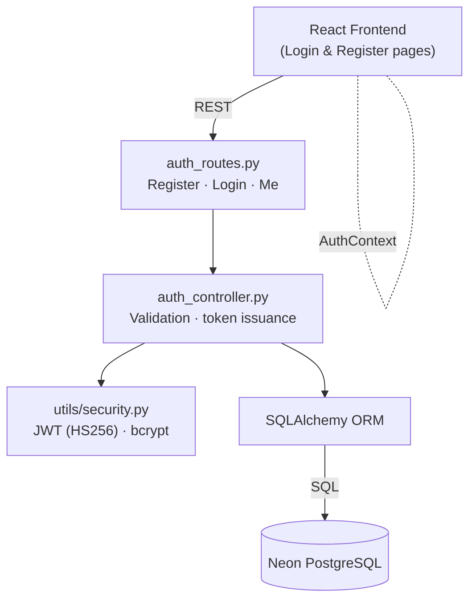
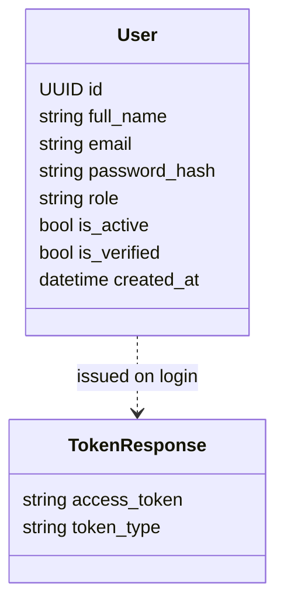
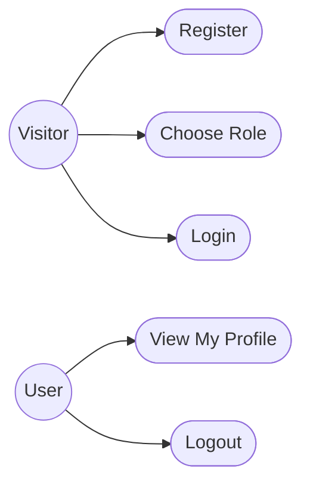
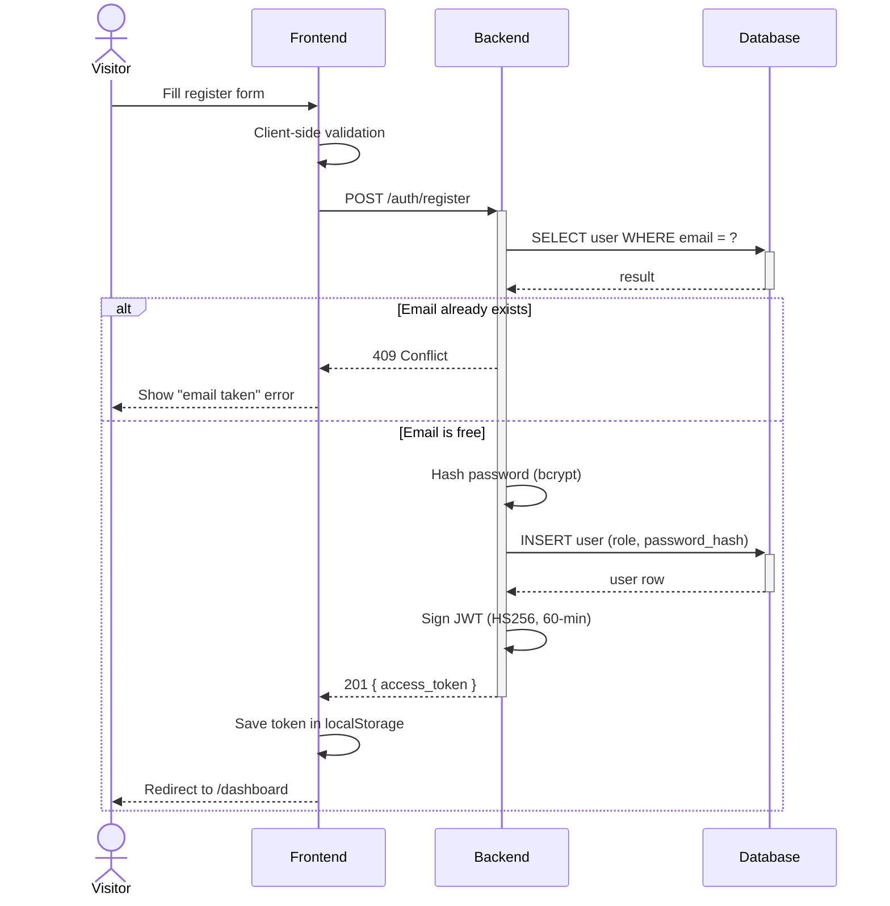
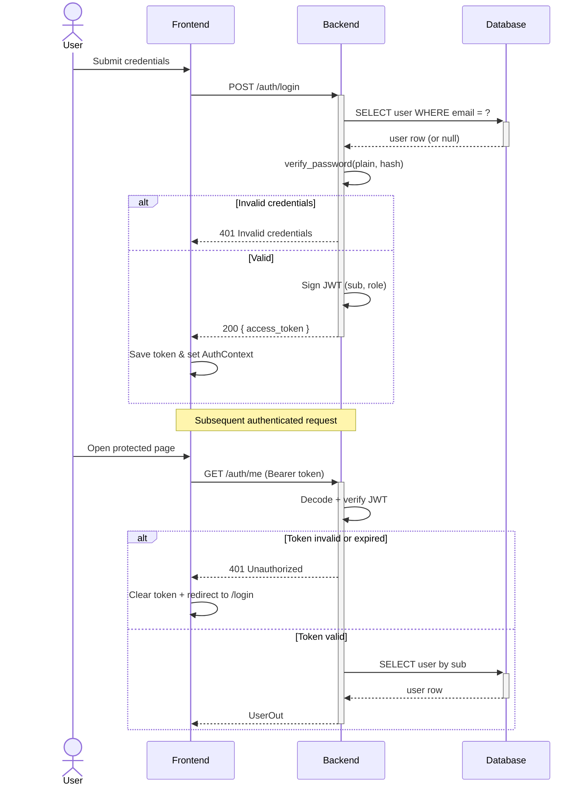

# Sprint 1 — Authentication

**Weeks 1–2**

## Introduction

The first sprint focuses on the foundation of Hub4Learners: a secure way for users to create an account, log in, and stay authenticated across the platform. It establishes the JWT-based session model and the role field on the user record that every later sprint relies on for access control.

## Sprint Goal

> Deliver a working sign-up and sign-in flow with role-aware JWT sessions that the rest of the platform can build on.

---

## User Stories

| ID | Priority | Story | Subtasks |
|---|---|---|---|
| US-1.1 | High | As a visitor, I can register an account with first name, last name, email and password | T-1.1.1: Build register form · T-1.1.2: Validate inputs · T-1.1.3: Reject duplicate emails |
| US-1.2 | High | As a visitor, I can choose my role at registration (student or professor) | T-1.2.1: Role selector in form · T-1.2.2: Default to student |
| US-1.3 | High | As the system, I hash every password with bcrypt before storing it | T-1.3.1: Integrate passlib · T-1.3.2: Never persist plaintext |
| US-1.4 | High | As a registered user, I can log in with my email and password | T-1.4.1: Build login form · T-1.4.2: Verify credentials |
| US-1.5 | High | As the system, I issue a signed JWT on successful login containing the user's id and role | T-1.5.1: Create token util · T-1.5.2: 60-minute expiry |
| US-1.6 | High | As a logged-in user, I can fetch my own profile through a `/me` endpoint | T-1.6.1: JWT decoding · T-1.6.2: Return user payload |
| US-1.7 | Medium | As a logged-in user, I can log out and have my session cleared | T-1.7.1: Clear token · T-1.7.2: Redirect to login |
| US-1.8 | Medium | As the system, I reject invalid or expired tokens with a clear error | T-1.8.1: Auth middleware · T-1.8.2: 401 response |

---

## Related Diagrams

### C4 Component View — Authentication Domain

This diagram shows the internal structure of the authentication module: the React frontend talks to a single `auth_routes` entry point, which delegates to the controller, the security utilities (JWT + bcrypt), and finally the database. It is the only sprint with no external third-party service.

### Class Diagram — User Identity

The class diagram captures the two artifacts introduced in this sprint: the persisted `User` entity and the transient `TokenResponse` returned on successful registration or login.

### Use Case Diagram — Authentication

The use case diagram lists the actions available to the two actors of this sprint: an anonymous Visitor who can register, choose their role, and log in, and an authenticated User who can view their profile and log out.

### Sequence Diagram — Registration

This sequence traces the full registration flow, including the email-uniqueness check, password hashing, JWT issuance, and the alternate path returned when the email is already taken.

### Sequence Diagram — Login & Token Validation

This diagram covers two related flows: the login endpoint that issues a JWT, and the follow-up `/auth/me` call that demonstrates how the backend validates the bearer token on every protected request.

---

## Conclusion

Sprint 1 delivers a minimal but solid authentication layer. With JWT-based sessions and a clear role field carried inside every token, every later sprint can rely on a consistent way to identify the caller and enforce role-based access.
