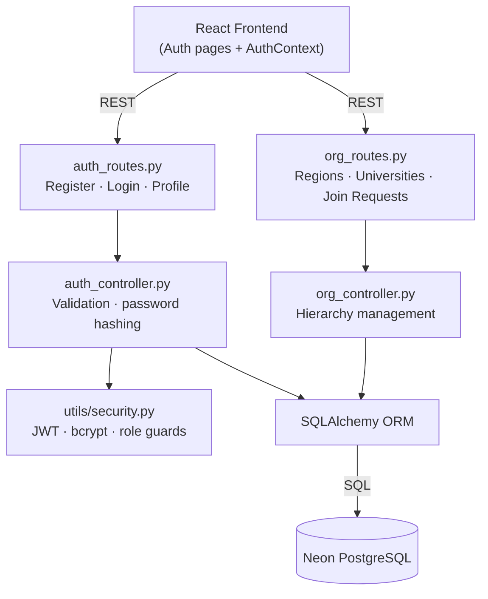
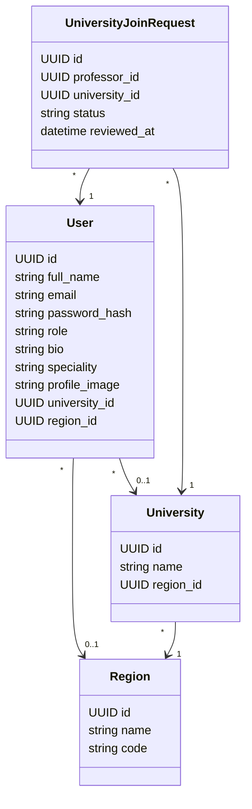
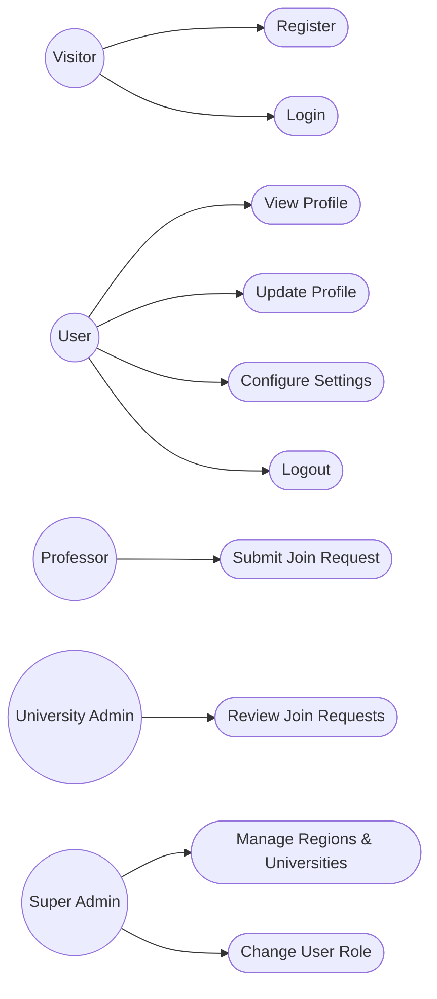
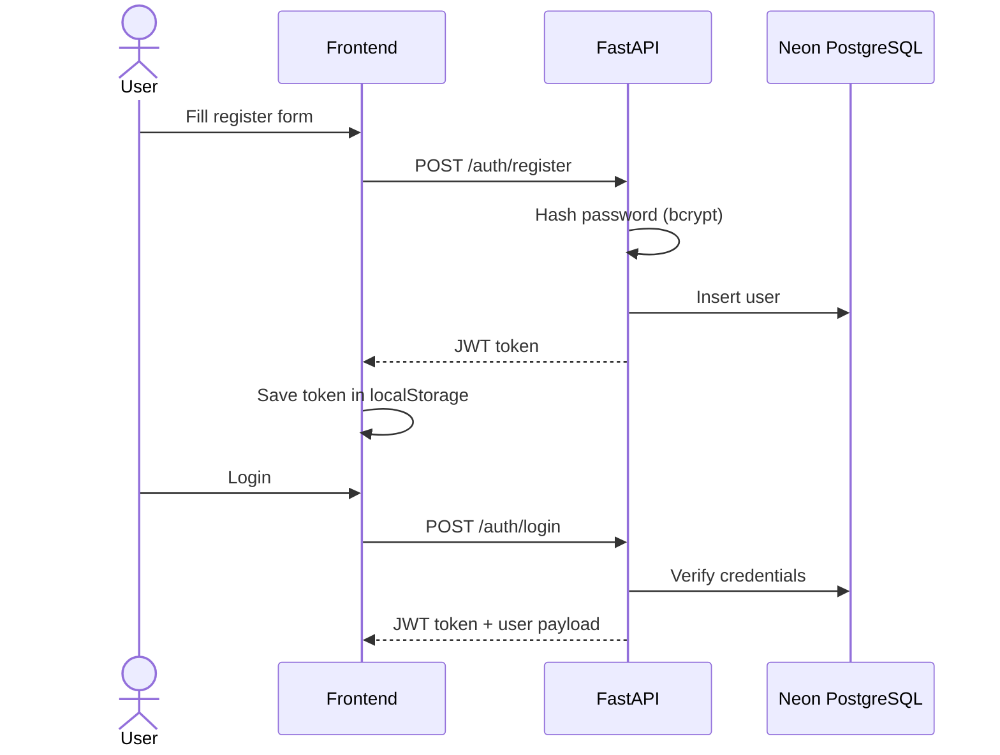
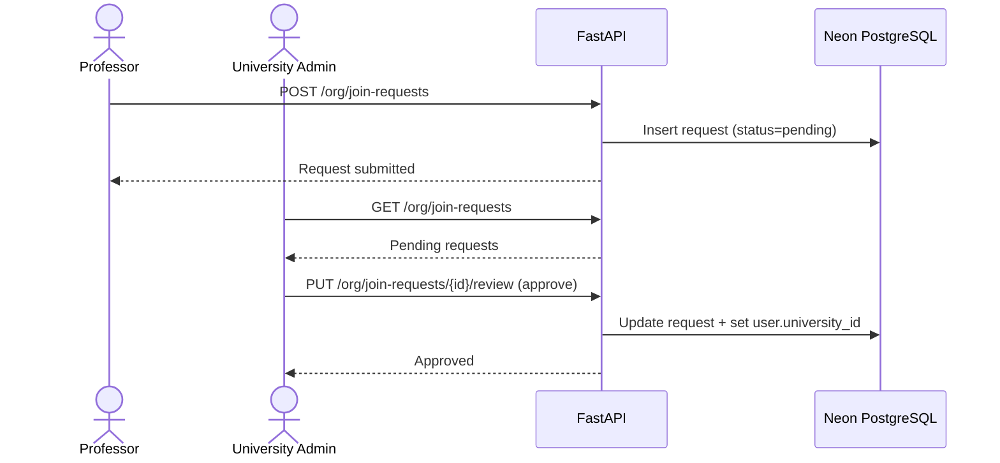

# Sprint 1 — Authentication & User Management

**Weeks 1–2**

## Introduction

The first sprint of Hub4Learners focuses on establishing the platform's identity layer. It delivers user registration, login, profile management, and the four-tier role model (student, professor, university admin, super admin) that every subsequent feature relies on. The sprint also lays down the organisational hierarchy — Regions, Universities, and the professor-to-university join request flow.

## Sprint Goal

> Provide a secure, role-aware authentication system that lets users register, log in, manage their profile, and be properly scoped to their university.

---

## User Stories

### Visitor & Registered User

| ID | Priority | Story | Subtasks |
|---|---|---|---|
| US-1.1 | High | As a visitor, I can register with my name, email, password and chosen role (student or professor) | T-1.1.1: Build register form · T-1.1.2: Hash password with bcrypt · T-1.1.3: Issue JWT on success |
| US-1.2 | High | As a registered user, I can log in with my email and password to receive a session token | T-1.2.1: Login form · T-1.2.2: Verify credentials · T-1.2.3: Store token in localStorage |
| US-1.3 | High | As a logged-in user, I can fetch my own profile through a `/me` endpoint | T-1.3.1: JWT decode middleware · T-1.3.2: Return user data |
| US-1.4 | Medium | As a user, I can update my profile (name, bio, speciality, profile image, password) | T-1.4.1: Profile edit form · T-1.4.2: Profile image upload |
| US-1.5 | Medium | As a user, I can configure my preferences (theme, notifications, privacy) in a settings modal | T-1.5.1: Settings modal UI · T-1.5.2: Persist preferences locally |
| US-1.6 | Medium | As a user, I can log out and have my session cleared | T-1.6.1: Clear token · T-1.6.2: Redirect to login |

### Organisation & Roles

| ID | Priority | Story | Subtasks |
|---|---|---|---|
| US-1.7 | High | As a super admin, I can manage Regions and Universities | T-1.7.1: CRUD endpoints · T-1.7.2: Admin panel UI |
| US-1.8 | High | As a super admin, I can promote a user to university admin | T-1.8.1: Role change endpoint · T-1.8.2: User management table |
| US-1.9 | Medium | As a professor, I can request to join a university | T-1.9.1: Join request form · T-1.9.2: Persist request |
| US-1.10 | Medium | As a university admin, I can approve or reject professor join requests | T-1.10.1: Review endpoint · T-1.10.2: Pending requests UI |

---

## Related Diagrams

### C4 Component View — Authentication Domain

### Class Diagram — Identity & Organisation

### Use Case Diagram — Authentication & Organisation

### Sequence Diagram — Registration & Login

### Sequence Diagram — Professor Join Request Flow

---

## Conclusion

Sprint 1 establishes the platform's identity foundation. With a role-aware JWT system, profile management, and a clean Region → University → User hierarchy in place, every later feature can rely on a stable authentication context and proper institutional scoping.
