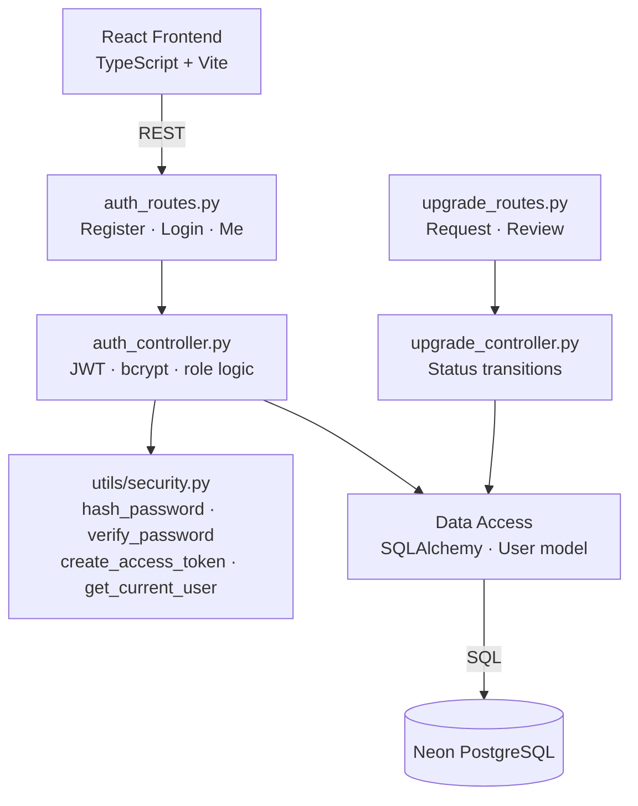
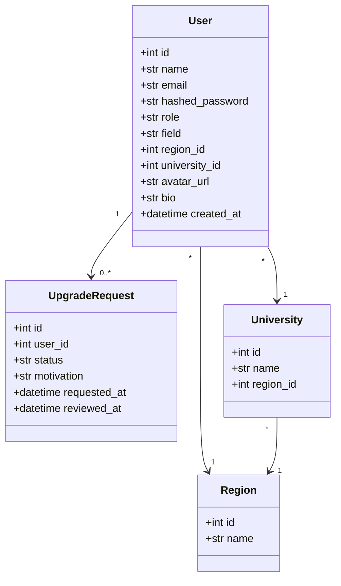
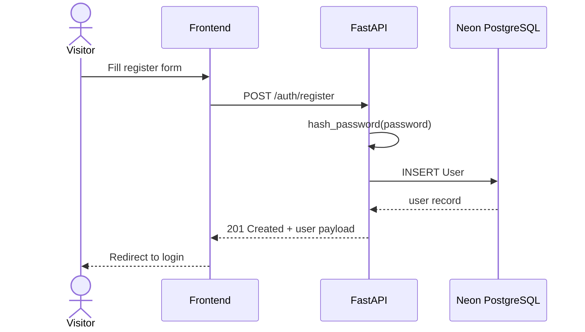
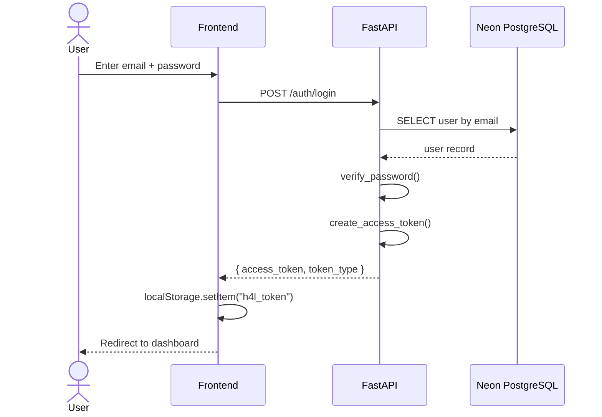

# Sprint 1 — Authentication & User Management
**Weeks 1–2 | Story Points: 34**

## Introduction

Sprint 1 establishes the foundation of the Hub4Learners platform. The focus is on building a secure authentication system, user profile management, and the role upgrade workflow that allows students to request professor status. This sprint also delivers the settings modal covering profile, security, appearance, notifications, and privacy tabs.

## Sprint Goal

> Enable users to register, log in, and manage their accounts securely, while giving students the ability to request a role upgrade to professor and allowing admins to review those requests.

---

## User Stories

| ID | Priority | User Story | Subtasks |
|---|---|---|---|
| US-01 | High | As a visitor, I can register with my name, email, password, field, region, and university | T-1.1: Create registration form · T-1.2: POST /auth/register endpoint · T-1.3: Hash password with bcrypt · T-1.4: Persist user to DB |
| US-02 | High | As a registered user, I can log in and receive a JWT token | T-1.5: Create login form · T-1.6: POST /auth/login endpoint · T-1.7: Sign JWT (HS256) · T-1.8: Store token in localStorage |
| US-03 | High | As a logged-in user, I can view my profile via GET /auth/me | T-1.9: Decode JWT in header · T-1.10: Return user payload · T-1.11: Display profile in dashboard |
| US-04 | Medium | As a student, I can edit my profile (name, bio, avatar) | T-1.12: Profile edit form · T-1.13: PUT /auth/profile endpoint · T-1.14: Upload avatar to /uploads |
| US-05 | High | As a student, I can request an upgrade to professor role | T-1.15: Upgrade request form · T-1.16: POST /upgrade/request · T-1.17: Persist UpgradeRequest record |
| US-06 | High | As an admin, I can view and approve/reject upgrade requests | T-1.18: Admin upgrade list · T-1.19: PATCH /upgrade/{id}/approve · T-1.20: Update user role in DB |
| US-07 | Medium | As a user, I can log out and clear my session | T-1.21: Clear localStorage token · T-1.22: Redirect to login |
| US-08 | Low | As a user, I can configure settings across 5 tabs (Profile, Security, Appearance, Notifications, Privacy) | T-1.23: Settings modal UI · T-1.24: Update password endpoint · T-1.25: Persist appearance preferences |

---

## Related Diagrams

### C4 Component View — Authentication Domain

### Class Diagram — User & Authentication

### Sequence Diagram — Registration Flow

### Sequence Diagram — Login & JWT Flow

---

## Conclusion

Sprint 1 successfully delivered a secure, token-based authentication system with role-aware access control. Users can register, log in, and manage their profiles, while the role upgrade pipeline gives students a clear path to becoming professors with admin oversight. The JWT infrastructure and `get_current_user` / `require_role()` utilities built here serve as the security backbone for all subsequent sprints.
