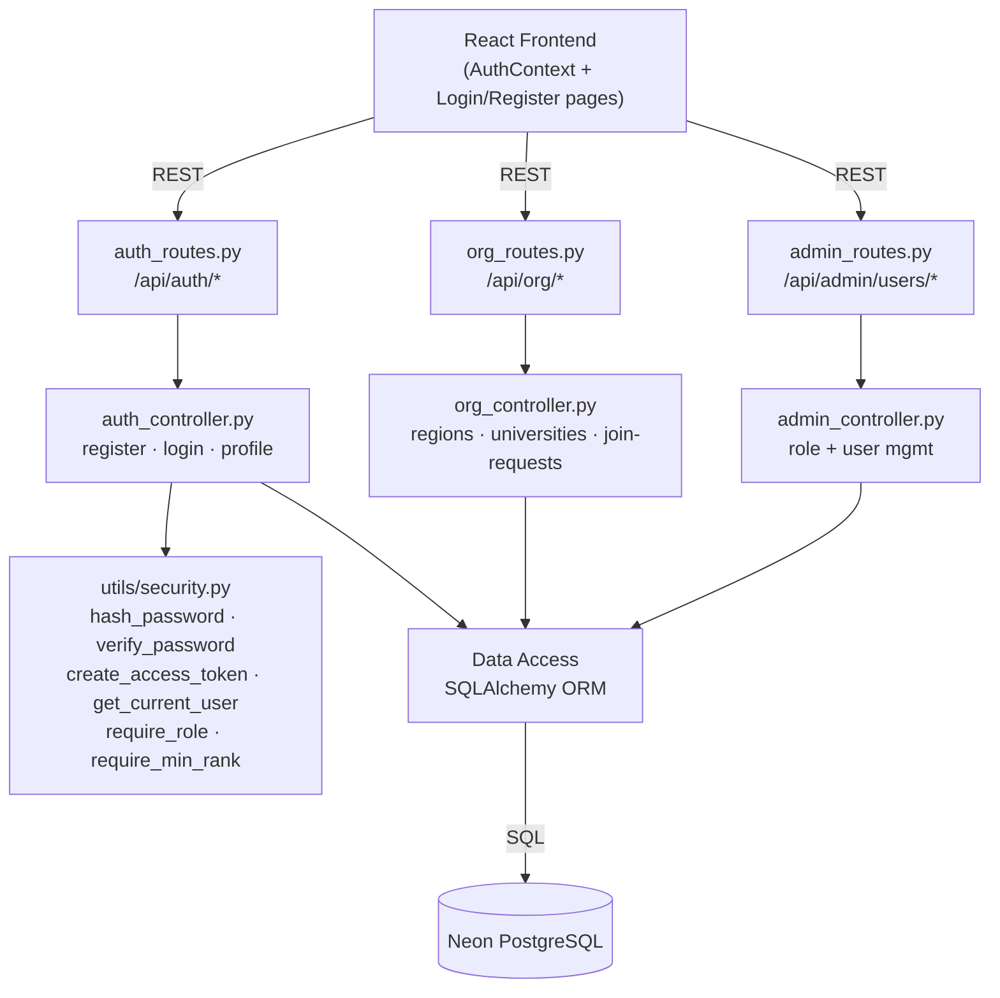
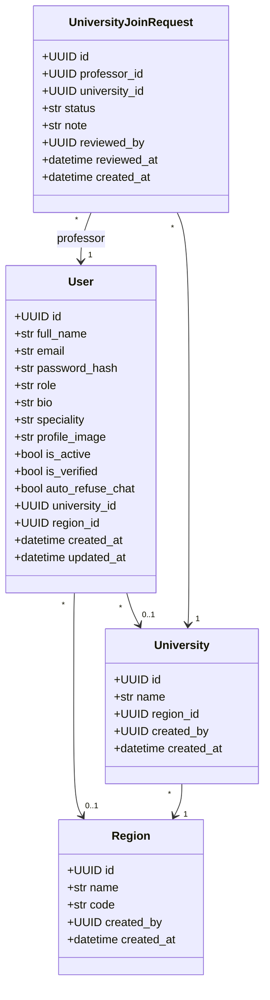
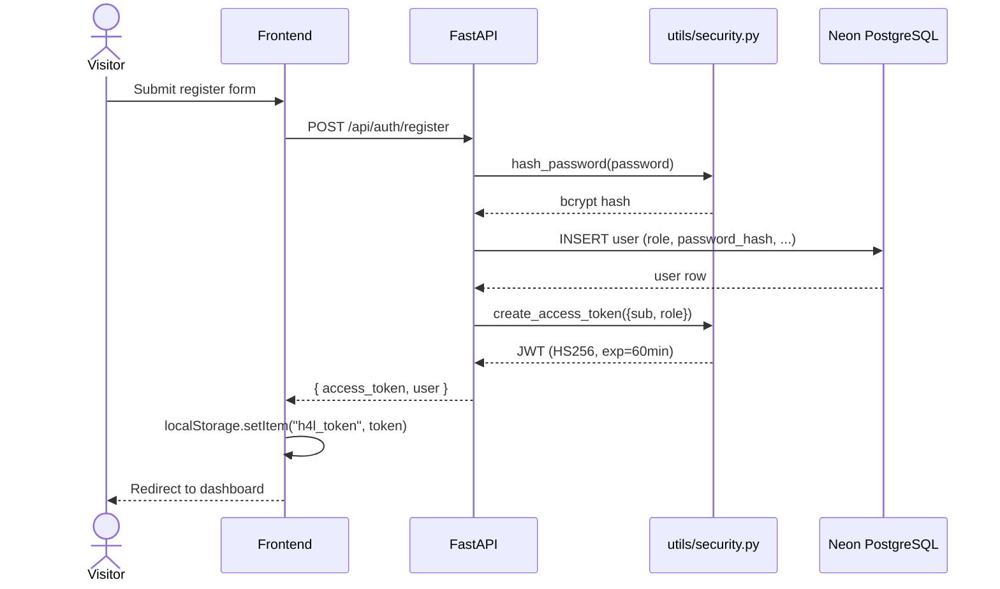

# Sprint 1 — Authentication & Identity

**Weeks 1–2**

## Introduction

Sprint 1 lays the security foundation of Hub4Learners. It delivers a JWT-based authentication system with a four-tier role model (`student`, `professor`, `university_admin`, `super_admin`), profile management, and the organisational hierarchy (Regions → Universities → Users) that scopes every later feature. The sprint also wires the role-rank guards (`require_role`, `require_min_rank`) that protect every privileged endpoint shipped in later sprints.

## Sprint Goal

> Ship a secure, role-aware authentication layer and the regional/university hierarchy that every subsequent feature will depend on, so users can register, log in, edit their profile, and be scoped to the right institution.

---

## User Stories

### Visitor / Authenticated User

| ID | Priority | User Story | Subtasks |
|---|---|---|---|
| US-1.1 | High | As a visitor, I can register with full name, email, password, role, optional university and region | T-1.1.1: `POST /api/auth/register` · T-1.1.2: bcrypt hash via `hash_password()` · T-1.1.3: Issue JWT (HS256, 60-min expiry) · T-1.1.4: Registration form (React) |
| US-1.2 | High | As a registered user, I can log in with email + password and receive a JWT token | T-1.2.1: `POST /api/auth/login` · T-1.2.2: `verify_password()` · T-1.2.3: `create_access_token({sub, role})` · T-1.2.4: Persist token in `localStorage["h4l_token"]` |
| US-1.3 | High | As a logged-in user, I can fetch my own profile via `GET /api/auth/me` | T-1.3.1: `get_current_user` dependency · T-1.3.2: Decode JWT from `Authorization: Bearer …` · T-1.3.3: Return `UserOut` payload |
| US-1.4 | Medium | As a user, I can edit my full name, bio, speciality, and profile image | T-1.4.1: `PUT /api/auth/profile` · T-1.4.2: Profile-image upload to `/uploads` · T-1.4.3: Settings → Profile tab |
| US-1.5 | Medium | As a user, I can configure account settings across five tabs (Profile, Security, Appearance, Notifications, Privacy) | T-1.5.1: Settings modal component · T-1.5.2: Password change flow · T-1.5.3: `auto_refuse_chat` toggle (privacy) |
| US-1.6 | Medium | As a user, I can log out and have my session cleared | T-1.6.1: Clear `h4l_token` · T-1.6.2: Reset `AuthContext` · T-1.6.3: Redirect to login |

### Organisational Hierarchy

| ID | Priority | User Story | Subtasks |
|---|---|---|---|
| US-1.7 | High | As a super_admin, I can create and delete Regions and Universities | T-1.7.1: `POST /api/org/regions` · T-1.7.2: `POST /api/org/universities` · T-1.7.3: `require_role("super_admin")` guard |
| US-1.8 | High | As a super_admin, I can promote a user to `university_admin` and scope them to a university | T-1.8.1: `POST /api/org/admins/university` · T-1.8.2: `admin_controller.change_user_role()` |
| US-1.9 | Medium | As a professor, I can submit a join request to attach myself to a university | T-1.9.1: `POST /api/org/join-requests` · T-1.9.2: `UniversityJoinRequest` model with status `pending`/`approved`/`rejected` |
| US-1.10 | Medium | As a university_admin, I can review (approve or reject) professor join requests for my university | T-1.10.1: `PUT /api/org/join-requests/{id}/review` · T-1.10.2: Set `User.university_id` on approve · T-1.10.3: `require_role("university_admin")` |

---

## Related Diagrams

### C4 Component View — Authentication & Organisation Domain



### Class Diagram — Identity & Organisation



### Sequence Diagram — Registration & JWT Issuance



### Sequence Diagram — Professor → University Join Request

```mermaid
sequenceDiagram
    actor Professor
    actor UniAdmin as University Admin
    participant Frontend
    participant FastAPI
    participant DB as Neon PostgreSQL

    Professor->>Frontend: Select university + submit request
    Frontend->>FastAPI: POST /api/org/join-requests
    FastAPI->>FastAPI: require_role("professor")
    FastAPI->>DB: INSERT university_join_request (status='pending')
    DB-->>FastAPI: request row
    FastAPI-->>Frontend: 201 + request payload

    UniAdmin->>Frontend: Open admin panel
    Frontend->>FastAPI: GET /api/org/join-requests
    FastAPI-->>Frontend: pending requests
    UniAdmin->>Frontend: Approve
    Frontend->>FastAPI: PUT /api/org/join-requests/{id}/review (action=approve)
    FastAPI->>FastAPI: require_role("university_admin")
    FastAPI->>DB: UPDATE request.status='approved'; UPDATE user.university_id
    DB-->>FastAPI: ok
    FastAPI-->>Frontend: 200 OK
```

---

## Conclusion

Sprint 1 produced a working four-role identity system with bcrypt password hashing, JWT issuance, and a clean role-rank model that every other sprint will rely on. The Region → University → User hierarchy and the professor join-request flow give the platform institutional structure from day one, so later features (analytics, announcements, leaderboards) can be naturally scoped per university without retrofitting.
