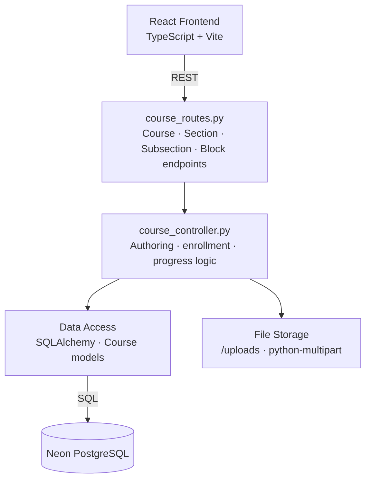
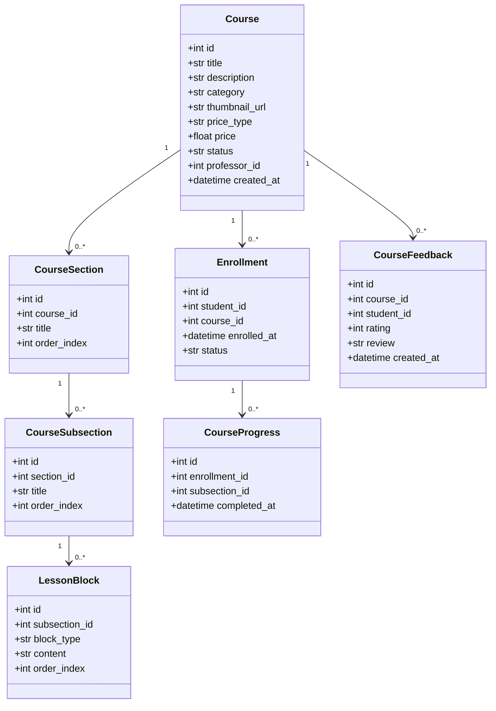
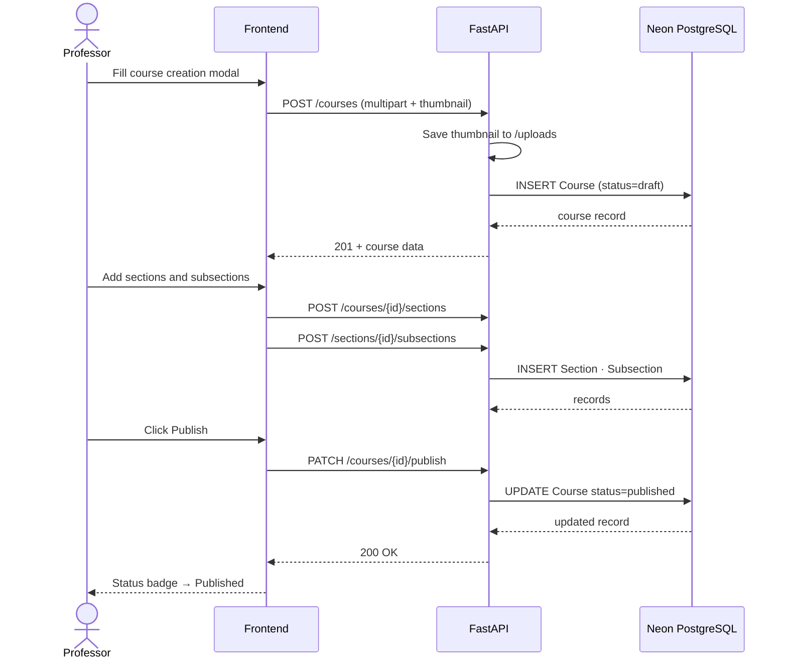
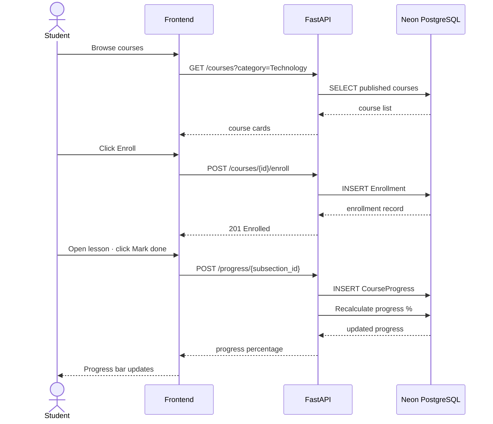

# Sprint 2 — Course Architecture
**Weeks 3–4 | Story Points: 34**

## Introduction

Sprint 2 builds the core educational content layer of the platform. Professors gain a full course authoring environment — creating courses, structuring them into sections and subsections, writing rich-text lesson blocks, uploading materials, and publishing. Students gain the ability to browse, enroll, track progress through lessons, and leave feedback upon completion.

## Sprint Goal

> Deliver a fully functional course authoring and enrollment system accessible to both professors and students.

---

## User Stories

### Professor

| ID | Priority | User Story | Subtasks |
|---|---|---|---|
| US-09 | High | As a professor, I can create a course with title, description, category, thumbnail, and price | T-2.1: Course creation modal · T-2.2: POST /courses · T-2.3: Save thumbnail to /uploads |
| US-10 | High | As a professor, I can structure my course into sections and subsections | T-2.4: Section/subsection UI · T-2.5: POST /courses/{id}/sections · T-2.6: POST /sections/{id}/subsections |
| US-11 | High | As a professor, I can add rich-text blocks (text, image, video) to subsections | T-2.7: Block editor UI · T-2.8: POST /subsections/{id}/blocks · T-2.9: Handle order_index |
| US-12 | Medium | As a professor, I can publish or unpublish my course | T-2.10: Publish toggle · T-2.11: PATCH /courses/{id}/publish · T-2.12: Status draft → published |
| US-13 | Medium | As a professor, I can edit and delete courses and their content | T-2.13: Edit course modal · T-2.14: PUT /courses/{id} · T-2.15: DELETE /courses/{id} |

### Student

| ID | Priority | User Story | Subtasks |
|---|---|---|---|
| US-14 | High | As a student, I can browse and filter published courses by category | T-2.16: Course browse page · T-2.17: GET /courses?category= · T-2.18: Course cards with enroll button |
| US-15 | High | As a student, I can enroll in a free course | T-2.19: Enroll button · T-2.20: POST /courses/{id}/enroll · T-2.21: Create Enrollment record |
| US-16 | High | As a student, I can track progress through course subsections | T-2.22: Mark done button · T-2.23: POST /progress/{subsection_id} · T-2.24: Progress bar update |
| US-17 | Medium | As a student, I can view all my enrolled courses in My Learning library | T-2.25: My Courses page · T-2.26: GET /enrollments/me · T-2.27: Filter by status |
| US-18 | Low | As a student, I can leave a rating and written review after completing a course | T-2.28: Feedback form · T-2.29: POST /courses/{id}/feedback · T-2.30: Display avg rating on course card |

---

## Related Diagrams

### C4 Component View — Course Management Domain

### Class Diagram — Course Hierarchy

### Sequence Diagram — Course Creation and Publishing

### Sequence Diagram — Student Enrollment and Progress

---

## Conclusion

Sprint 2 delivered a complete, end-to-end course lifecycle — from professor authoring to student consumption. The hierarchical content model (course → section → subsection → block) proved flexible enough to support varied lesson formats, and the progress tracking system gives students a clear view of their advancement. The foundation laid here — enrollment records, progress state, and published course visibility — feeds directly into the AI and gamification layers introduced in Sprints 3 and 4.
