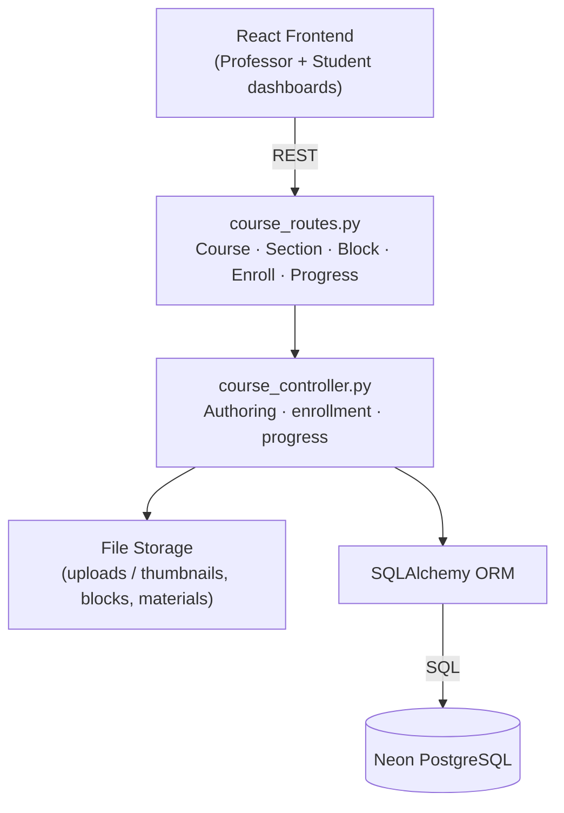
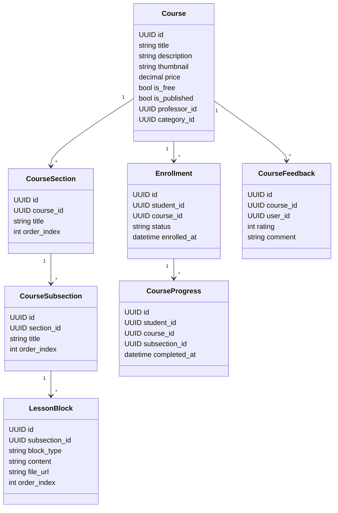
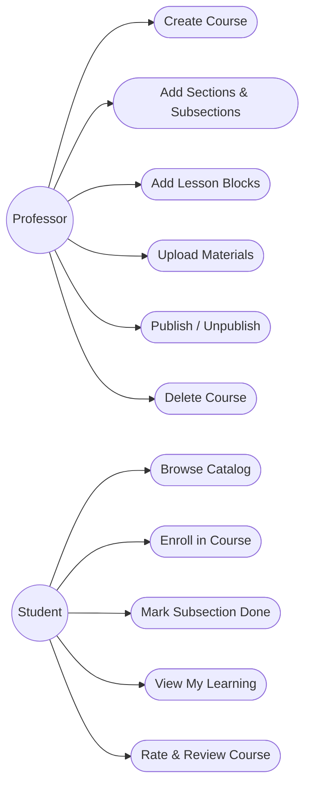
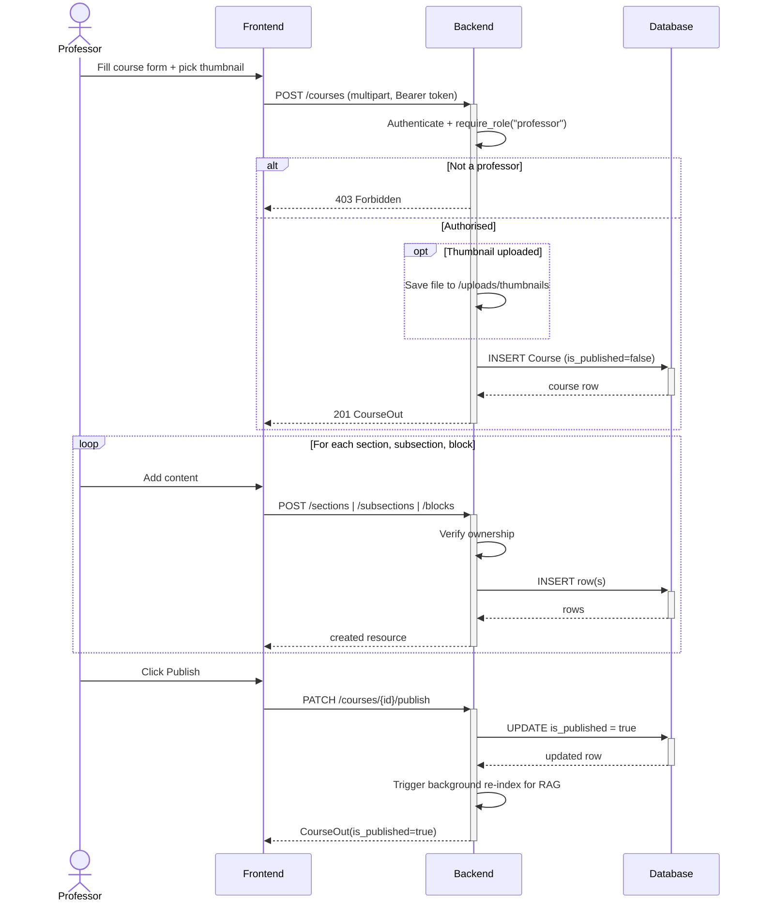
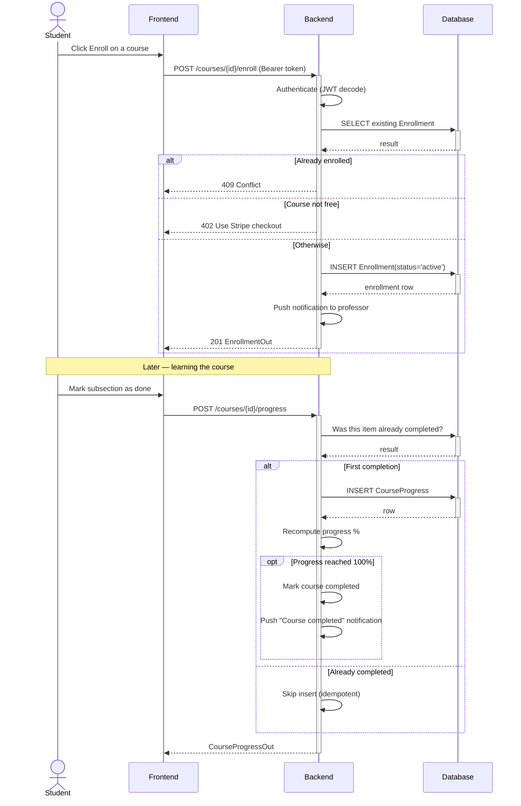

# Sprint 2 — Course Architecture

**Weeks 3–4**

## Introduction

Sprint 2 introduces the content layer of Hub4Learners. Professors gain a full authoring experience — courses divided into sections and subsections, with rich lesson blocks (text, image, video) and supporting materials. Students get the discovery side: browsing the public catalog, enrolling in free courses, marking subsections complete, and rating courses after completion.

## Sprint Goal

> Deliver the full course lifecycle so professors can build structured courses and students can enroll, learn, and provide feedback.

---

## User Stories

### Professor

| ID | Priority | Story | Subtasks |
|---|---|---|---|
| US-2.1 | High | As a professor, I can create a course with title, description, category, thumbnail and pricing | T-2.1.1: Course creation modal · T-2.1.2: Thumbnail upload |
| US-2.2 | High | As a professor, I can organise my course into ordered sections and subsections | T-2.2.1: Section/subsection endpoints · T-2.2.2: Drag-friendly UI |
| US-2.3 | High | As a professor, I can add text, image, and video blocks inside a subsection | T-2.3.1: Block editor (TipTap) · T-2.3.2: Media uploads |
| US-2.4 | High | As a professor, I can publish or unpublish a course | T-2.4.1: Publish toggle · T-2.4.2: Status badge |
| US-2.5 | Medium | As a professor, I can edit or delete courses, sections, and blocks | T-2.5.1: Edit forms · T-2.5.2: Delete confirmations |
| US-2.6 | Medium | As a professor, I can upload PDF materials per section | T-2.6.1: Material upload · T-2.6.2: Material list UI |

### Student

| ID | Priority | Story | Subtasks |
|---|---|---|---|
| US-2.7 | High | As a student, I can browse the public catalog and filter by category | T-2.7.1: Course grid · T-2.7.2: Category sidebar |
| US-2.8 | High | As a student, I can enroll in a free course in one click | T-2.8.1: Enroll endpoint · T-2.8.2: Enrollment state on card |
| US-2.9 | High | As a student, I can mark subsections complete and see my progress percentage | T-2.9.1: Mark-done button · T-2.9.2: Progress bar |
| US-2.10 | Medium | As a student, I can view all my enrolled courses in a "My Learning" library | T-2.10.1: My Learning page · T-2.10.2: Filter tabs (in progress, completed, not started) |
| US-2.11 | Medium | As a student, I can leave a single rating and comment per course | T-2.11.1: Feedback modal · T-2.11.2: Persist rating |

---

## Related Diagrams

### C4 Component View — Course Management Domain

This diagram shows the course management subsystem: the frontend talks to `course_routes`, which delegates to a single course controller responsible for authoring, enrollment, and progress, with thumbnails and lesson media saved to the local file storage.

### Class Diagram — Course Hierarchy

The class diagram models the four-level content hierarchy (Course → Section → Subsection → LessonBlock), the engagement side (Enrollment + CourseProgress), and the feedback entity that captures one rating per student per course.

### Use Case Diagram — Course Management

The use case diagram separates professor responsibilities (authoring and publishing) from student actions (discovering, enrolling, learning, and rating), showing the clear split in capabilities introduced by this sprint.

### Sequence Diagram — Course Creation & Publishing

This sequence follows a professor from the initial course creation, through iteratively adding sections, subsections and blocks, to the final publish action that flips the visibility flag and triggers a background re-index for the AI tutor.

### Sequence Diagram — Enrollment & Progress Tracking

This diagram traces a student from enrolling in a course to marking individual subsections complete, with explicit handling of duplicate enrollments, idempotent progress updates, and the 100% completion event that closes the learning loop.

---

## Sprint Review

| Topic | Outcome |
|---|---|
| Review | Demonstrated the end-to-end course lifecycle: professor authoring (sections, subsections, blocks, materials, publish) and student journey (browse, enroll, progress tracking, feedback). All user stories met their Definition of Done. |
| Went well | The four-level content hierarchy (Course → Section → Subsection → LessonBlock) proved flexible enough to host text, image and video uniformly, and the file-storage layout under `/uploads` kept thumbnail and lesson media handling consistent. |
| To improve | Drag-and-drop reordering of sections and subsections was de-scoped to keep the sprint on schedule. Reorder endpoints and the matching UI should be added in a follow-up. |

---

## Conclusion

Sprint 2 delivers the end-to-end course lifecycle. The hierarchical Course → Section → Subsection → Block model gives professors flexibility to build rich lessons, while students get a smooth path from discovery to enrollment to completion. This content backbone is what every later sprint — AI, gamification, communication — builds on.
