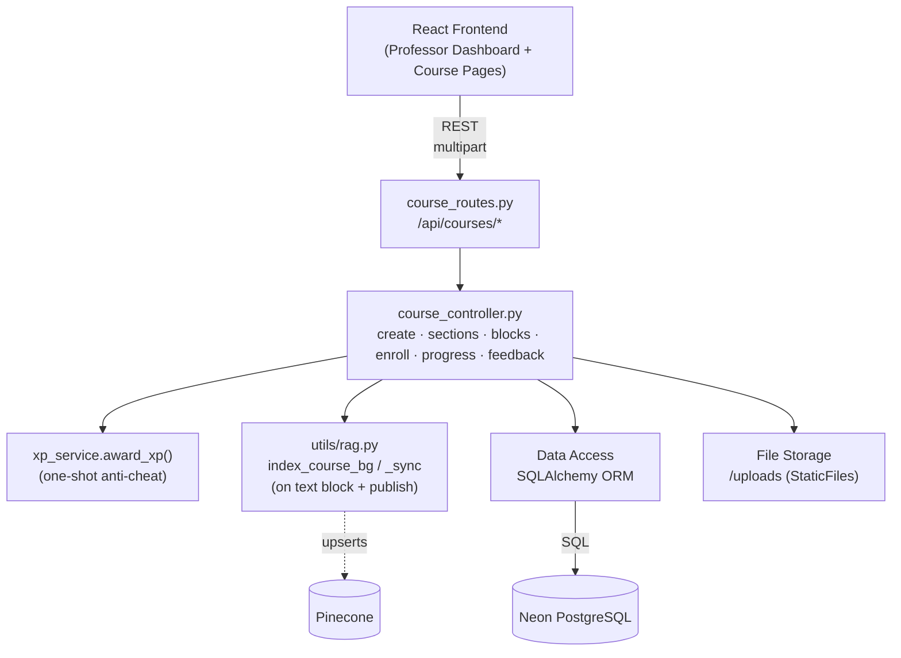
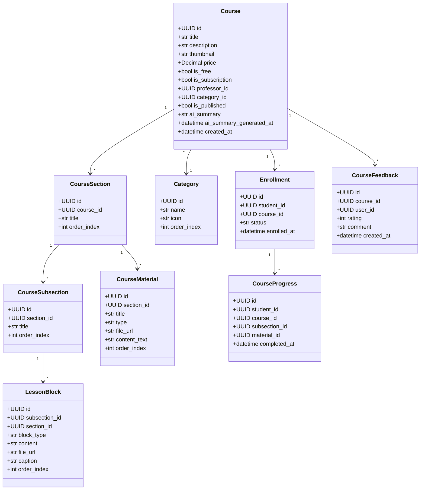
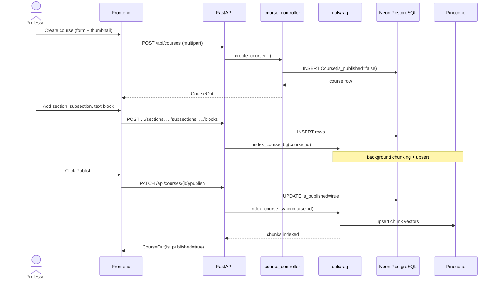
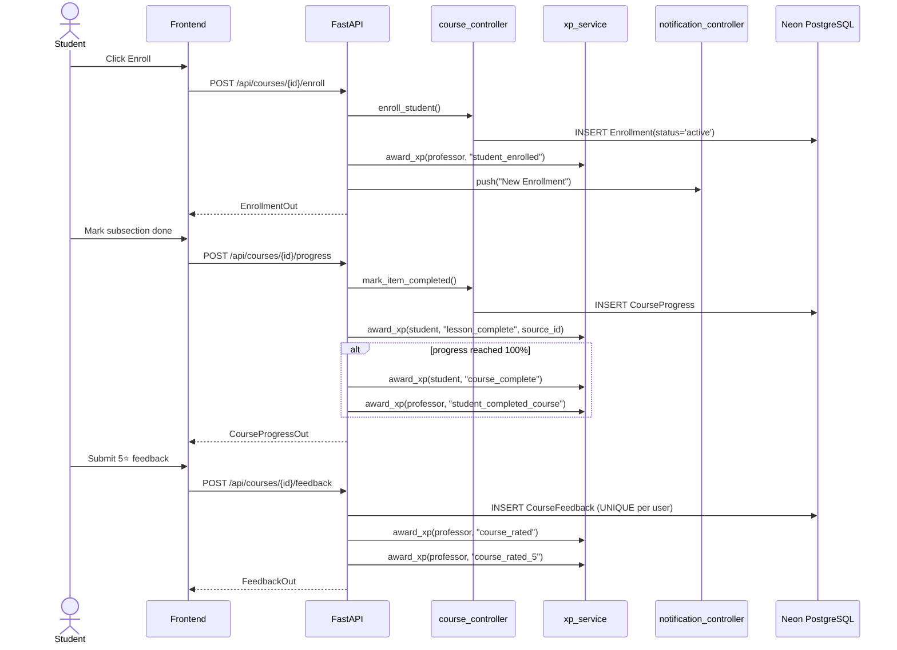

# Sprint 2 — Course Architecture & Enrollment

**Weeks 3–4**

## Introduction

Sprint 2 builds the platform's content layer. Professors get a complete authoring environment — courses split into sections, sections split into subsections, and each subsection composed of text / image / video lesson blocks. Students can browse the public catalog, enroll in free courses, mark subsections complete to track progress, and leave a one-time star rating with a written comment.

## Sprint Goal

> Deliver the end-to-end course lifecycle: professors can author and publish structured courses with mixed-media lesson blocks, and students can discover, enroll, learn, and review them.

---

## User Stories

### Professor — Authoring

| ID | Priority | User Story | Subtasks |
|---|---|---|---|
| US-2.1 | High | As a professor, I can create a course with title, description, category, thumbnail, and `is_free`/`price` | T-2.1.1: `POST /api/courses` (multipart) · T-2.1.2: Save thumbnail under `/uploads` · T-2.1.3: Insert `Course` with `is_published=false` |
| US-2.2 | High | As a professor, I can add ordered sections to a course | T-2.2.1: `POST /api/courses/{course_id}/sections` · T-2.2.2: `CourseSection` model with `order_index` |
| US-2.3 | High | As a professor, I can add ordered subsections inside a section | T-2.3.1: `POST /api/courses/{course_id}/sections/{section_id}/subsections` · T-2.3.2: `CourseSubsection.order_index` |
| US-2.4 | High | As a professor, I can add text / image / video lesson blocks to a subsection | T-2.4.1: `POST …/subsections/{subsection_id}/blocks` (multipart) · T-2.4.2: `LessonBlock(block_type ∈ {text,image,video})` · T-2.4.3: Background reindex on text-block change |
| US-2.5 | Medium | As a professor, I can edit or delete blocks, sections, and the course itself | T-2.5.1: `PATCH /api/courses/blocks/{id}` · T-2.5.2: `DELETE /api/courses/{id}/sections/{id}` · T-2.5.3: `DELETE /api/courses/{id}` |
| US-2.6 | High | As a professor, I can toggle publish on a course, which makes it visible and triggers RAG indexing | T-2.6.1: `PATCH /api/courses/{id}/publish` · T-2.6.2: Synchronous `index_course_sync()` when going public · T-2.6.3: Award `course_published` XP (one-shot) |
| US-2.7 | Medium | As a professor, I can upload supporting PDF materials per section | T-2.7.1: `POST …/sections/{id}/materials` · T-2.7.2: `CourseMaterial(type ∈ {pdf,video,lesson})` |
| US-2.8 | Medium | As a professor, I can list my own courses on `/api/courses/my` | T-2.8.1: `course_controller.get_my_courses()` · T-2.8.2: Professor dashboard grid |

### Student — Discovery & Learning

| ID | Priority | User Story | Subtasks |
|---|---|---|---|
| US-2.9 | High | As a student (or visitor), I can browse published courses filtered by category | T-2.9.1: `GET /api/courses?category_id=…` · T-2.9.2: `Course.is_published=true` filter · T-2.9.3: Category sidebar |
| US-2.10 | High | As a student, I can enroll in a free course | T-2.10.1: `POST /api/courses/{id}/enroll` · T-2.10.2: Insert `Enrollment(status='active')` · T-2.10.3: Notify professor + award `student_enrolled` XP |
| US-2.11 | High | As a student, I can mark subsections / materials complete to track progress | T-2.11.1: `POST /api/courses/{id}/progress` with `subsection_id` or `material_id` · T-2.11.2: `CourseProgress` insert · T-2.11.3: Award `lesson_complete` / `video_watched` XP (one-shot per item) |
| US-2.12 | High | As a student, when I hit 100% the system marks the course complete and grants `course_complete` XP | T-2.12.1: Recompute `progress_pct` after each mark · T-2.12.2: Award `course_complete` XP · T-2.12.3: Award professor `student_completed_course` XP |
| US-2.13 | Medium | As a student, I can see all my enrolled courses on My Learning | T-2.13.1: `GET /api/courses/enrolled` · T-2.13.2: Filter tabs: All / In Progress / Completed / Not Started |
| US-2.14 | Medium | As a student, I can leave a single rating (1–5) + optional comment per course | T-2.14.1: `POST /api/courses/{id}/feedback` · T-2.14.2: `CourseFeedback` with `UNIQUE(course_id,user_id)` · T-2.14.3: Award professor `course_rated` (+ `course_rated_5` if 5⭐) |

---

## Related Diagrams

### C4 Component View — Course Management Domain

### Class Diagram — Course Hierarchy & Engagement

### Sequence Diagram — Course Authoring & Publishing

### Sequence Diagram — Enrollment, Progress & Feedback

---

## Conclusion

Sprint 2 delivered Hub4Learners' core value proposition: a fully working authoring tool for professors and a working learning loop for students. The hierarchical model (Course → Section → Subsection → Block) is flexible enough to support mixed media and the lessons-as-blocks design pays off in Sprint 3 when the AI tutor needs clean, chunkable text. Crucially, publishing also kicks off RAG indexing — every course shipped in this sprint becomes AI-ready the moment it goes public.
