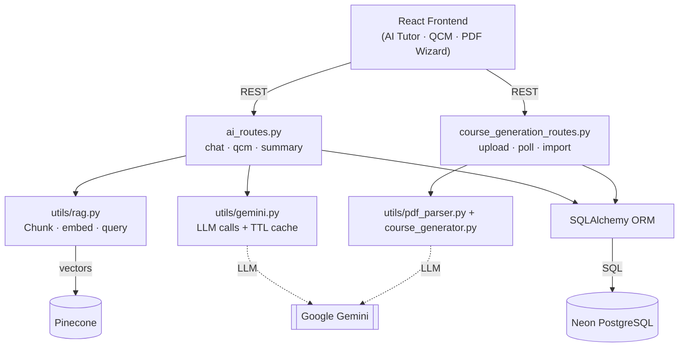
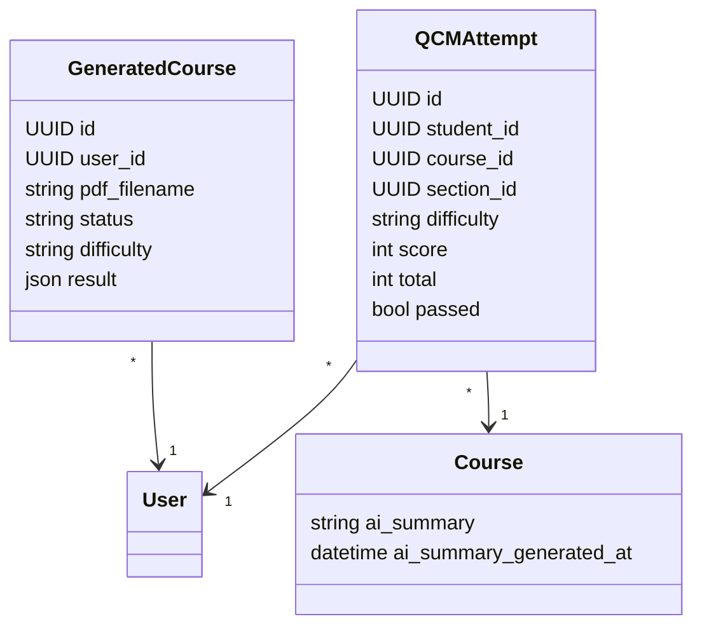
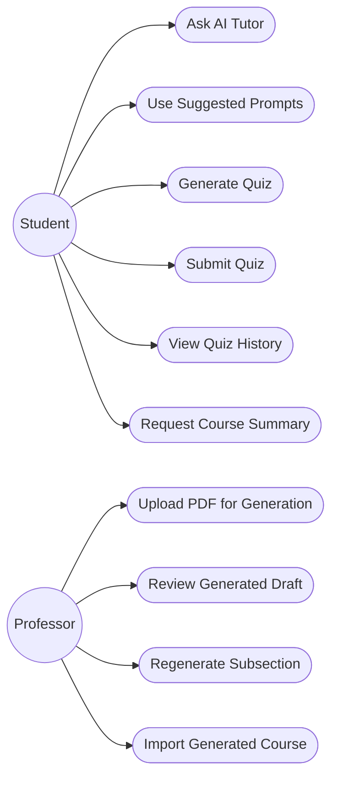
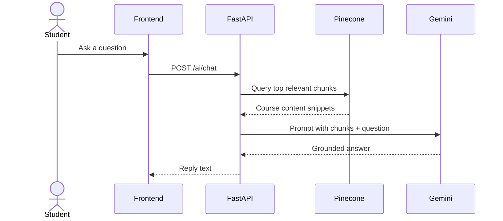
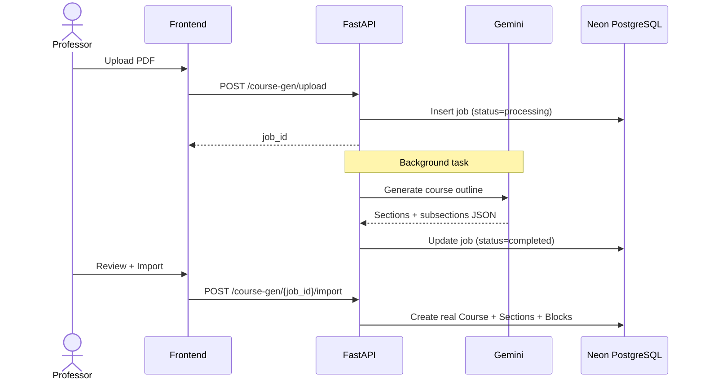

# Sprint 3 — AI Learning Features

**Weeks 5–6**

## Introduction

Sprint 3 brings AI capabilities into the platform. Students gain a course-scoped AI tutor that answers questions grounded in the course content, plus auto-generated multiple-choice quizzes and on-demand course summaries. Professors get a PDF-to-course generator that turns an uploaded PDF into a draft course structure they can review, edit, and import.

## Sprint Goal

> Integrate AI features that help students learn (tutor, quizzes, summaries) and help professors author courses faster from existing PDF material.

---

## User Stories

### Student

| ID | Priority | Story | Subtasks |
|---|---|---|---|
| US-3.1 | High | As a student, I can chat with an AI tutor that answers only from the course content | T-3.1.1: AI Tutor panel · T-3.1.2: RAG retrieval from Pinecone · T-3.1.3: Gemini answer |
| US-3.2 | High | As a student, I can use suggested prompts (summarize, key concepts, quiz me) | T-3.2.1: Prompt chips · T-3.2.2: Pre-fill chat input |
| US-3.3 | High | As a student, I can generate a multiple-choice quiz at chosen difficulty | T-3.3.1: QCM modal · T-3.3.2: Gemini quiz generation |
| US-3.4 | High | As a student, I can submit my quiz answers and get a score with pass/fail | T-3.4.1: Score endpoint · T-3.4.2: Save attempt |
| US-3.5 | Medium | As a student, I can view my quiz attempt history per course | T-3.5.1: History endpoint · T-3.5.2: History UI |
| US-3.6 | Medium | As a student, I can request an AI-generated summary of an entire course | T-3.6.1: Summary endpoint · T-3.6.2: Markdown viewer |

### Professor

| ID | Priority | Story | Subtasks |
|---|---|---|---|
| US-3.7 | High | As a professor, I can upload a PDF and have the AI propose a course structure | T-3.7.1: PDF upload · T-3.7.2: Background generation job |
| US-3.8 | High | As a professor, I can review and edit the generated draft before saving | T-3.8.1: Draft preview UI · T-3.8.2: Inline edit |
| US-3.9 | Medium | As a professor, I can import the generated draft into a real course | T-3.9.1: Import endpoint · T-3.9.2: Auto re-index for RAG |
| US-3.10 | Medium | As a professor, I can regenerate a single subsection at a different difficulty | T-3.10.1: Regenerate endpoint |

---

## Related Diagrams

### C4 Component View — AI Domain

### Class Diagram — AI-Related Entities

### Use Case Diagram — AI Features

### Sequence Diagram — AI Tutor (RAG Chat)

### Sequence Diagram — PDF → Course Generation

---

## Conclusion

Sprint 3 transforms Hub4Learners from a static content platform into an interactive learning environment. RAG-grounded answers, automated quizzes, and PDF-driven authoring meaningfully reduce friction for both learners and professors, while keeping AI output anchored to the actual course material.
