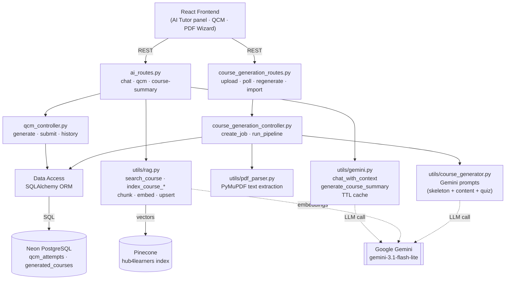
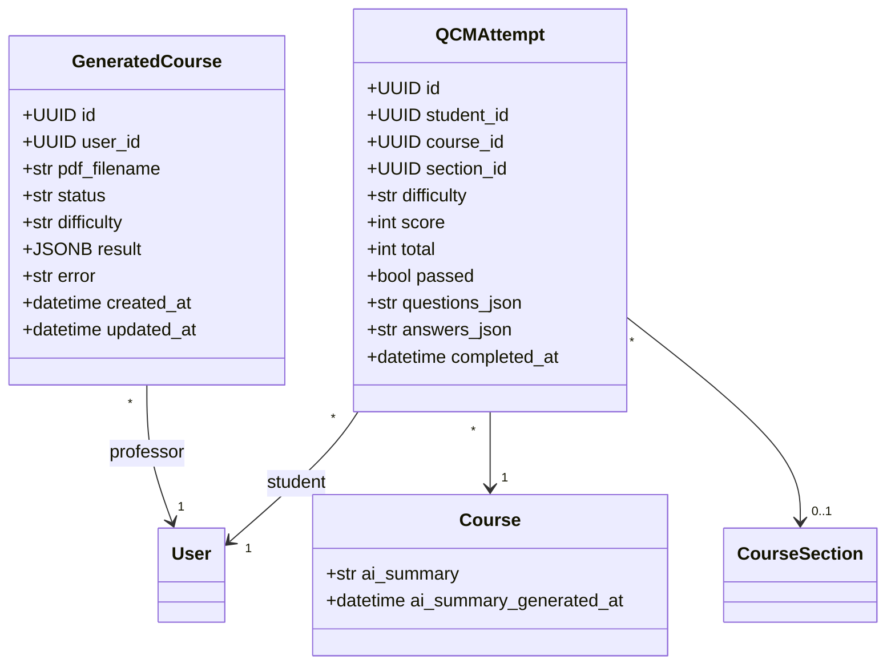
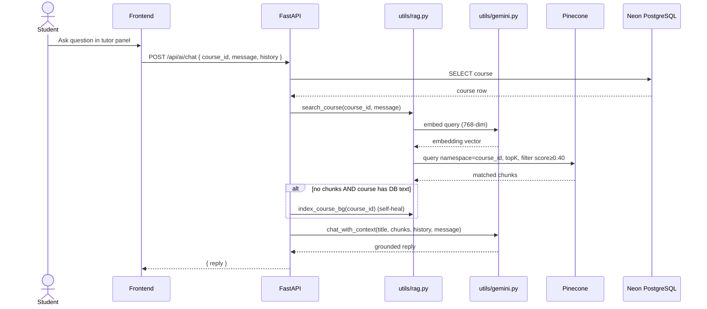
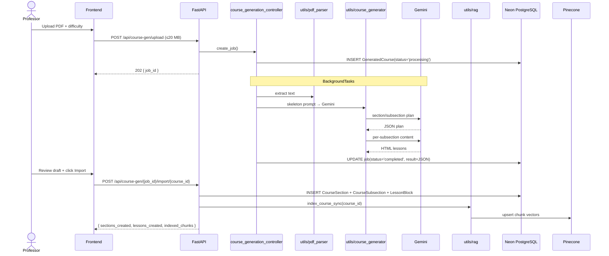

# Sprint 3 — AI-Assisted Learning

**Weeks 5–6**

## Introduction

Sprint 3 turns Hub4Learners from a static content host into an AI-grounded learning environment. Every published course is chunked, embedded with `gemini-embedding-001` (768-dim), and upserted into Pinecone. Students get a course-scoped AI tutor whose answers are RAG-grounded against those vectors, AI-generated multiple-choice quizzes per section, and on-demand markdown recaps of an entire course. Professors get a PDF-to-course pipeline that turns an uploaded PDF into a draft course skeleton they can review, edit, and import.

## Sprint Goal

> Add AI tutoring, AI-generated MCQ quizzes, and AI-assisted course creation — all grounded in the actual course content (RAG) rather than free-form LLM hallucination.

---

## User Stories

### Student — AI Tutor & Quizzes

| ID | Priority | User Story | Subtasks |
|---|---|---|---|
| US-3.1 | High | As a student, I can chat with a course-scoped AI tutor that only answers from the course content | T-3.1.1: `POST /api/ai/chat` · T-3.1.2: `search_course()` retrieves top chunks with `MIN_SCORE=0.40` · T-3.1.3: `chat_with_context()` calls `gemini-3.1-flash-lite` |
| US-3.2 | High | As a student, when a course has DB text but no Pinecone vectors, the system self-heals by reindexing in the background | T-3.2.1: `course_index_stats()` check · T-3.2.2: `index_course_bg()` kick-off · T-3.2.3: Honest "no context" reply for current message |
| US-3.3 | High | As a student, I can generate an MCQ quiz on a section at beginner / intermediate / advanced difficulty | T-3.3.1: `POST /api/ai/qcm/generate` · T-3.3.2: `qcm_controller.generate_qcm()` · T-3.3.3: Prompt Gemini with section content |
| US-3.4 | High | As a student, I can submit my QCM answers and get a score, pass/fail (≥70%), and stored attempt | T-3.4.1: `POST /api/ai/qcm/submit` · T-3.4.2: `QCMAttempt` with `score`, `total`, `passed` · T-3.4.3: Award `quiz_pass` + `quiz_perfect_bonus` XP |
| US-3.5 | Medium | As a student, I can view my QCM attempt history for a course | T-3.5.1: `GET /api/ai/qcm/history?course_id=…` · T-3.5.2: `list_attempts()` |
| US-3.6 | Medium | As a student, I can request an AI-generated markdown summary of an entire course | T-3.6.1: `POST /api/ai/course-summary/{course_id}` · T-3.6.2: `generate_course_summary()` with structured sections · T-3.6.3: Persist into `Course.ai_summary` |

### Professor — PDF → Course

| ID | Priority | User Story | Subtasks |
|---|---|---|---|
| US-3.7 | High | As a professor, I can upload a PDF (≤20 MB) and the system extracts text + generates a course skeleton in the background | T-3.7.1: `POST /api/course-gen/upload` (BackgroundTasks) · T-3.7.2: `utils/pdf_parser` + `utils/course_generator` · T-3.7.3: `GeneratedCourse` job row |
| US-3.8 | High | As a professor, I can poll the generation job to see status (`processing`/`completed`/`failed`) | T-3.8.1: `GET /api/course-gen/{job_id}` · T-3.8.2: Owner-only access guard |
| US-3.9 | Medium | As a professor, I can regenerate a single subsection at a different difficulty | T-3.9.1: `POST …/{job_id}/sections/{s}/subsections/{ss}/regenerate` · T-3.9.2: `_content_prompt()` polish-only mode |
| US-3.10 | High | As a professor, I can import the generated job into an existing course, creating real sections + subsections + text blocks | T-3.10.1: `POST /api/course-gen/{job_id}/import/{course_id}` · T-3.10.2: Append after existing `order_index` · T-3.10.3: Synchronous `index_course_sync()` after import |
| US-3.11 | Medium | As a professor, I can request a preview quiz for any generated subsection | T-3.11.1: `POST …/{job_id}/sections/{s}/subsections/{ss}/quiz` · T-3.11.2: `generate_quiz()` |

### System — RAG Pipeline

| ID | Priority | User Story | Subtasks |
|---|---|---|---|
| US-3.12 | High | As the system, when a course is published or a text block changes, content is re-chunked and upserted to Pinecone | T-3.12.1: `_chunk_text()` sentence-aware (target 1500 chars, max 2500, min 200) · T-3.12.2: `EMBED_DIM=768` Gemini embedding · T-3.12.3: `UPSERT_BATCH=100` to Pinecone |
| US-3.13 | High | As the system, AI summary generation results are deduplicated via an in-process TTL cache | T-3.13.1: `_TTLCache(max=256, ttl=6h)` · T-3.13.2: Hash-keyed by input payload |
| US-3.14 | Medium | As a professor, I can manually trigger reindex for a course | T-3.14.1: `POST /api/ai/reindex/{course_id}` · T-3.14.2: `GET /api/ai/index-status/{course_id}` |

---

## Related Diagrams

### C4 Component View — AI Domain



### Class Diagram — AI Persistence



### Sequence Diagram — AI Tutor RAG Chat



### Sequence Diagram — PDF → Course Generation & Import



### Sequence Diagram — QCM Generation, Submission & XP

```mermaid
sequenceDiagram
    actor Student
    participant Frontend
    participant FastAPI
    participant QCMCtrl as qcm_controller
    participant Gemini
    participant XP as xp_service
    participant DB as Neon PostgreSQL

    Student->>Frontend: Pick section + difficulty
    Frontend->>FastAPI: POST /api/ai/qcm/generate
    FastAPI->>QCMCtrl: generate_qcm(course_id, section_id, difficulty)
    QCMCtrl->>DB: Load section content
    QCMCtrl->>Gemini: prompt → MCQ JSON
    Gemini-->>QCMCtrl: questions[]
    QCMCtrl-->>Frontend: QCMGenerateOut

    Student->>Frontend: Submit answers
    Frontend->>FastAPI: POST /api/ai/qcm/submit
    FastAPI->>QCMCtrl: submit_qcm()
    QCMCtrl->>QCMCtrl: score = sum(correct) ; passed = score/total ≥ 70%
    QCMCtrl->>DB: INSERT QCMAttempt(questions_json, answers_json, passed)
    alt passed
        FastAPI->>XP: award_xp("quiz_pass", source_id=attempt_id)
        opt 100% score
            FastAPI->>XP: award_xp("quiz_perfect_bonus")
        end
    end
    FastAPI-->>Frontend: QCMSubmitOut
```

---

## Conclusion

Sprint 3 establishes the AI backbone of Hub4Learners. RAG retrieval is grounded — the tutor genuinely answers from the course's own text, not the model's training data — and the indexing pipeline is wired into the natural lifecycle events (text edit, publish, AI import) so professors never have to think about "making the AI ready." The PDF generator removes the highest-effort step of building a course, and the QCM loop closes the cycle by giving students automatic, content-aware assessment with XP rewards plugged into the gamification system from Sprint 4.
