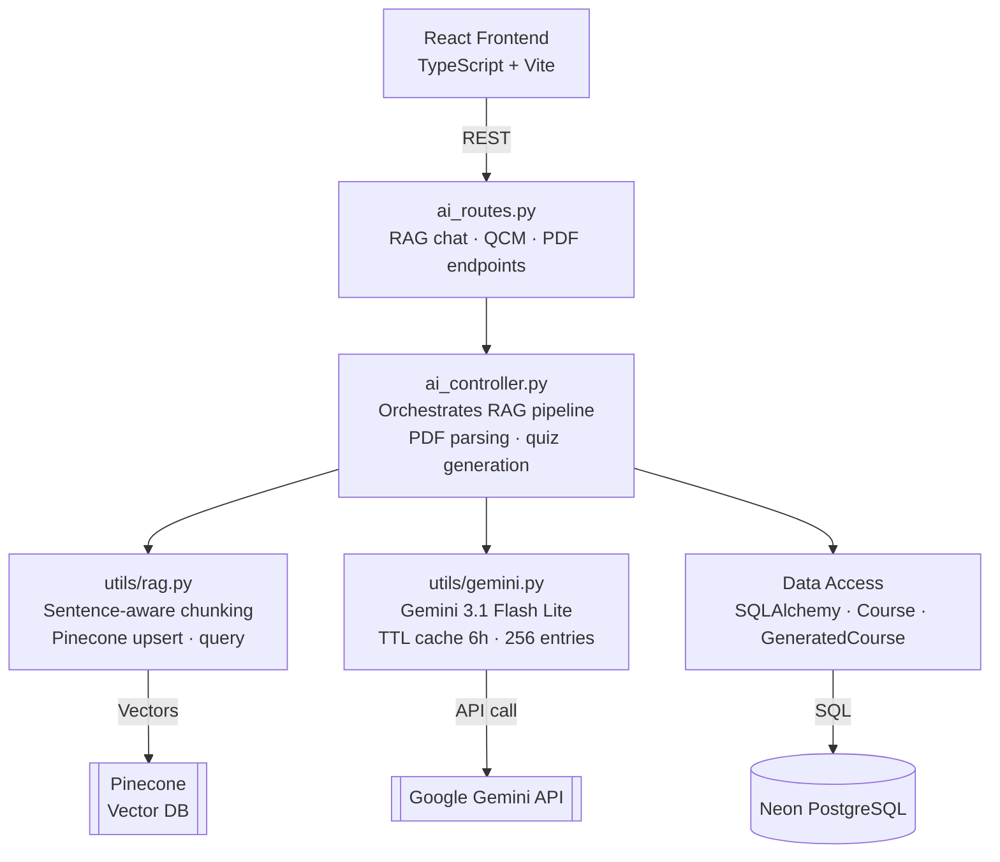
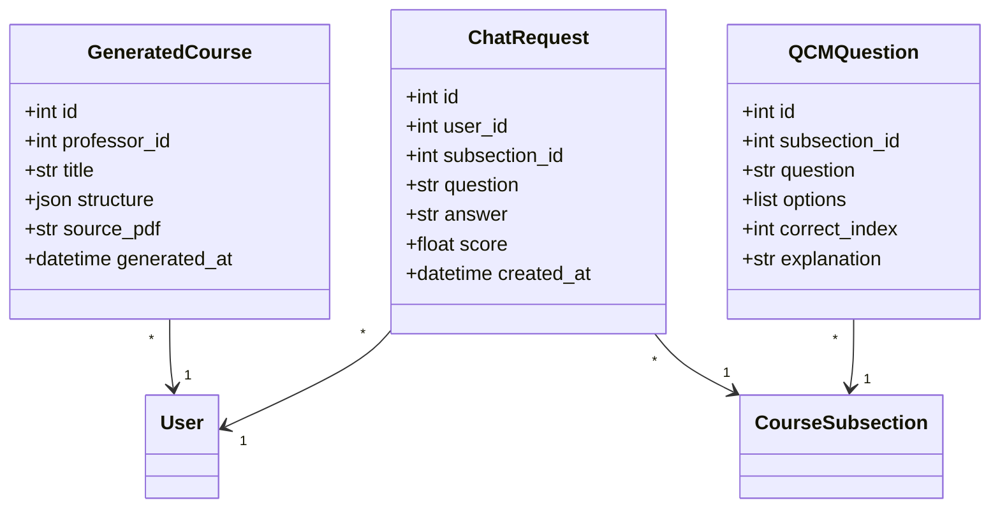
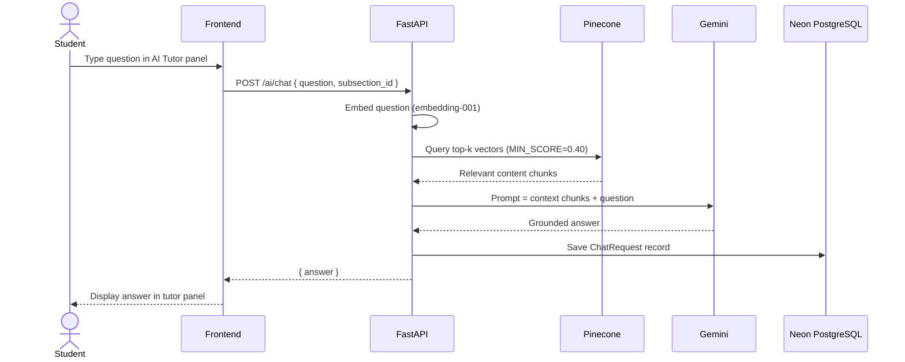
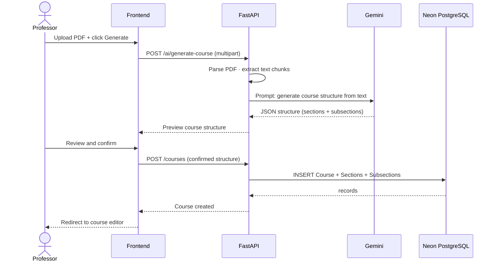

# Sprint 3 — AI Learning Features
**Weeks 5–6 | Story Points: 43**

## Introduction

Sprint 3 integrates the platform's AI capabilities, transforming passive content consumption into an interactive learning experience. Students gain access to an AI Tutor powered by a RAG pipeline (Pinecone + Gemini) that answers questions strictly grounded in course materials. Professors can generate an entire course structure from a PDF upload, and automated knowledge checks appear at the end of each lesson.

## Sprint Goal

> Integrate AI-powered learning capabilities into the platform, enabling students to interact with course content through an intelligent tutor, receive automated knowledge checks, and allowing professors to accelerate course creation through PDF-based AI generation.

---

## User Stories

### Student

| ID | Priority | User Story | Subtasks |
|---|---|---|---|
| US-19 | High | As a student, I can ask the AI Tutor questions about the current lesson and receive answers grounded in course materials | T-3.1: AI Tutor panel UI · T-3.2: POST /ai/chat · T-3.3: RAG retrieval from Pinecone · T-3.4: Gemini answer generation |
| US-20 | High | As a student, I can use suggested prompts (Summarize, Key concepts, Quiz me) to interact with the AI Tutor quickly | T-3.5: Prompt chip UI · T-3.6: Pre-fill chat input on click |
| US-21 | High | As a student, I receive AI-generated knowledge check questions at the end of each lesson | T-3.7: Knowledge check UI · T-3.8: GET /ai/qcm/{subsection_id} · T-3.9: Render QCM with scoring |
| US-22 | Medium | As a student, I can view an AI-generated summary of a discussion thread to catch up quickly | T-3.10: Summary button in discussion · T-3.11: POST /ai/summarize · T-3.12: Display summary card |

### Professor

| ID | Priority | User Story | Subtasks |
|---|---|---|---|
| US-23 | High | As a professor, I can generate a full course structure from an uploaded PDF | T-3.13: "Generate from PDF" button · T-3.14: POST /ai/generate-course · T-3.15: PDF parsing + Gemini structuring |
| US-24 | High | As a professor, I can review and edit the AI-generated course structure before saving | T-3.16: Preview/edit wizard UI · T-3.17: Confirm & save to DB |
| US-25 | Medium | As a professor, I can trigger AI generation of a quiz for any subsection | T-3.18: Generate quiz button · T-3.19: POST /ai/generate-qcm · T-3.20: Save questions to DB |

### System

| ID | Priority | User Story | Subtasks |
|---|---|---|---|
| US-26 | High | As the system, course materials are chunked, embedded, and indexed in Pinecone when uploaded | T-3.21: Sentence-aware chunker (1500 char target) · T-3.22: embedding-001 vectorisation · T-3.23: Pinecone upsert |
| US-27 | High | As the system, RAG queries retrieve only chunks above MIN_SCORE=0.40 | T-3.24: Cosine similarity filter · T-3.25: Top-k retrieval · T-3.26: Inject context into Gemini prompt |

---

## Related Diagrams

### C4 Component View — AI Learning Domain

### Class Diagram — AI Models

### Sequence Diagram — RAG Chat Flow

### Sequence Diagram — PDF Course Generation

---

## Conclusion

Sprint 3 elevated Hub4Learners from a content delivery platform to an intelligent learning environment. The RAG pipeline, built on Pinecone vector search and Google Gemini generation, ensures AI answers are accurate and course-scoped. The PDF-to-course generator significantly reduces professor onboarding time, and knowledge checks provide immediate feedback loops for students. The TTL caching layer on Gemini calls ensures performance remains consistent under load.
