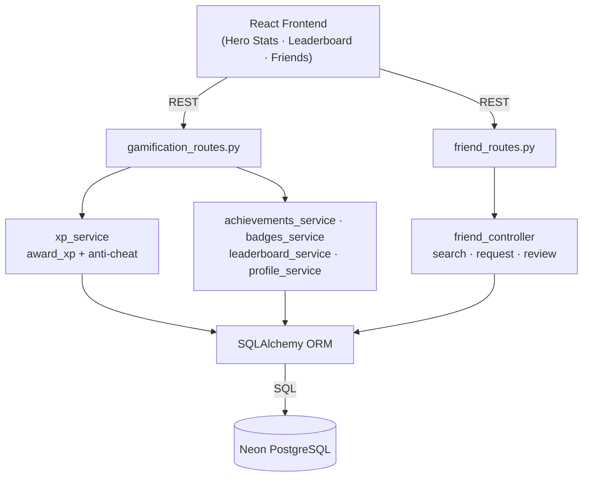
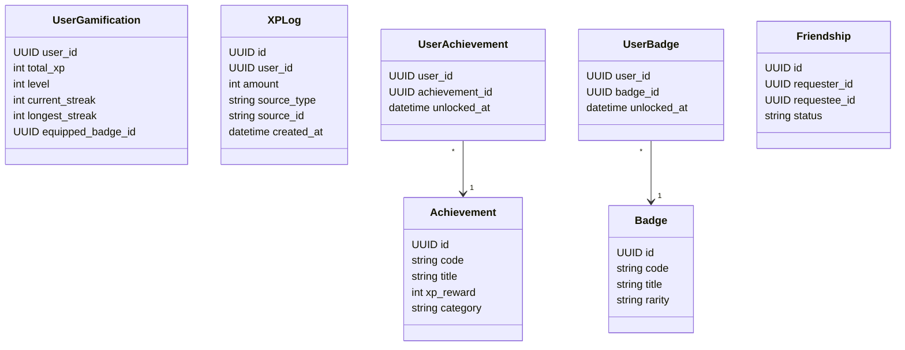
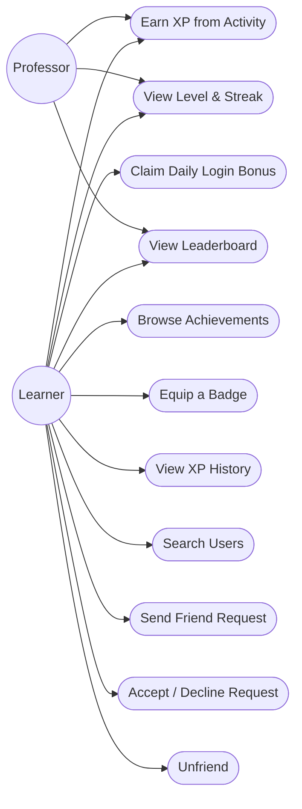
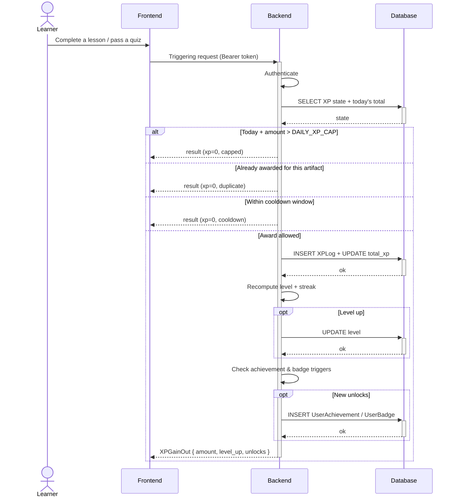
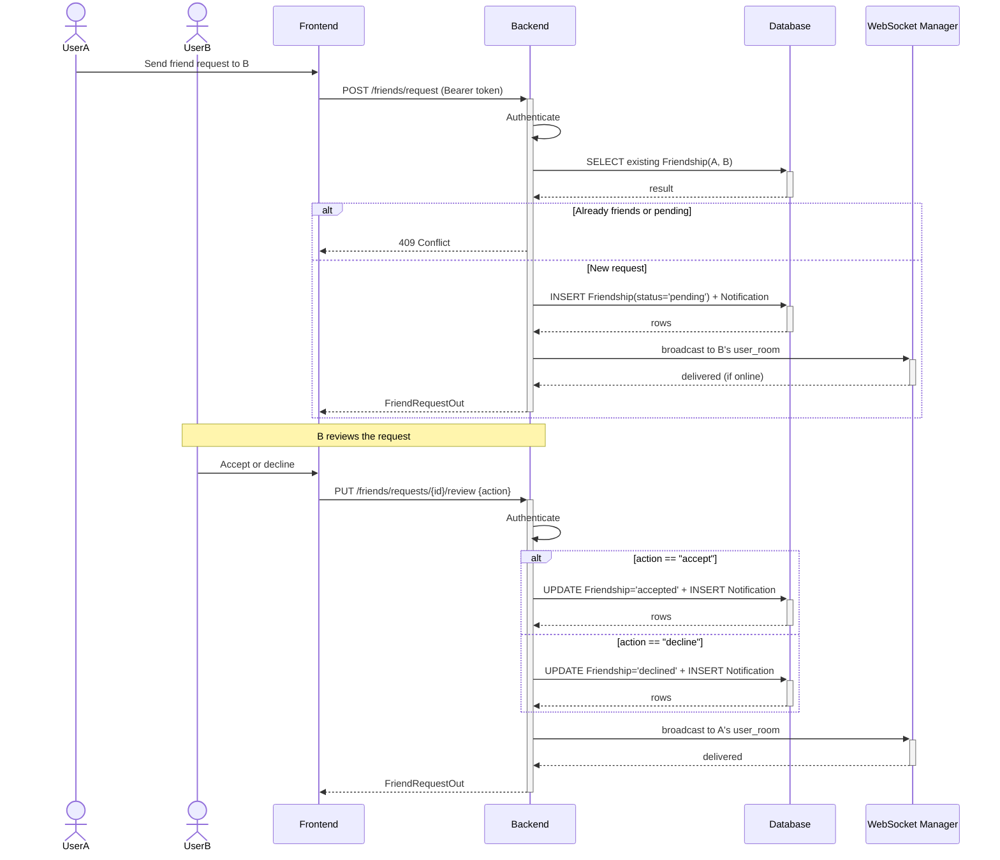

# Sprint 4 — Gamification & Social

**Weeks 7–8**

## Introduction

Sprint 4 adds the engagement layer of the platform. Learners earn XP for meaningful activity, level up, maintain daily streaks, unlock achievements and badges, and compete on leaderboards. A friend system lets users find each other, send and accept requests, and follow each other's learning journey.

## Sprint Goal

> Make learning rewarding through XP, levels, streaks, achievements and badges, while enabling social connections between users via friend requests and leaderboards.

---

## User Stories

### Gamification

| ID | Priority | Story | Subtasks |
|---|---|---|---|
| US-4.1 | High | As a learner, I earn XP for completing lessons, passing quizzes, and finishing courses | T-4.1.1: Central XP service · T-4.1.2: Anti-cheat (one-shot per item, daily cap) |
| US-4.2 | High | As a learner, I earn a daily-login bonus once per day | T-4.2.1: Daily-login endpoint · T-4.2.2: Idempotent per UTC day |
| US-4.3 | High | As a professor, I also earn XP when I publish courses, get enrollments, completions, and ratings | T-4.3.1: Professor XP sources |
| US-4.4 | High | As a learner, my XP determines my level and the UI shows progress to the next level | T-4.4.1: Level curve · T-4.4.2: XP bar component |
| US-4.5 | High | As a learner, my learning streak increases when I complete lessons on consecutive days | T-4.5.1: Streak tracking · T-4.5.2: Streak widget |
| US-4.6 | Medium | As a learner, I unlock achievements when I reach milestones (first lesson, 7-day streak, etc.) | T-4.6.1: Achievement catalog · T-4.6.2: Unlock toasts |
| US-4.7 | Medium | As a learner, I collect badges of varying rarity (common → legendary) | T-4.7.1: Badge catalog · T-4.7.2: Badge shelf |
| US-4.8 | Medium | As a learner, I can equip a badge as my profile flair | T-4.8.1: Equip endpoint |
| US-4.9 | High | As a user, I can view leaderboards for XP, streak, and completed courses | T-4.9.1: Leaderboard endpoint · T-4.9.2: Daily / Weekly / All-time tabs |
| US-4.10 | Medium | As a learner, I can see my full XP grant history | T-4.10.1: XP log endpoint · T-4.10.2: Activity feed UI |

### Social Graph

| ID | Priority | Story | Subtasks |
|---|---|---|---|
| US-4.11 | High | As a user, I can search for other users by name | T-4.11.1: Search endpoint |
| US-4.12 | High | As a user, I can send and cancel friend requests | T-4.12.1: Request endpoints |
| US-4.13 | High | As a user, I can accept or decline incoming friend requests | T-4.13.1: Review endpoint |
| US-4.14 | Medium | As a user, I can view my friends list and unfriend someone | T-4.14.1: Friends list · T-4.14.2: Unfriend action |

---

## Related Diagrams

### C4 Component View — Gamification & Social Domain

This diagram shows two sibling subsystems sharing the same database: gamification (XP service + achievements/badges/leaderboard) on one side, and the social graph (search + friend requests) on the other.

### Class Diagram — Gamification & Friendship

The class diagram covers the seven entities introduced by this sprint: per-user gamification state, the XP audit log, the achievement and badge catalogs with their unlock join tables, and the friendship record that powers the social graph.

### Use Case Diagram — Gamification & Social

The use case diagram maps the gamification and social actions available to learners (XP, levels, streaks, achievements, badges, leaderboards, friend graph) and the subset that also applies to professors who participate in XP and leaderboards as content authors.

### Sequence Diagram — Earning XP

This sequence walks through the central `award_xp` choke point that every grant flows through, showing the three guardrails — daily cap, one-shot artifact check, source cooldown — and the cascade that happens on a successful award: level recompute, streak update, and achievement/badge unlock checks.

### Sequence Diagram — Friend Request Lifecycle

This diagram traces both sides of a friend request — sender and recipient — including the duplicate-request guard, the accept/decline branches, and the live WebSocket notifications that keep both users informed without polling.

---

## Sprint Review

| Topic | Outcome |
|---|---|
| Review | Demonstrated the full gamification loop (XP, levels, streaks, achievements, badges, leaderboards) for both learners and professors, plus the friend graph with search, requests and unfriend. All user stories met their Definition of Done. |
| Went well | Centralising every grant through a single `award_xp` function with one-shot, cooldown and daily-cap guards made the XP economy trustworthy from day one and kept the audit log clean. |
| To improve | The achievement and badge unlock rules are still hard-coded inside the service. Externalising them into the database (or a config file) would make tuning and adding new achievements easier without code changes. |

---

## Conclusion

Sprint 4 closes the engagement loop. Every learning action gives meaningful feedback through XP, levels, streaks and unlocks, and the friend graph turns Hub4Learners into a social space where learners can motivate each other. The anti-cheat layer keeps progression fair and the data trustworthy.
