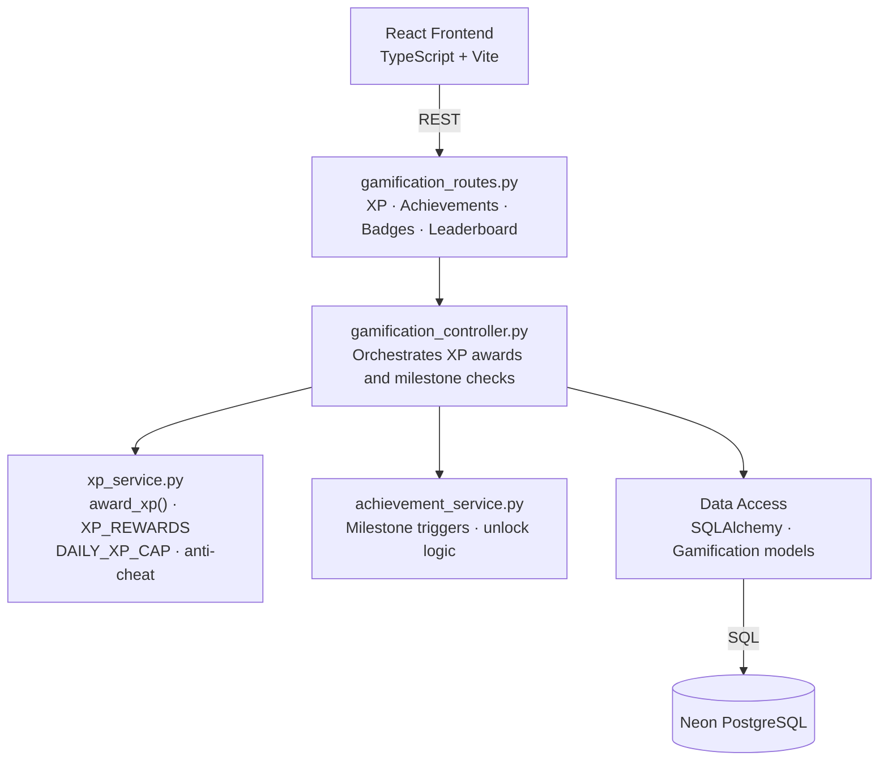
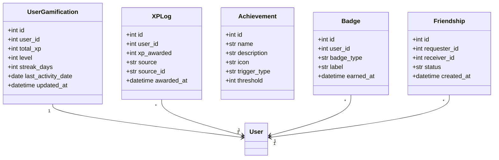
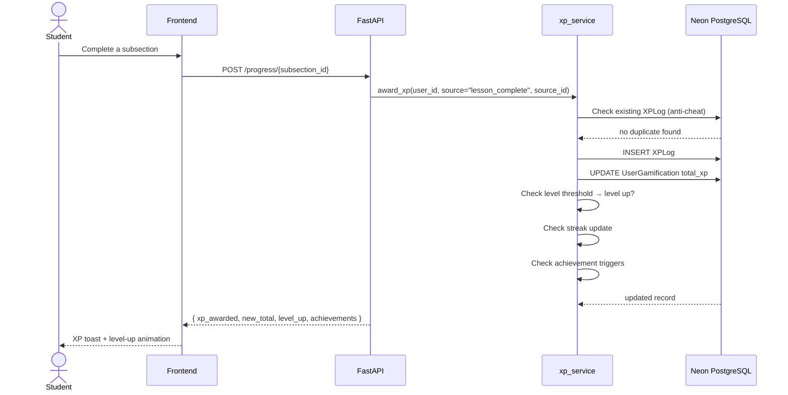
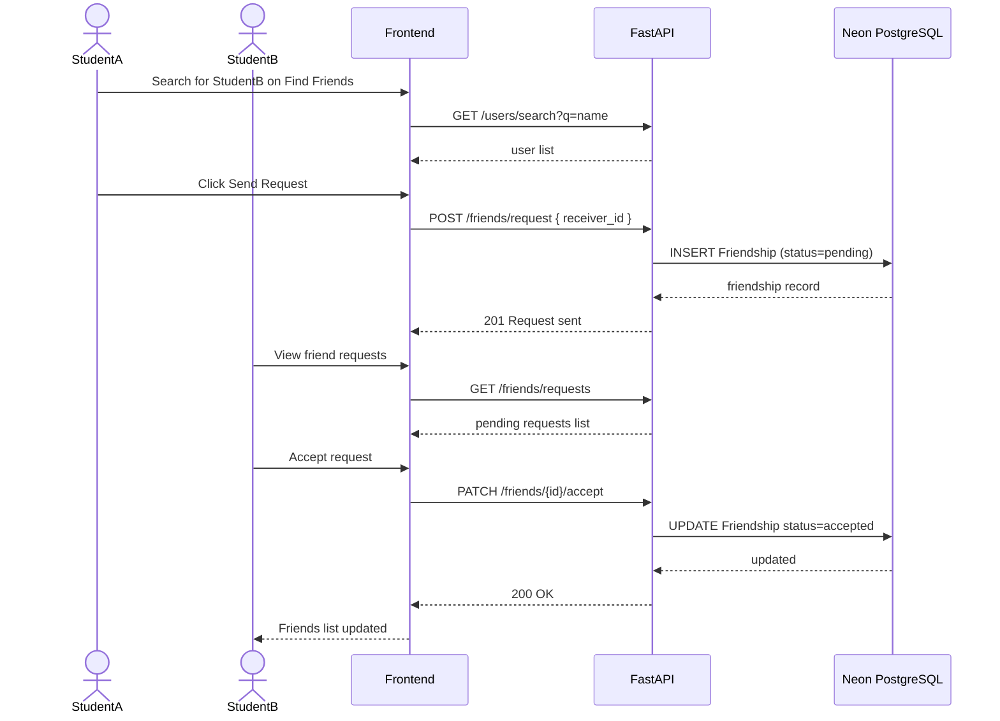

# Sprint 4 — Gamification & Social
**Weeks 7–8 | Story Points: 38**

## Introduction

Sprint 4 introduces the gamification engine and social features that drive long-term student engagement. Students earn XP for learning activities, level up, maintain daily streaks, unlock achievements and badges, and compete on leaderboards. A friend system allows users to connect with peers and follow each other's progress.

## Sprint Goal

> Make learning intrinsically motivating by rewarding students with XP, levels, streaks, badges, and achievements, while enabling social connections through a friend system and leaderboards.

---

## User Stories

### Gamification

| ID | Priority | User Story | Subtasks |
|---|---|---|---|
| US-28 | High | As a student, I earn XP for completing lessons, logging in daily, finishing courses, and other learning activities | T-4.1: award_xp() service · T-4.2: XP_REWARDS dict · T-4.3: DAILY_XP_CAP=5000 · T-4.4: Anti-cheat via source_id |
| US-29 | High | As a student, my XP accumulates and determines my level on the platform | T-4.5: Level thresholds · T-4.6: Level-up detection · T-4.7: Display level badge in profile |
| US-30 | High | As a student, I maintain a daily login streak that resets if I miss a day | T-4.8: Streak tracking logic · T-4.9: Streak display in dashboard · T-4.10: Streak freeze item |
| US-31 | Medium | As a student, I can view my XP history and activity log | T-4.11: XPLog model · T-4.12: GET /gamification/xp-log · T-4.13: Activity timeline UI |
| US-32 | Medium | As a student, I unlock achievements based on milestones (first course, 7-day streak, etc.) | T-4.14: Achievement triggers · T-4.15: Achievement unlock notification · T-4.16: Achievement list UI |
| US-33 | Medium | As a student, I collect badges awarded for specific accomplishments | T-4.17: Badge model · T-4.18: Badge award logic · T-4.19: Badge shelf in profile |
| US-34 | Medium | As a student, I can view a leaderboard ranking students by XP within my university | T-4.20: GET /gamification/leaderboard · T-4.21: Leaderboard UI with rank, avatar, XP |

### Social

| ID | Priority | User Story | Subtasks |
|---|---|---|---|
| US-35 | Medium | As a student, I can send and accept friend requests | T-4.22: Friend request model · T-4.23: POST /friends/request · T-4.24: PATCH /friends/{id}/accept |
| US-36 | Low | As a student, I can view my friends list and their learning stats | T-4.25: Friends list UI · T-4.26: GET /friends/me · T-4.27: Display friend XP and level |
| US-37 | Low | As a student, I can find other students by name or university | T-4.28: Find Friends page · T-4.29: GET /users/search · T-4.30: Send request from results |

---

## Related Diagrams

### C4 Component View — Gamification Domain

### Class Diagram — Gamification Models

### Sequence Diagram — XP Award Flow

### Sequence Diagram — Friend Request Flow

---

## Conclusion

Sprint 4 transformed Hub4Learners from a course platform into a motivating learning ecosystem. The XP engine with daily caps and anti-cheat source tracking ensures fair progression, while achievements and badges create memorable milestones. The leaderboard and friend system introduce a social dimension that encourages peer accountability. Together, these features significantly increase daily active usage and course completion rates.
