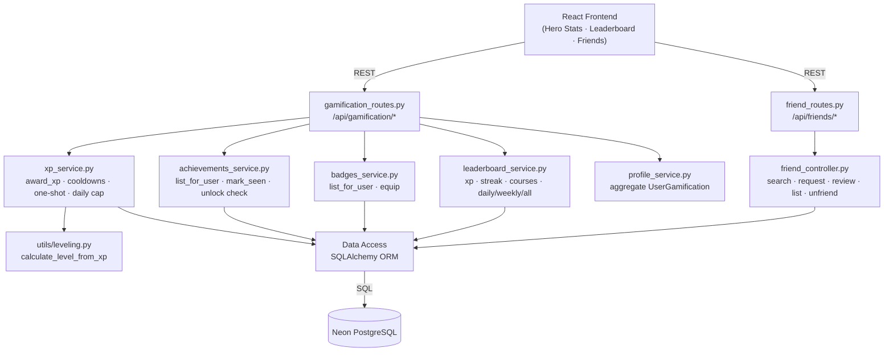
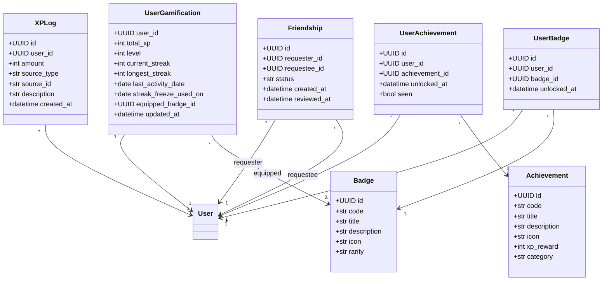
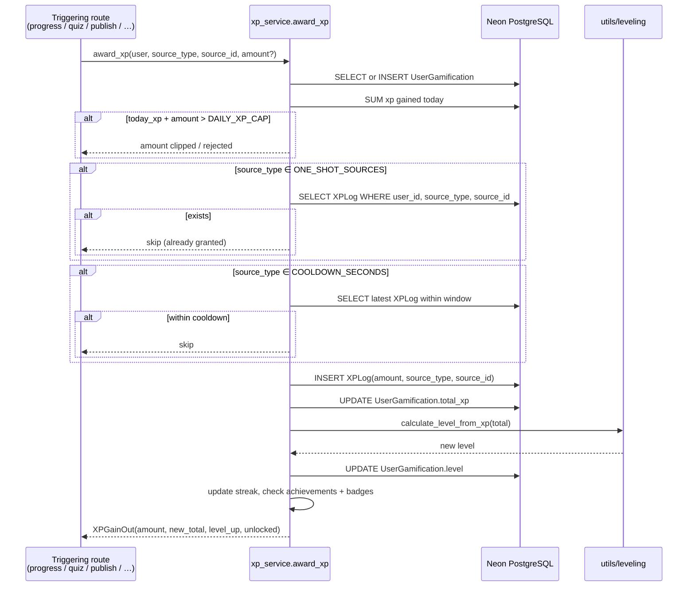
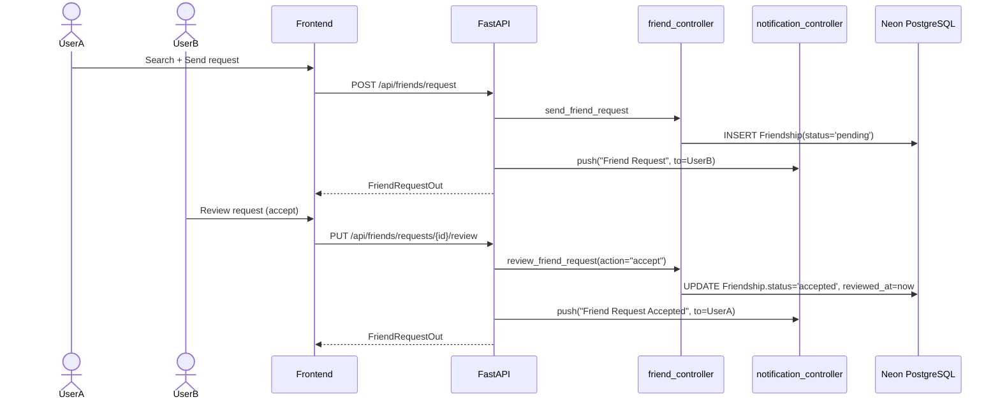

# Sprint 4 — Gamification & Engagement

**Weeks 7–8**

## Introduction

Sprint 4 adds the engagement engine on top of the learning loop built in Sprints 2–3. Every meaningful action — completing a lesson, passing a quiz, publishing a course, having a student finish your course, receiving a 5-star rating — flows through a single `award_xp()` choke point with anti-cheat guards (one-shot artifacts, cooldown windows, a 5 000-XP daily cap). XP feeds level progression, learning streaks, an achievement catalog, an unlockable/equippable badge collection, and three leaderboards (XP, streak, courses).

## Sprint Goal

> Reward both learners and professors for real, verifiable activity through XP, levels, streaks, achievements, badges, and leaderboards — backed by a tamper-resistant grant pipeline.

---

## User Stories

### Student & Professor — Earning XP

| ID | Priority | User Story | Subtasks |
|---|---|---|---|
| US-4.1 | High | As a learner, I earn XP for completing a lesson (25), passing a quiz (50, +25 perfect), completing a course (250), and watching a video (15) | T-4.1.1: `XP_REWARDS` map in `xp_service.py` · T-4.1.2: `ONE_SHOT_SOURCES` set · T-4.1.3: `source_id` keys per artifact |
| US-4.2 | High | As a learner, I can claim daily-login XP once per UTC day | T-4.2.1: `POST /api/gamification/daily-login` · T-4.2.2: `source_id = login-{user}-{YYYY-MM-DD}` · T-4.2.3: 12-hour cooldown |
| US-4.3 | High | As a professor, I earn XP when I publish a course (150), when a student enrolls (15), completes (100), or rates (25 + 40 bonus on 5⭐) | T-4.3.1: Professor entries in `XP_REWARDS` · T-4.3.2: Composite `source_id` like `{course_id}:{student_id}` |
| US-4.4 | High | As the system, the same artifact cannot grant XP twice and source-type cooldowns block automation | T-4.4.1: `ONE_SHOT_SOURCES` exact-match check · T-4.4.2: `COOLDOWN_SECONDS` window query on `XPLog` · T-4.4.3: `DAILY_XP_CAP=5000` daily ceiling |

### Levels, Streaks, Achievements & Badges

| ID | Priority | User Story | Subtasks |
|---|---|---|---|
| US-4.5 | High | As a learner, my XP total drives my level via `calculate_level_from_xp()` and the UI shows progress to the next level | T-4.5.1: `utils/leveling.py` curve · T-4.5.2: `UserGamification.level` recomputed on every award · T-4.5.3: Level-up returned in `XPGainOut` |
| US-4.6 | High | As a learner, my current and longest learning streaks update when I complete a lesson on a new UTC day | T-4.6.1: `last_activity_date` comparison · T-4.6.2: Increment `current_streak` if consecutive, reset otherwise · T-4.6.3: Bump `longest_streak` |
| US-4.7 | Medium | As a learner, I unlock seeded achievements when I cross their thresholds, and the UI marks them as "unseen" until I view them | T-4.7.1: `Achievement` catalog seeded on startup · T-4.7.2: `UserAchievement(seen=false)` · T-4.7.3: `POST /api/gamification/achievements/seen` |
| US-4.8 | Medium | As a learner, I can browse my badge collection and equip one as my profile flair | T-4.8.1: `GET /api/gamification/badges` · T-4.8.2: `POST /api/gamification/badges/equip` · T-4.8.3: `UserGamification.equipped_badge_id` |
| US-4.9 | High | As a learner, I can view three leaderboards (XP, streak, courses) with daily / weekly / all-time periods | T-4.9.1: `GET /api/gamification/leaderboard?metric=&period=` · T-4.9.2: Pagination (`page`, `page_size`) · T-4.9.3: Highlight "me" row |
| US-4.10 | Medium | As a learner, I can see my full XP grant history | T-4.10.1: `GET /api/gamification/xp/logs?limit=…` · T-4.10.2: Activity feed UI |
| US-4.11 | Medium | As a learner, I can view another user's public gamification profile | T-4.11.1: `GET /api/gamification/profile/{user_id}` · T-4.11.2: Total XP · level · streak · equipped badge |

### Social Graph

| ID | Priority | User Story | Subtasks |
|---|---|---|---|
| US-4.12 | High | As a user, I can search for other users by name | T-4.12.1: `GET /api/friends/search?q=` · T-4.12.2: Exclude self + existing friends |
| US-4.13 | High | As a user, I can send, accept, decline, and cancel friend requests | T-4.13.1: `POST /api/friends/request` · T-4.13.2: `PUT …/{id}/review` · T-4.13.3: `Friendship.status` lifecycle |
| US-4.14 | Medium | As a user, I can list my accepted friends and unfriend someone | T-4.14.1: `GET /api/friends/list` · T-4.14.2: `DELETE /api/friends/{friendship_id}` |

---

## Related Diagrams

### C4 Component View — Gamification & Social Domain

### Class Diagram — Gamification & Social Entities

### Sequence Diagram — `award_xp()` with Anti-Cheat

### Sequence Diagram — Friend Request Lifecycle

---

## Conclusion

Sprint 4 closes the engagement loop. Every learner and professor action funnels through a single `award_xp()` function whose anti-cheat behaviour (one-shot per artifact, cooldown windows, daily cap, full audit log in `xp_logs`) makes XP — and therefore levels, streaks, leaderboards, and unlocks — trustworthy. The friend graph built alongside is the social substrate that Sprint 5's direct-messaging and discussion features will sit on top of.
