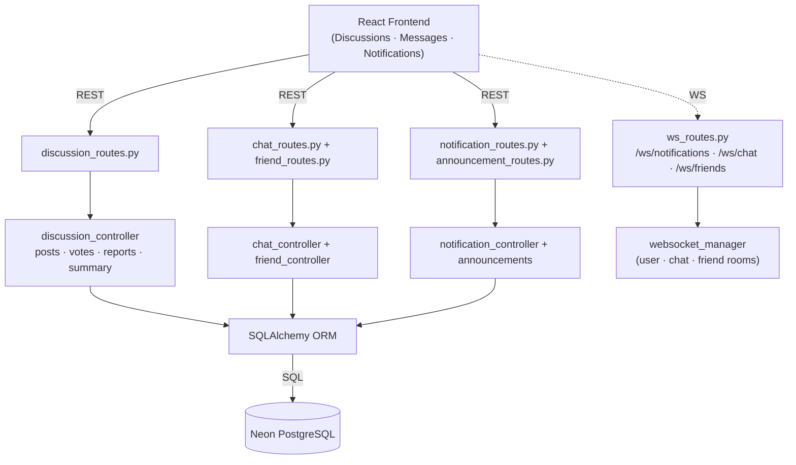
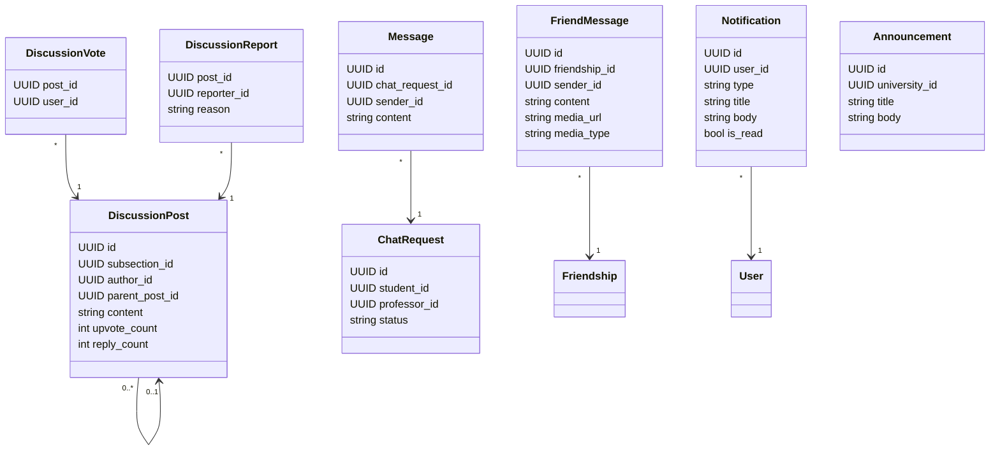
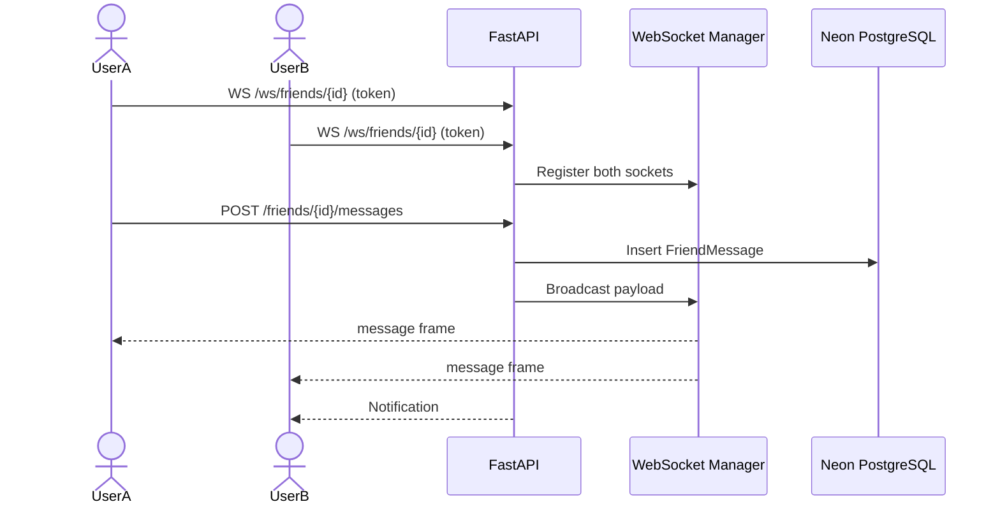
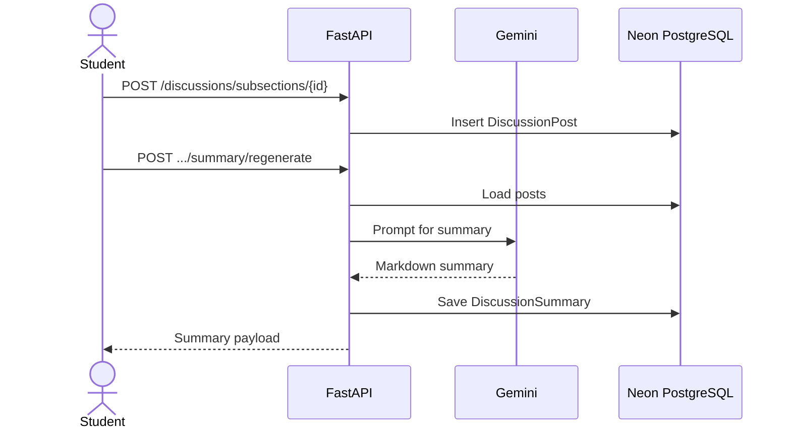

# Sprint 5 — Communication & Community

**Weeks 9–10**

## Introduction

Sprint 5 turns Hub4Learners into a place where learners and professors actually interact. Three communication channels ship in parallel: lesson-level discussion threads with votes and reports, real-time friend messaging with text and media, and a student-to-professor chat-request flow. A unified notification system keeps every important event visible across the app.

## Sprint Goal

> Enable real-time communication across the platform through discussions, friend messaging, professor chat requests, and live notifications.

---

## User Stories

### Discussions

| ID | Priority | Story | Subtasks |
|---|---|---|---|
| US-5.1 | High | As a user, I can post a discussion message on a specific lesson | T-5.1.1: Post endpoint · T-5.1.2: Thread UI |
| US-5.2 | High | As a user, I can reply to a post and create a nested thread | T-5.2.1: Reply endpoint |
| US-5.3 | Medium | As a user, I can upvote posts (one vote per user) | T-5.3.1: Toggle vote endpoint |
| US-5.4 | Medium | As a user, I can report inappropriate posts | T-5.4.1: Report endpoint |
| US-5.5 | Medium | As a user, I can request an AI-generated summary of a long thread | T-5.5.1: Summary endpoint · T-5.5.2: Cached summary |
| US-5.6 | Medium | As an author, I can edit my own post; admins can soft-delete any post | T-5.6.1: Edit / delete endpoints |

### Friend Messaging

| ID | Priority | Story | Subtasks |
|---|---|---|---|
| US-5.7 | High | As a user, I can chat with my friends in real time | T-5.7.1: Message endpoint · T-5.7.2: WebSocket broadcast |
| US-5.8 | Medium | As a user, I can send images or files as attachments | T-5.8.1: Media upload · T-5.8.2: Inline preview |
| US-5.9 | Medium | As a user, I can view my full message history with a friend | T-5.9.1: History endpoint |

### Professor Chat Requests

| ID | Priority | Story | Subtasks |
|---|---|---|---|
| US-5.10 | High | As a student, I can send a chat request to a professor | T-5.10.1: Request endpoint |
| US-5.11 | High | As a professor, I can accept or refuse chat requests | T-5.11.1: Review endpoint |
| US-5.12 | Medium | As a professor, I can toggle auto-refuse to decline new requests automatically | T-5.12.1: Auto-refuse setting |
| US-5.13 | High | As both sides, once accepted I can exchange messages in real time | T-5.13.1: Chat room WebSocket · T-5.13.2: Message persistence |

### Notifications & Announcements

| ID | Priority | Story | Subtasks |
|---|---|---|---|
| US-5.14 | High | As a user, I receive live notifications for relevant events (messages, requests, enrollments, role changes) | T-5.14.1: Notification push · T-5.14.2: Bell + unread badge |
| US-5.15 | Medium | As a user, I can mark notifications as read or clear them all | T-5.15.1: Read / clear endpoints |
| US-5.16 | Medium | As a university admin, I can post an announcement that fans out to my university | T-5.16.1: Announcement endpoint · T-5.16.2: Recipient fan-out |

---

## Related Diagrams

### C4 Component View — Communication Domain

### Class Diagram — Communication Entities

### Sequence Diagram — Real-Time Friend Messaging

### Sequence Diagram — Discussion Post & AI Summary

---

## Conclusion

Sprint 5 turns the platform into a community. WebSocket-driven messaging keeps conversations alive in real time, discussions add a learning-focused forum to each lesson, and the unified notification system makes sure no important event is missed. With Sprint 6 left, only monetisation and administration remain.
