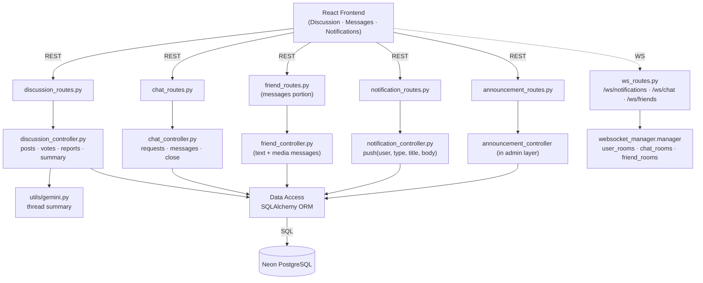
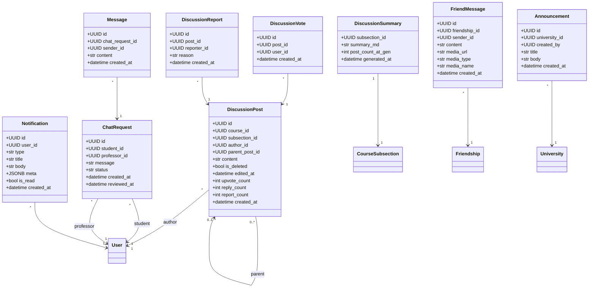
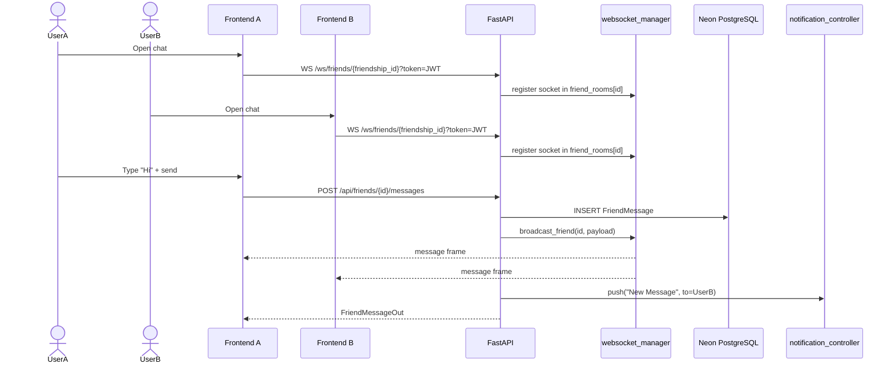
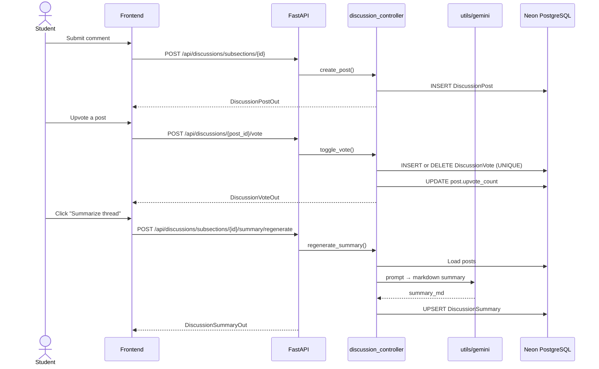
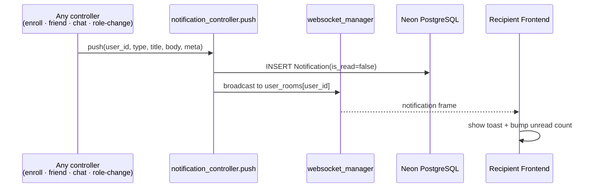

# Sprint 5 — Communication & Community

**Weeks 9–10**

## Introduction

Sprint 5 turns Hub4Learners into a place where learners and professors actually talk. Three communication surfaces ship in parallel: per-subsection discussion threads with votes, reports, and AI-summaries; one-on-one friend chat over WebSockets with text and media attachments; and a student-to-professor chat-request flow with a professor-side `auto_refuse` toggle. Everything pushes real-time notifications through a JWT-secured WebSocket layer with three room types (notifications / chat / friends).

## Sprint Goal

> Ship the real-time communication stack — friend DM, professor office-hours chat, lesson discussions — and the notification system that keeps every conversation visible across the app.

---

## User Stories

### Lesson Discussions

| ID | Priority | User Story | Subtasks |
|---|---|---|---|
| US-5.1 | High | As a student or professor, I can post a top-level discussion message on a subsection | T-5.1.1: `POST /api/discussions/subsections/{id}` · T-5.1.2: Insert `DiscussionPost(parent_post_id=null)` · T-5.1.3: Increment counters |
| US-5.2 | High | As a user, I can reply to any post, creating a nested thread | T-5.2.1: `POST /api/discussions/{post_id}/replies` · T-5.2.2: Resolve `subsection_id` from parent · T-5.2.3: Increment parent `reply_count` |
| US-5.3 | High | As a user, I can sort the thread list by `relevant`, `top`, `new`, or `old` | T-5.3.1: `GET /api/discussions/subsections/{id}?sort=…` · T-5.3.2: Ranking SQL per mode |
| US-5.4 | High | As a user, I can toggle an upvote on a post (one vote per user) | T-5.4.1: `POST /api/discussions/{post_id}/vote` · T-5.4.2: `DiscussionVote` with `UNIQUE(post_id,user_id)` · T-5.4.3: Maintain `upvote_count` on post |
| US-5.5 | Medium | As a user, I can report a post for review | T-5.5.1: `POST /api/discussions/{post_id}/report` · T-5.5.2: `DiscussionReport(reason)` with `UNIQUE(post_id,reporter_id)` · T-5.5.3: Increment `report_count` |
| US-5.6 | Medium | As the author, I can edit my own post; admins can delete any post (soft-delete) | T-5.6.1: `PATCH /api/discussions/{post_id}` (sets `edited_at`) · T-5.6.2: `DELETE /api/discussions/{post_id}` flips `is_deleted=true` |
| US-5.7 | Medium | As a user, I can request an AI summary of a subsection's discussion | T-5.7.1: `GET /api/discussions/subsections/{id}/summary` · T-5.7.2: `POST …/summary/regenerate` · T-5.7.3: Persist `DiscussionSummary(summary_md, post_count_at_gen)` |

### Friend Chat (DM)

| ID | Priority | User Story | Subtasks |
|---|---|---|---|
| US-5.8 | High | As a user, I can send a text message to a friend (after the friendship is accepted) | T-5.8.1: `POST /api/friends/{friendship_id}/messages` · T-5.8.2: `FriendMessage(content)` insert · T-5.8.3: Broadcast over WebSocket |
| US-5.9 | High | As a user, I can send an image or file (≤size limit) attachment | T-5.9.1: `POST …/messages/media` (multipart) · T-5.9.2: Save to `/uploads` · T-5.9.3: Set `media_type ∈ {image,file}` |
| US-5.10 | High | As a user, my chat updates live across all my open tabs without polling | T-5.10.1: `WS /ws/friends/{friendship_id}?token=…` · T-5.10.2: JWT decode on accept · T-5.10.3: `manager.broadcast_friend()` |
| US-5.11 | Medium | As a user, I can load full message history with a friend | T-5.11.1: `GET /api/friends/{friendship_id}/messages` · T-5.11.2: Order by `created_at ASC` |

### Student ↔ Professor Chat Requests

| ID | Priority | User Story | Subtasks |
|---|---|---|---|
| US-5.12 | High | As a student, I can request a chat with a professor by sending a short message | T-5.12.1: `POST /api/chat/request` · T-5.12.2: `ChatRequest(status='pending')` |
| US-5.13 | High | As a professor, I can see incoming chat requests and accept or refuse them | T-5.13.1: `GET /api/chat/incoming` · T-5.13.2: `PUT /api/chat/requests/{id}/review` (action: accept/refuse) |
| US-5.14 | Medium | As a professor, I can toggle `auto_refuse_chat` so new requests are auto-declined | T-5.14.1: `GET/PUT /api/chat/auto-refuse` · T-5.14.2: `User.auto_refuse_chat` boolean |
| US-5.15 | High | Once accepted, both sides exchange messages in real time over a chat-room WebSocket | T-5.15.1: `POST /api/chat/requests/{id}/messages` · T-5.15.2: `WS /ws/chat/{request_id}` · T-5.15.3: `manager.broadcast_chat()` |
| US-5.16 | Medium | As a professor, I can close a chat room when the conversation is done | T-5.16.1: `PUT /api/chat/requests/{id}/close` · T-5.16.2: Status transition `accepted → closed` |

### Notifications & Announcements

| ID | Priority | User Story | Subtasks |
|---|---|---|---|
| US-5.17 | High | As a user, I receive a real-time notification toast for enrollments, chat requests, friend events, messages, and role changes | T-5.17.1: `notification_controller.push()` · T-5.17.2: `Notification(type,title,body,meta)` insert · T-5.17.3: `WS /ws/notifications/{user_id}` broadcast |
| US-5.18 | Medium | As a user, I can list my notifications and mark them as read | T-5.18.1: `GET /api/notifications` · T-5.18.2: `PATCH /api/notifications/{id}/read` · T-5.18.3: Unread badge in header |
| US-5.19 | Medium | As a university_admin, I can post an announcement scoped to my university | T-5.19.1: `POST /api/announcements` (university-scoped) · T-5.19.2: `Announcement(university_id, created_by, title, body)` |
| US-5.20 | Medium | As a user, I see announcements for my university on my dashboard | T-5.20.1: `GET /api/announcements` filtered by `User.university_id` |

---

## Related Diagrams

### C4 Component View — Communication Domain

### Class Diagram — Communication Entities

### Sequence Diagram — Real-Time Friend Chat over WebSocket

### Sequence Diagram — Discussion Post + Vote + AI Summary

### Sequence Diagram — Notification Push over WebSocket

---

## Conclusion

Sprint 5 ships three independent but consistent communication surfaces — threaded lesson discussions, friend DMs, and student/professor chat requests — all driven by the same JWT-authenticated WebSocket manager and unified notification pipeline. The discussion module reuses Gemini from Sprint 3 to summarise long threads, and the `auto_refuse_chat` toggle gives professors a polite escape hatch when they are overloaded. By the end of this sprint Hub4Learners is not just a course platform but a living community.
