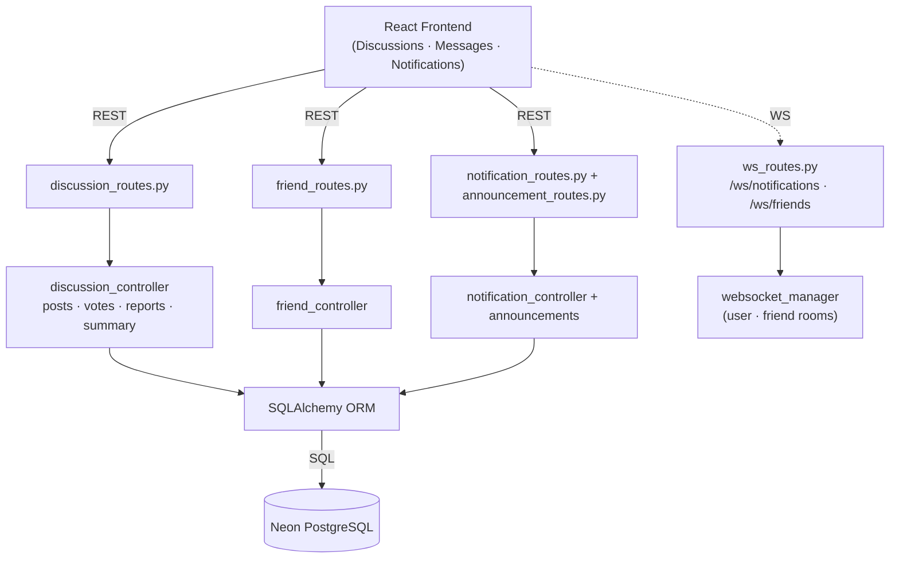
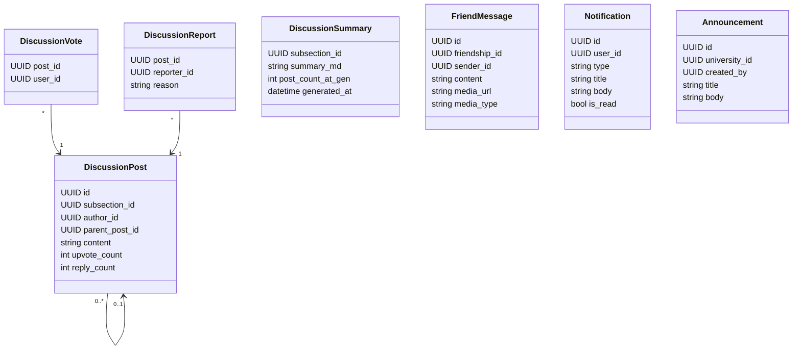
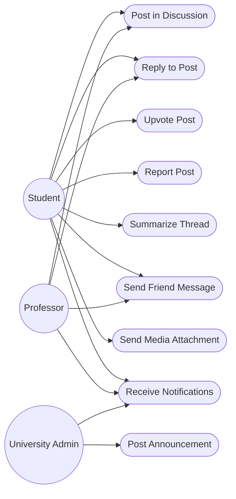
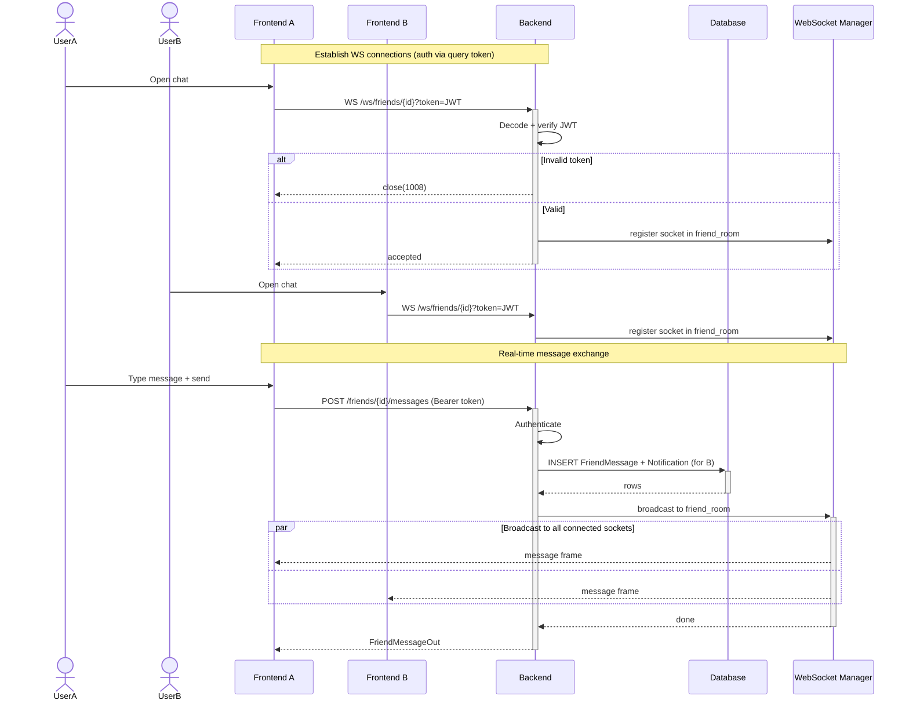
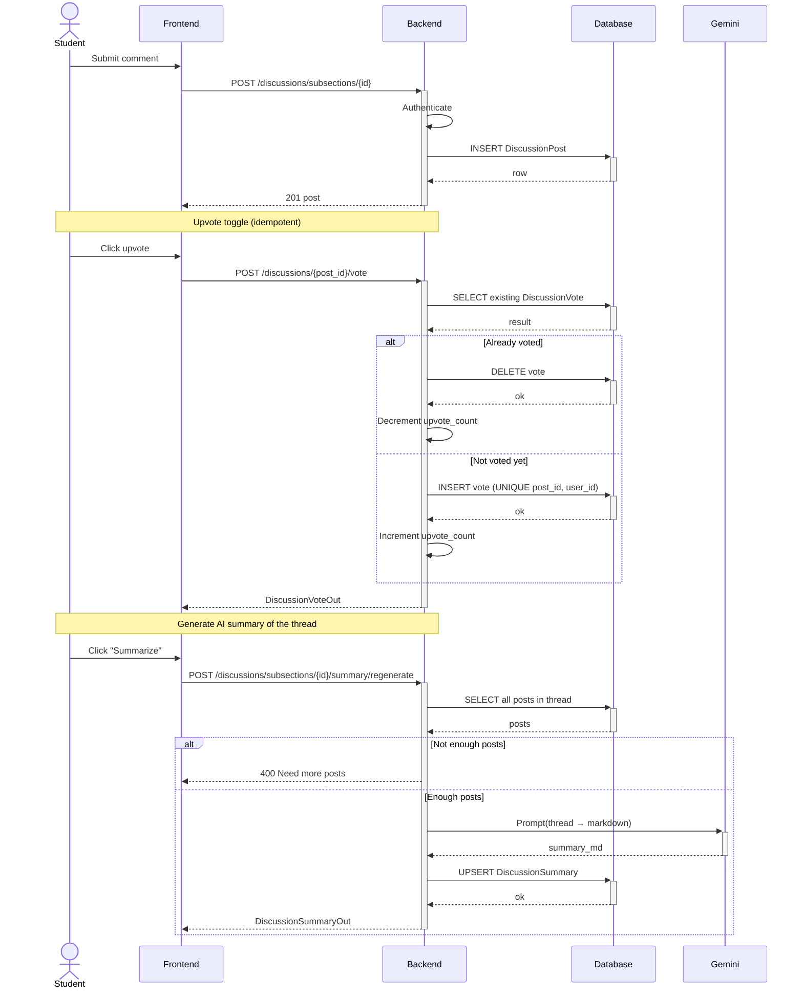

# Sprint 5 — Communication & Community

**Weeks 9–10**

## Introduction

Sprint 5 turns Hub4Learners into a place where learners and professors actually interact. Two communication channels ship in parallel: lesson-level discussion threads with votes and reports, and real-time friend messaging with text and media. A unified notification system keeps every important event visible across the app, and university admins can broadcast announcements to their entire institution.

## Sprint Goal

> Enable real-time communication across the platform through discussions, friend messaging, live notifications, and university announcements.

---

## User Stories

### Discussions

| ID | Priority | Story | Subtasks |
|---|---|---|---|
| US-5.1 | High | As a user, I can post a discussion message on a specific lesson | T-5.1.1: Post endpoint · T-5.1.2: Thread UI |
| US-5.2 | High | As a user, I can reply to a post and create a nested thread | T-5.2.1: Reply endpoint |
| US-5.3 | Medium | As a user, I can upvote posts (one vote per user) | T-5.3.1: Toggle vote endpoint |
| US-5.4 | Medium | As a user, I can report inappropriate posts | T-5.4.1: Report endpoint |
| US-5.5 | Medium | As a user, I can request an AI-generated summary of a long thread | T-5.5.1: Summary endpoint · T-5.5.2: Cached summary |
| US-5.6 | Medium | As an author, I can edit my own post; admins can soft-delete any post | T-5.6.1: Edit / delete endpoints |

### Friend Messaging

| ID | Priority | Story | Subtasks |
|---|---|---|---|
| US-5.7 | High | As a user, I can chat with my friends in real time | T-5.7.1: Message endpoint · T-5.7.2: WebSocket broadcast |
| US-5.8 | Medium | As a user, I can send images or files as attachments | T-5.8.1: Media upload · T-5.8.2: Inline preview |
| US-5.9 | Medium | As a user, I can view my full message history with a friend | T-5.9.1: History endpoint |

### Notifications & Announcements

| ID | Priority | Story | Subtasks |
|---|---|---|---|
| US-5.10 | High | As a user, I receive live notifications for relevant events (friend requests, messages, enrollments, role changes) | T-5.10.1: Notification push · T-5.10.2: Bell + unread badge |
| US-5.11 | Medium | As a user, I can mark notifications as read or clear them all | T-5.11.1: Read / clear endpoints |
| US-5.12 | Medium | As a university admin, I can post an announcement that fans out to my university | T-5.12.1: Announcement endpoint · T-5.12.2: Recipient fan-out |

---

## Related Diagrams

### C4 Component View — Communication Domain

This diagram shows the three parallel communication subsystems — discussions, friend messages, and notifications/announcements — all served by the same FastAPI backend and reusing a single WebSocket manager for real-time delivery across two room types.

### Class Diagram — Communication Entities

The class diagram covers the entities introduced by this sprint: discussion posts with their associated votes, reports and summary, friend messages, and the unified Notification and Announcement records.

### Use Case Diagram — Communication & Community

The use case diagram lays out who can do what across the two communication channels — discussions and friend messages — and adds the announcement-posting capability reserved for university admins.

### Sequence Diagram — Real-Time Friend Messaging

This sequence shows the two phases of a friend chat: each user opens an authenticated WebSocket connection, then a sent message is persisted and broadcast in parallel to every connected socket in the friendship room, with an offline notification triggered for the recipient as well.

### Sequence Diagram — Discussion Post, Vote & AI Summary

This diagram covers three discussion actions in one flow: posting a comment, toggling an upvote (with the database-level uniqueness guard), and regenerating the AI summary of an entire thread through a Gemini call cached for the subsection.

---

## Sprint Review

| Topic | Outcome |
|---|---|
| Review | Demonstrated the two communication channels — per-lesson discussions and friend chat with media — plus the unified notification system and university-scoped announcements. All user stories met their Definition of Done. |
| Went well | Reusing a single WebSocket manager across two room types (notifications and friendships) kept the real-time layer simple, and the JWT-on-query-string authentication on every socket made connection handling consistent. |
| To improve | When a recipient is offline, WebSocket broadcasts are silently dropped — only the database notification persists. A proper offline-delivery story (push or polling fallback on reconnect) should be planned next. |

---

## Conclusion

Sprint 5 turns the platform into a community. WebSocket-driven messaging keeps conversations alive in real time, discussions add a learning-focused forum to each lesson, and the unified notification system makes sure no important event is missed. With Sprint 6 left, only monetisation and administration remain.
