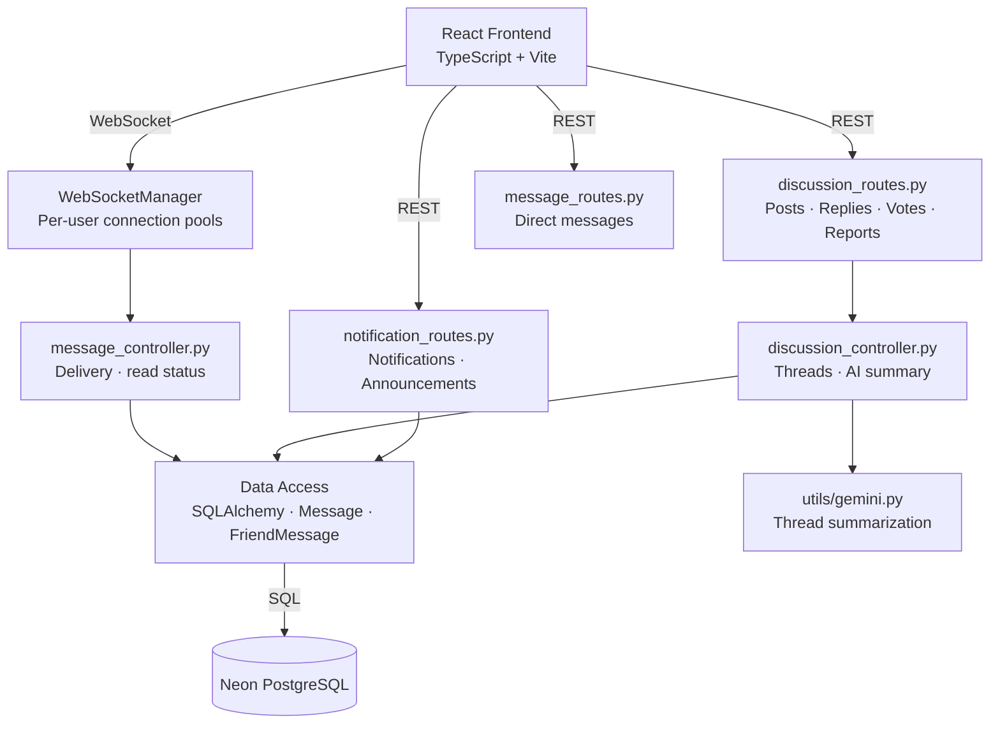
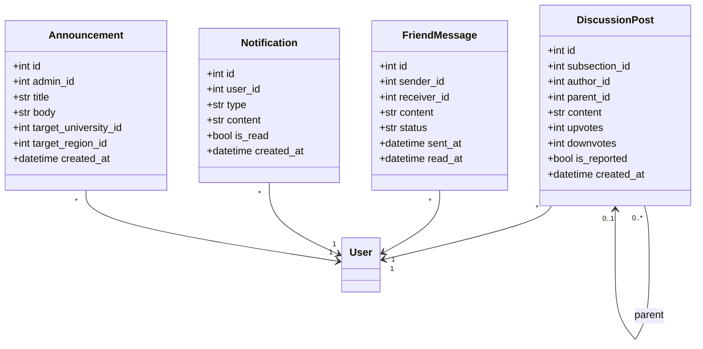
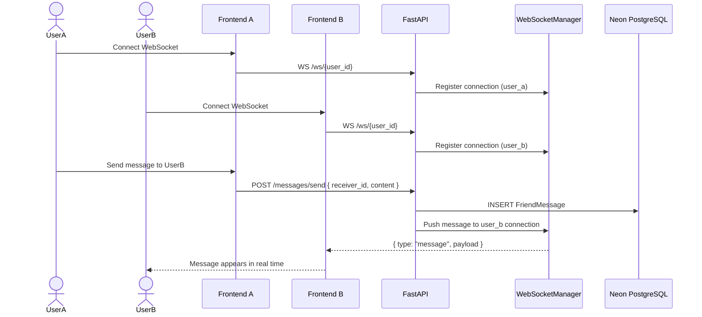
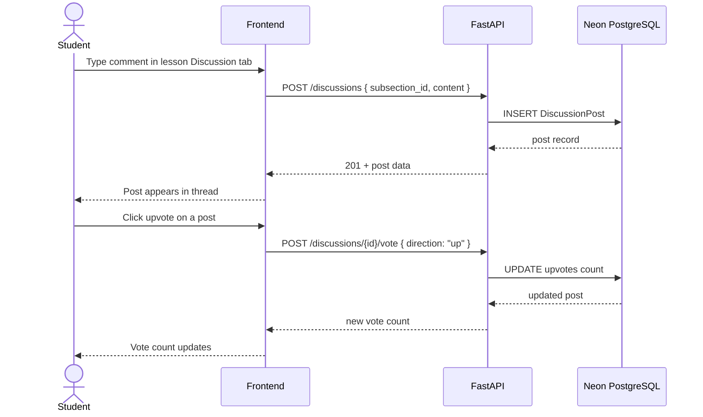

# Sprint 5 — Communication & Community
**Weeks 9–10 | Story Points: 40**

## Introduction

Sprint 5 builds the real-time communication and community layers of the platform. Students and professors can exchange direct messages over WebSockets, participate in per-lesson discussion threads, vote on posts, report content, and receive live notifications. Admins can broadcast announcements to specific universities or regions.

## Sprint Goal

> Enable real-time communication between users through WebSocket-powered direct messaging, per-lesson discussion threads, and a notification system that keeps everyone informed of relevant activity.

---

## User Stories

### Direct Messaging

| ID | Priority | User Story | Subtasks |
|---|---|---|---|
| US-38 | High | As a user, I can send and receive direct messages with friends in real time | T-5.1: WebSocket connection per user · T-5.2: WebSocketManager pool · T-5.3: POST /messages/send · T-5.4: Message UI |
| US-39 | High | As a user, I can view my full conversation history with a contact | T-5.5: GET /messages/{friend_id} · T-5.6: Chat history UI · T-5.7: Scroll to latest |
| US-40 | Medium | As a user, I can see when a message has been delivered or read | T-5.8: Message status field · T-5.9: Mark read on open · T-5.10: Read indicator UI |

### Discussions

| ID | Priority | User Story | Subtasks |
|---|---|---|---|
| US-41 | High | As a student, I can post a question or comment in the discussion section of any lesson | T-5.11: DiscussionSection component · T-5.12: POST /discussions · T-5.13: Thread display |
| US-42 | High | As a student, I can reply to existing discussion posts | T-5.14: Reply UI · T-5.15: POST /discussions/{id}/reply · T-5.16: Nested reply display |
| US-43 | Medium | As a student, I can upvote or downvote discussion posts | T-5.17: Vote buttons · T-5.18: POST /discussions/{id}/vote · T-5.19: Vote count display |
| US-44 | Medium | As a student, I can report inappropriate discussion content | T-5.20: Report button · T-5.21: POST /discussions/{id}/report · T-5.22: Admin review flag |
| US-45 | Medium | As a student, I can view an AI-generated summary of a long discussion thread | T-5.23: Summarize button · T-5.24: POST /ai/summarize · T-5.25: Summary card display |

### Notifications & Announcements

| ID | Priority | User Story | Subtasks |
|---|---|---|---|
| US-46 | High | As a user, I receive real-time notifications for replies, messages, and achievements | T-5.26: Notification model · T-5.27: WebSocket push on event · T-5.28: Notification bell UI |
| US-47 | Medium | As a user, I can mark notifications as read | T-5.29: PATCH /notifications/{id}/read · T-5.30: Unread badge count |
| US-48 | Medium | As an admin, I can create announcements targeted to a university or region | T-5.31: Announcement form · T-5.32: POST /announcements · T-5.33: Scoped delivery logic |
| US-49 | Low | As a student, I can view announcements relevant to my university on my dashboard | T-5.34: Announcements page · T-5.35: GET /announcements/me |

---

## Related Diagrams

### C4 Component View — Communication Domain

### Class Diagram — Communication Models

### Sequence Diagram — WebSocket Direct Message

### Sequence Diagram — Discussion Post and Vote

---

## Conclusion

Sprint 5 completed the communication layer of Hub4Learners. The WebSocket-based messaging system provides a low-latency direct messaging experience, while the per-lesson discussion module fosters collaborative learning within course content. The notification system ensures users stay aware of relevant activity without needing to poll, and the announcement feature gives admins a targeted broadcast channel for institutional communication.
