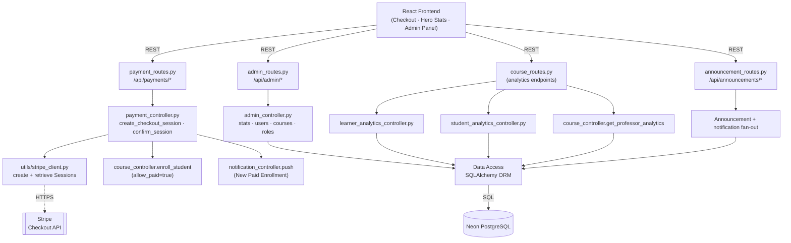
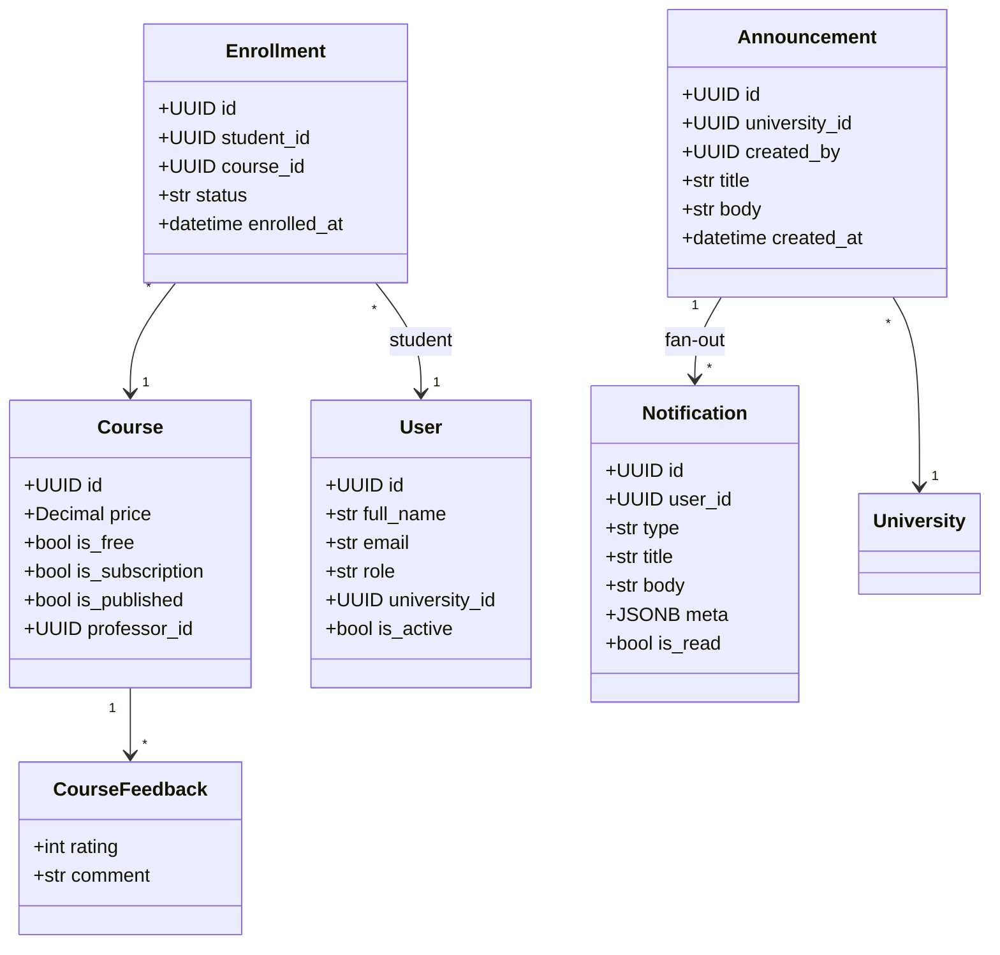
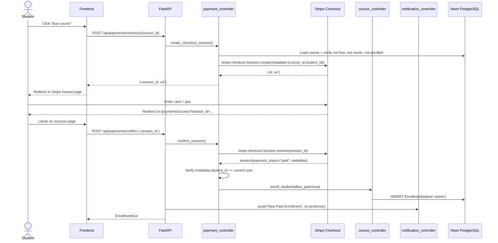
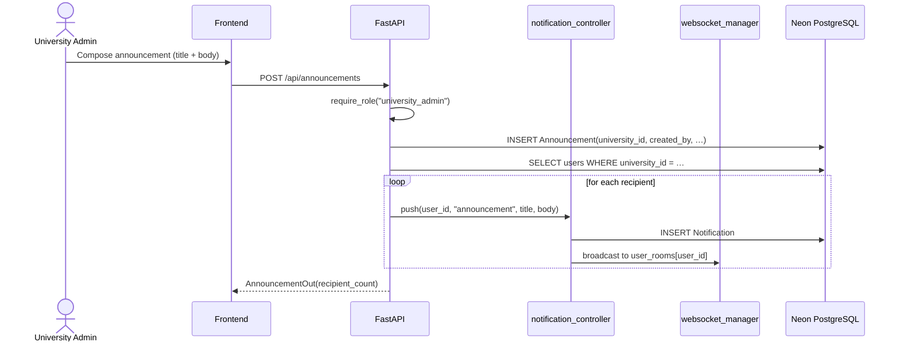
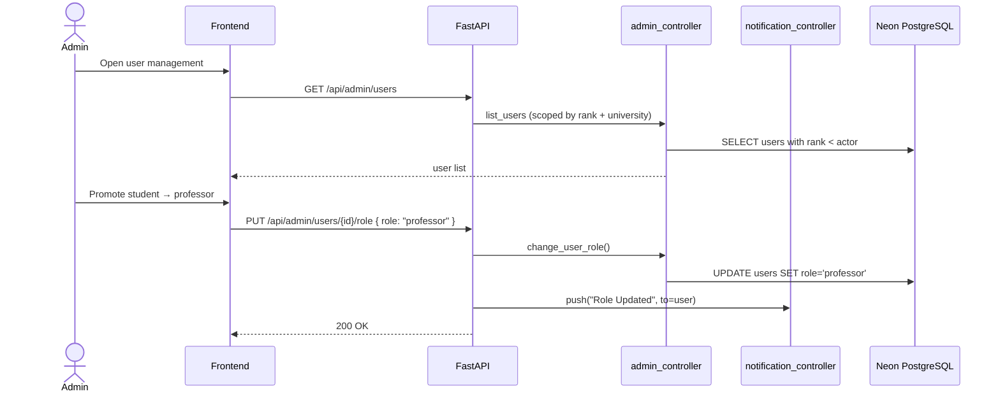

# Sprint 6 — Payments, Analytics & Administration

**Weeks 11–12**

## Introduction

Sprint 6 closes the platform with monetisation, observability, and governance. Professors can sell paid courses through Stripe Checkout, students pay on the hosted Stripe page and are auto-enrolled when the frontend confirms the session. Professors get learner analytics dashboards and an aggregate analytics view of their courses. University admins manage their professors, run announcements, and review their scope. Super admins get platform-wide statistics, full user management, and the ability to delete courses across the platform.

## Sprint Goal

> Monetise paid courses through Stripe Checkout, give professors and learners actionable analytics, and equip university and super admins with the tools they need to manage the platform at scale.

---

## User Stories

### Payments (Stripe Checkout)

| ID | Priority | User Story | Subtasks |
|---|---|---|---|
| US-6.1 | High | As a student, I can pay for a paid course through a hosted Stripe Checkout session | T-6.1.1: `POST /api/payments/checkout/{course_id}` · T-6.1.2: `stripe_client.create_checkout_session()` · T-6.1.3: Redirect to `session.url` |
| US-6.2 | High | After payment, my frontend success page confirms the session and the backend enrolls me | T-6.2.1: `POST /api/payments/confirm` with `session_id` · T-6.2.2: `stripe.checkout.Session.retrieve()` + `payment_status == "paid"` check · T-6.2.3: `course_controller.enroll_student(allow_paid=true)` |
| US-6.3 | High | As the system, I refuse to create a checkout for a free course, an already-enrolled student, or the professor's own course | T-6.3.1: `is_free` guard · T-6.3.2: Duplicate-enrollment 409 · T-6.3.3: Self-enroll 400 |
| US-6.4 | Medium | As the frontend, I can read the Stripe publishable key from `/api/payments/config` | T-6.4.1: `GET /api/payments/config` · T-6.4.2: Env-driven `Stripe_publishable_key` |
| US-6.5 | Medium | As a professor, I am notified when a student purchases my course | T-6.5.1: `notification_controller.push("New Paid Enrollment")` after `confirm` |

### Analytics

| ID | Priority | User Story | Subtasks |
|---|---|---|---|
| US-6.6 | High | As a professor, I can view aggregate analytics for all my courses (enrollments, completions, ratings, top courses) | T-6.6.1: `GET /api/courses/my/analytics` · T-6.6.2: `course_controller.get_professor_analytics()` · T-6.6.3: KPI cards + bar charts |
| US-6.7 | High | As a professor, I can see per-learner analytics for my courses (who is on track, who is stuck) | T-6.7.1: `GET /api/courses/professor/learners/analytics` · T-6.7.2: `learner_analytics_controller.get_learner_analytics()` · T-6.7.3: Per-learner progress + last-active table |
| US-6.8 | High | As a student, I can see my personal learning analytics — XP timeline, courses completed, time-on-platform proxies | T-6.8.1: `GET /api/courses/student/analytics` · T-6.8.2: `student_analytics_controller.get_student_analytics()` · T-6.8.3: Charts on Hero Stats page |
| US-6.9 | Medium | As a professor, I can see the list of students enrolled in each of my courses | T-6.9.1: `GET /api/courses/my/students` · T-6.9.2: Group by course |
| US-6.10 | Medium | As anyone, I can read public homepage stats (students count, published courses, subjects, average rating) | T-6.10.1: `GET /api/public/stats` (or equivalent) · T-6.10.2: `admin_controller.get_public_stats()` |

### Administration (Roles & Tools)

| ID | Priority | User Story | Subtasks |
|---|---|---|---|
| US-6.11 | High | As a super_admin, I can view platform-wide stats (users by role, courses, published, enrollments) | T-6.11.1: `GET /api/admin/stats` · T-6.11.2: `get_platform_stats()` · T-6.11.3: Admin dashboard KPI cards |
| US-6.12 | High | As an admin, I can list users I have authority over, filter by role, and search by name/email | T-6.12.1: `GET /api/admin/users?role=&search=` · T-6.12.2: `university_admin` scoped to their university · T-6.12.3: Only show users with lower role rank |
| US-6.13 | High | As an admin, I can change a user's role within my authority and the user gets a real-time notification | T-6.13.1: `PUT /api/admin/users/{id}/role` · T-6.13.2: `change_user_role()` · T-6.13.3: `notification_controller.push("Role Updated")` |
| US-6.14 | Medium | As an admin, I can delete users below my rank | T-6.14.1: `DELETE /api/admin/users/{id}` · T-6.14.2: Cascading FK cleanups |
| US-6.15 | Medium | As an admin, I can list every course on the platform (university-scoped for `university_admin`) | T-6.15.1: `GET /api/admin/courses` · T-6.15.2: `require_min_rank("university_admin")` |
| US-6.16 | Medium | As an admin, I can toggle a course's publish state; super_admin can also delete a course | T-6.16.1: `PATCH /api/admin/courses/{id}/publish` · T-6.16.2: `DELETE /api/admin/courses/{id}` (super_admin) |
| US-6.17 | Medium | As a university_admin, I can post an announcement that is broadcast to every user in my university | T-6.17.1: `POST /api/announcements` · T-6.17.2: Insert `Announcement(university_id, …)` · T-6.17.3: Fan out notifications to every user with that `university_id` |
| US-6.18 | Medium | As a user, I can list announcements for my university on my dashboard | T-6.18.1: `GET /api/announcements/my` filtered by `User.university_id` |

---

## Related Diagrams

### C4 Component View — Payments, Analytics & Admin Domain

### Class Diagram — Payment & Admin Surfaces

### Sequence Diagram — Stripe Checkout → Enrollment

### Sequence Diagram — University Announcement Fan-Out

### Sequence Diagram — Admin Role Change

---

## Conclusion

Sprint 6 turns Hub4Learners into a fully operable product. Stripe Checkout is wired through the same `enroll_student` path as the free flow (just with a paid flag), so a single course lifecycle handles both monetisation strategies. The three analytics surfaces — professor aggregate, professor per-learner, and student personal — give every persona feedback on the platform's value. The role-aware admin tools and university-scoped announcements complete the governance story: super admins steer the platform, university admins run their campus, and learners and professors get the visibility they need without ever leaving the product.
