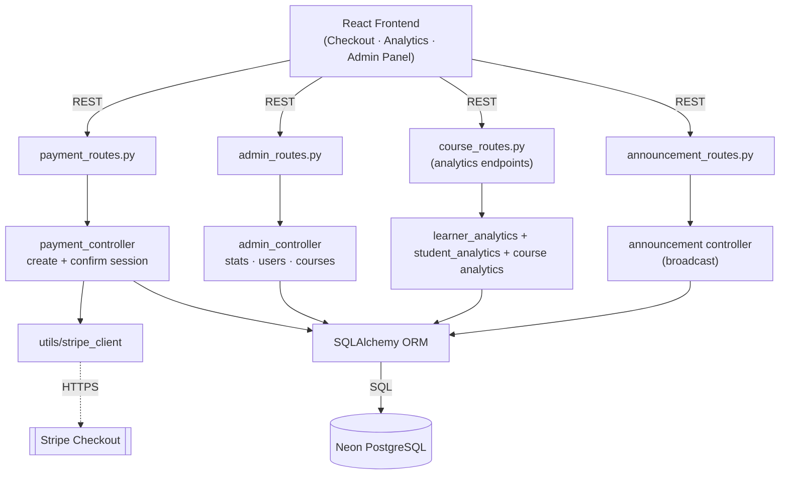
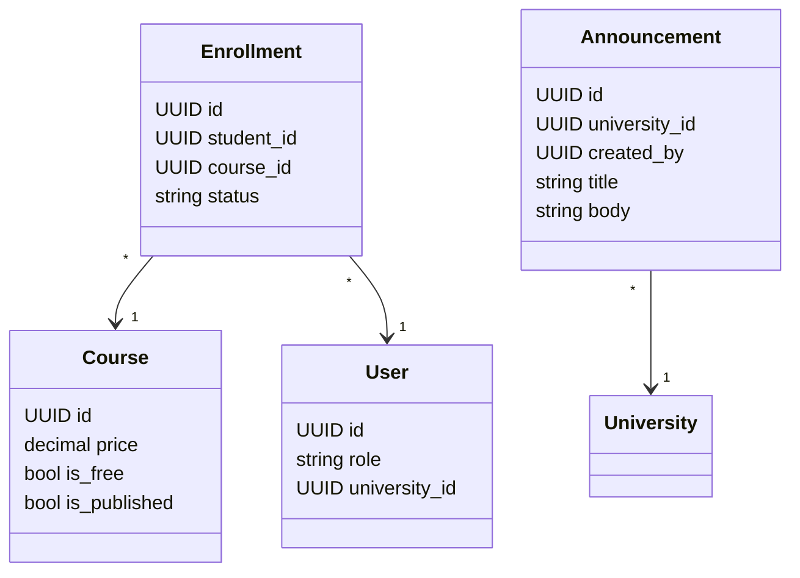
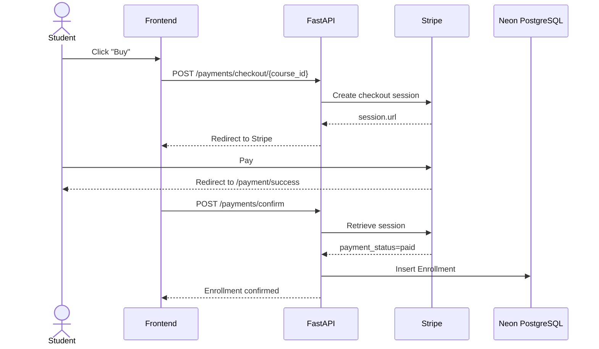
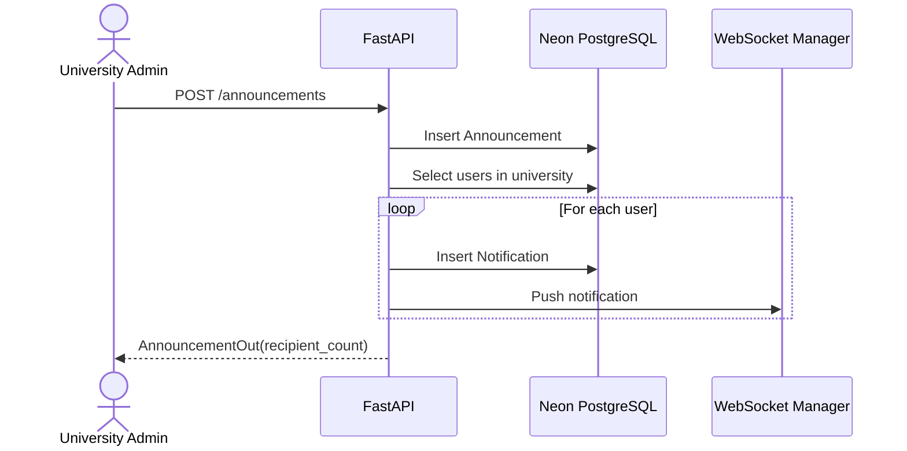

# Sprint 6 — Payments, Analytics & Admin

**Weeks 11–12**

## Introduction

The final sprint completes Hub4Learners with monetisation, insight, and governance. Stripe Checkout lets professors sell paid courses, while analytics dashboards give learners and professors a clear view of their progress and impact. The administration layer gives university and super admins the tools they need to run the platform — users, courses, announcements, and platform-wide statistics.

## Sprint Goal

> Enable paid course sales through Stripe, deliver actionable analytics for learners and professors, and equip admins with full management tools.

---

## User Stories

### Payments

| ID | Priority | Story | Subtasks |
|---|---|---|---|
| US-6.1 | High | As a student, I can pay for a paid course via Stripe Checkout | T-6.1.1: Checkout endpoint · T-6.1.2: Redirect to Stripe |
| US-6.2 | High | After successful payment, I am automatically enrolled in the course | T-6.2.1: Confirm endpoint · T-6.2.2: Verify session paid |
| US-6.3 | Medium | As a professor, I am notified when a student purchases my course | T-6.3.1: Payment notification |
| US-6.4 | Medium | As the system, I prevent paid checkout for free courses, owners, or already-enrolled students | T-6.4.1: Guard checks |

### Analytics

| ID | Priority | Story | Subtasks |
|---|---|---|---|
| US-6.5 | High | As a professor, I can view analytics for all my courses (enrollments, completions, ratings, trends) | T-6.5.1: Course analytics endpoint · T-6.5.2: Charts UI |
| US-6.6 | High | As a professor, I can see per-learner stats to identify at-risk students | T-6.6.1: Learner analytics endpoint · T-6.6.2: Risk levels |
| US-6.7 | High | As a student, I can view my personal learning analytics (progress, quiz performance, streaks) | T-6.7.1: Student analytics endpoint · T-6.7.2: Hero Stats page |
| US-6.8 | Medium | As anyone, I can see public homepage stats (students, courses, average rating) | T-6.8.1: Public stats endpoint |

### Administration

| ID | Priority | Story | Subtasks |
|---|---|---|---|
| US-6.9 | High | As a super admin, I can view platform-wide stats (users by role, courses, enrollments) | T-6.9.1: Stats endpoint · T-6.9.2: Admin dashboard |
| US-6.10 | High | As an admin, I can list and manage users I have authority over (within my rank and university) | T-6.10.1: User list · T-6.10.2: Scoped queries |
| US-6.11 | High | As an admin, I can change a user's role and the user is notified | T-6.11.1: Role change endpoint · T-6.11.2: Notification push |
| US-6.12 | Medium | As an admin, I can list every course, toggle publish state, and (super admin) delete courses | T-6.12.1: Admin course endpoints |
| US-6.13 | Medium | As a university admin, I can broadcast an announcement to my university | T-6.13.1: Announcement endpoint · T-6.13.2: Fan-out notifications |

---

## Related Diagrams

### C4 Component View — Payments, Analytics & Admin

### Class Diagram — Payments, Analytics & Admin

### Sequence Diagram — Stripe Checkout & Enrollment

### Sequence Diagram — University Announcement Broadcast

---

## Conclusion

Sprint 6 closes the project. Stripe brings monetisation, the three analytics surfaces give every persona meaningful feedback on the platform's value, and the admin layer ensures Hub4Learners can be operated at scale. With this sprint complete, the platform delivers the full vision laid out in the initial planning phase.
