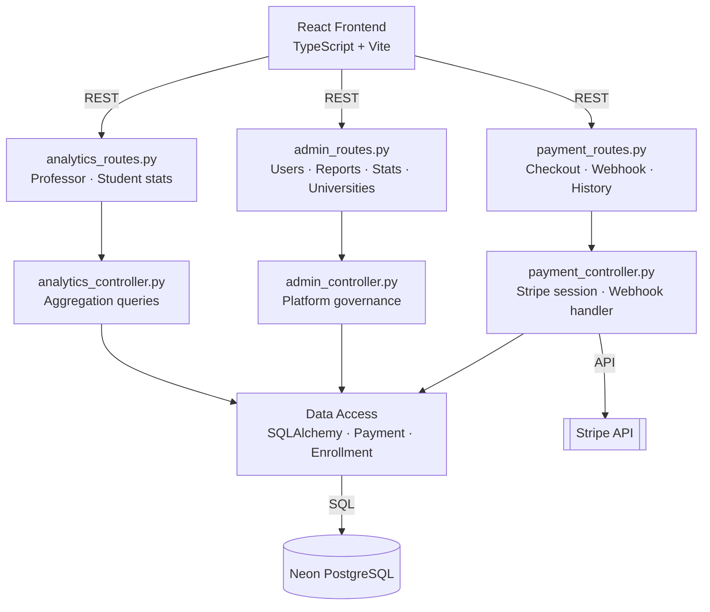
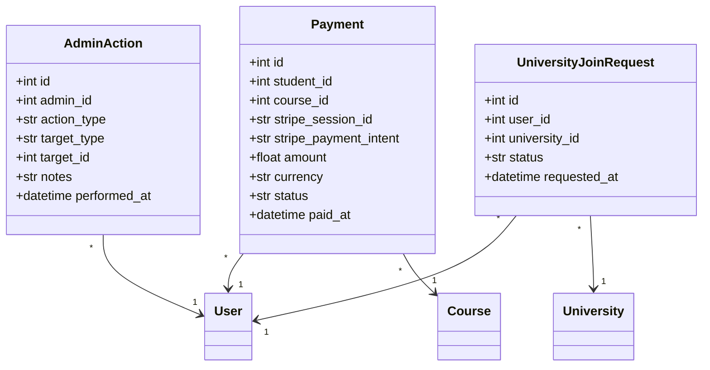
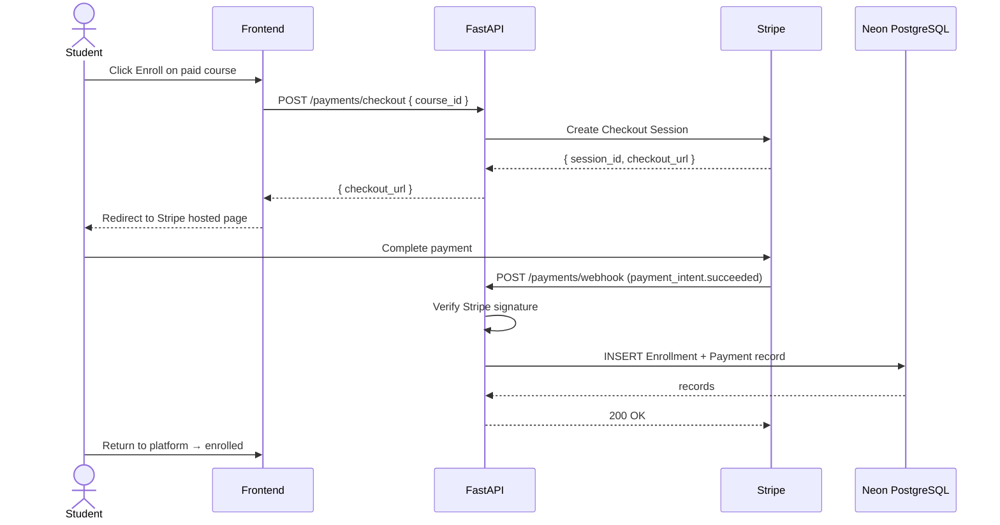
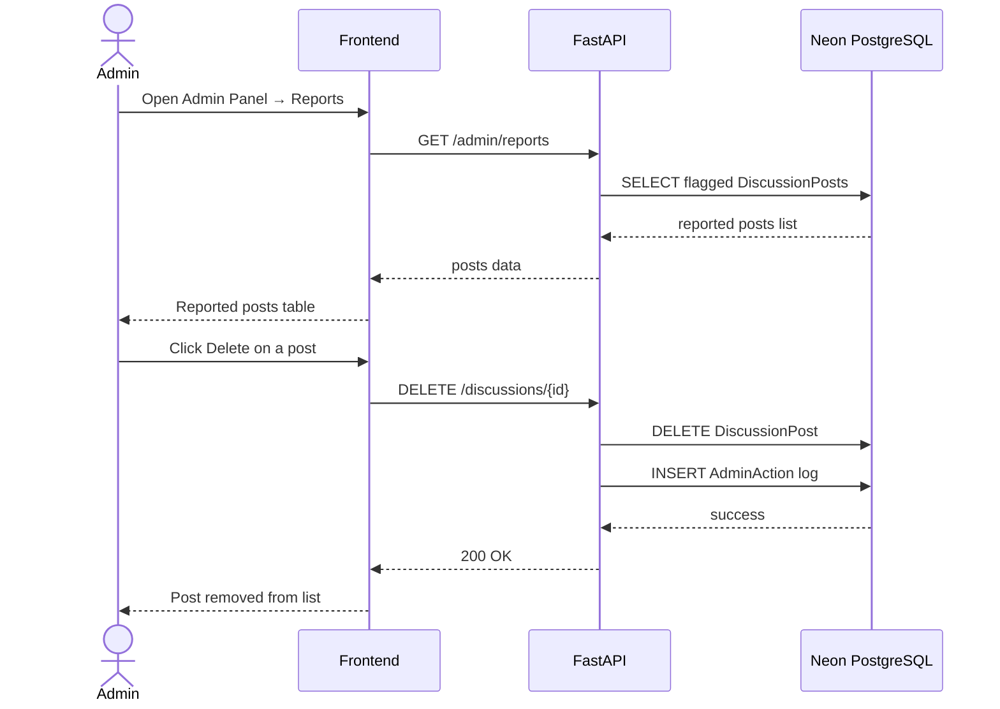

# Sprint 6 — Payments, Analytics & Administration
**Weeks 11–12 | Story Points: 42**

## Introduction

Sprint 6 completes the platform by introducing paid course monetisation via Stripe Checkout, professor and student analytics dashboards, and a comprehensive admin panel for platform governance. This sprint ties together all previous features under a unified management and reporting layer, making Hub4Learners production-ready.

## Sprint Goal

> Monetise the platform with Stripe-powered paid course enrollment, equip professors and students with actionable analytics, and give administrators full visibility and control over platform activity.

---

## User Stories

### Payments

| ID | Priority | User Story | Subtasks |
|---|---|---|---|
| US-50 | High | As a student, I can enroll in a paid course by completing a Stripe Checkout session | T-6.1: Stripe Checkout session creation · T-6.2: POST /payments/checkout · T-6.3: Redirect to Stripe hosted page |
| US-51 | High | As the system, I handle Stripe webhook events to confirm enrollment after successful payment | T-6.4: POST /payments/webhook endpoint · T-6.5: Verify Stripe signature · T-6.6: INSERT Enrollment on payment_intent.succeeded |
| US-52 | Medium | As a student, I can view my payment history and receipts | T-6.7: GET /payments/history · T-6.8: Payment history UI |
| US-53 | Medium | As a professor, I can see total revenue generated by each of my paid courses | T-6.9: GET /analytics/professor/revenue · T-6.10: Revenue chart by course |

### Analytics

| ID | Priority | User Story | Subtasks |
|---|---|---|---|
| US-54 | High | As a professor, I can view enrollment trends, completion rates, and average ratings for my courses | T-6.11: GET /analytics/professor · T-6.12: Enrollment over time chart · T-6.13: Completion rate per course |
| US-55 | High | As a student, I can view my personal learning analytics (XP history, time spent, courses completed) | T-6.14: GET /analytics/student · T-6.15: Progress charts · T-6.16: Weekly activity heatmap |
| US-56 | Medium | As a professor, I can see which lessons have the lowest completion rates to improve content | T-6.17: Per-subsection drop-off stats · T-6.18: Low-completion alert highlight |

### Administration

| ID | Priority | User Story | Subtasks |
|---|---|---|---|
| US-57 | High | As an admin, I can view a platform overview dashboard (users, courses, enrollments, revenue) | T-6.19: Admin dashboard page · T-6.20: GET /admin/stats · T-6.21: KPI cards UI |
| US-58 | High | As an admin, I can manage users (view, ban, change role) | T-6.22: User management table · T-6.23: PATCH /admin/users/{id} · T-6.24: Role and status update |
| US-59 | High | As an admin, I can review and moderate reported discussion posts | T-6.25: Reported posts list · T-6.26: GET /admin/reports · T-6.27: Delete or dismiss action |
| US-60 | Medium | As an admin, I can manage universities and regions | T-6.28: University CRUD · T-6.29: POST/PUT/DELETE /admin/universities · T-6.30: Region management |
| US-61 | Medium | As an admin, I can view platform-wide analytics and generate reports | T-6.31: GET /admin/analytics · T-6.32: Export data as CSV |

---

## Related Diagrams

### C4 Component View — Payments & Admin Domain

### Class Diagram — Payments & Admin Models

### Sequence Diagram — Stripe Payment & Enrollment

### Sequence Diagram — Admin Moderation Flow

---

## Conclusion

Sprint 6 brought Hub4Learners to production readiness. Stripe integration enables a sustainable monetisation model for premium courses, while the analytics dashboards give professors data-driven insights to improve their content and students a clear view of their learning journey. The admin panel consolidates platform governance — from user management to content moderation — into a single interface, completing the full feature set envisioned for the platform at the start of the project.
