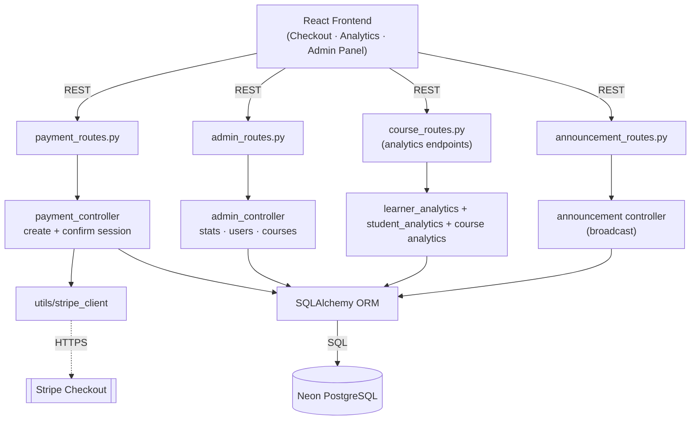
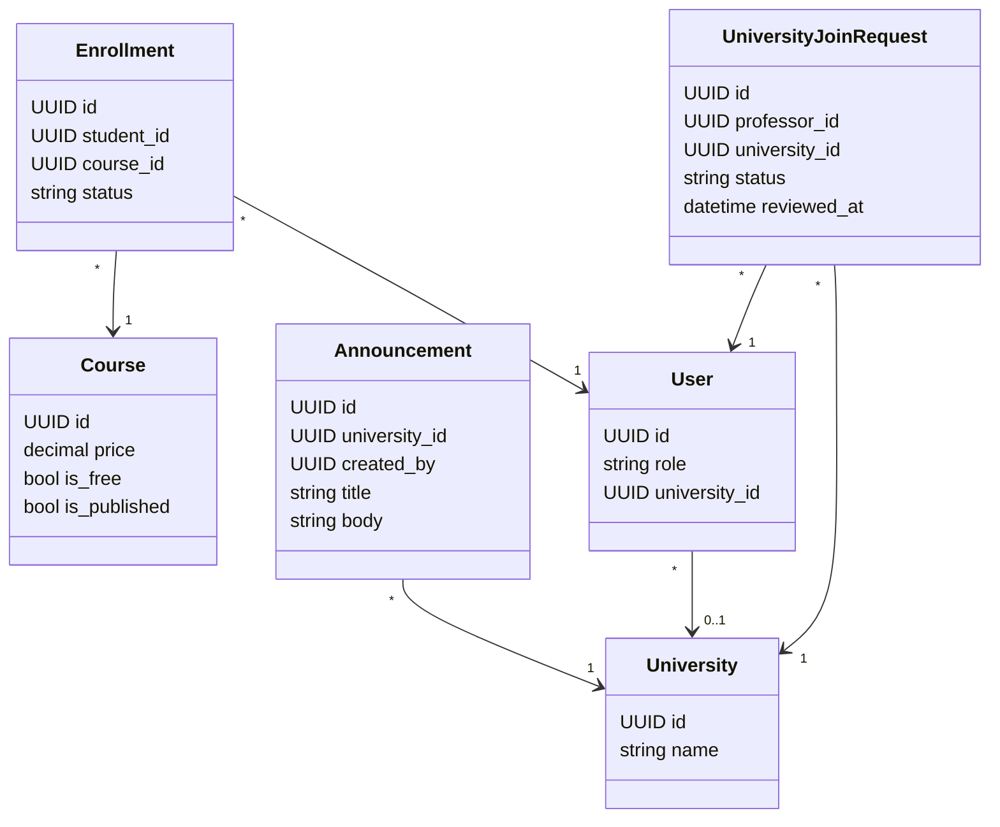
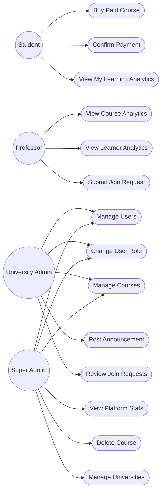
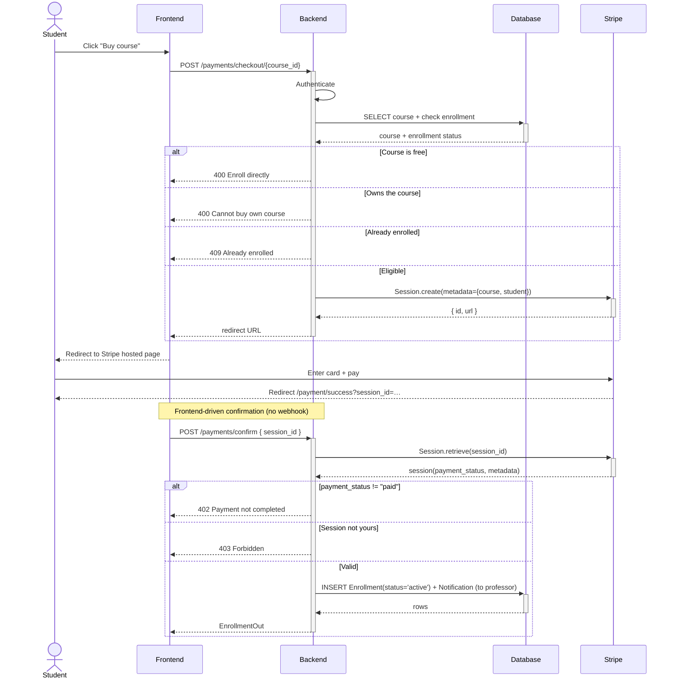
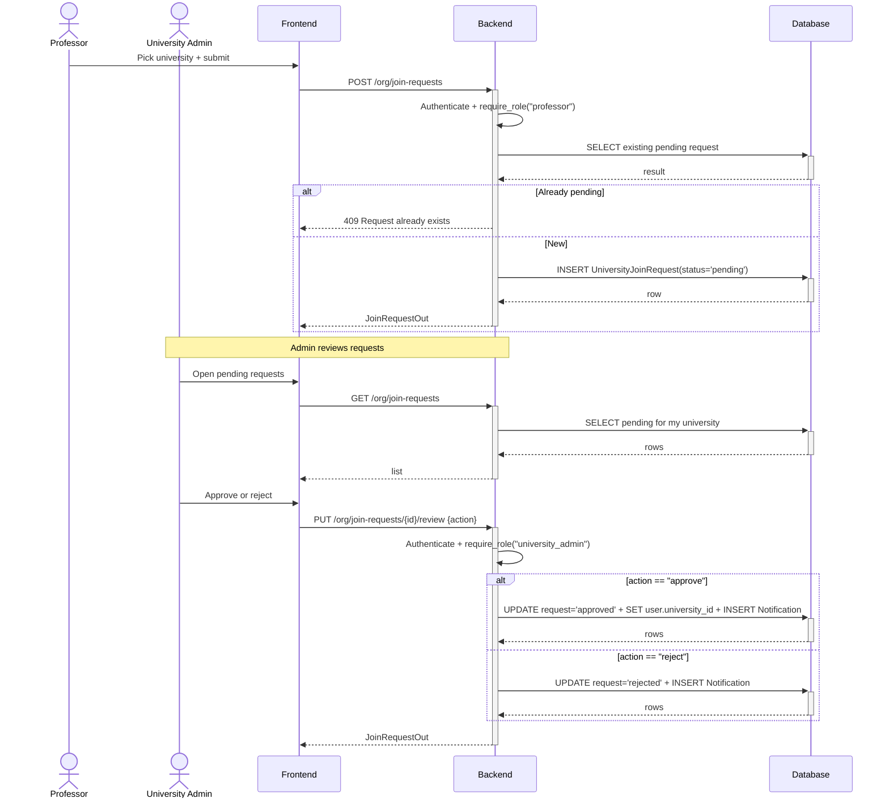
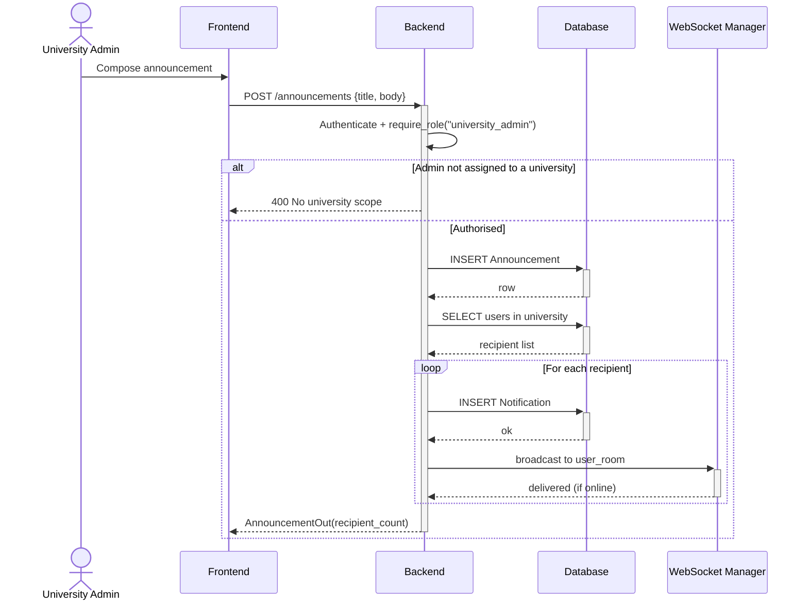

# Sprint 6 — Payments, Analytics & Admin

**Weeks 11–12**

## Introduction

The final sprint completes Hub4Learners with monetisation, insight, and governance. Stripe Checkout lets professors sell paid courses, while analytics dashboards give learners and professors a clear view of their progress and impact. The administration layer gives university and super admins the tools they need to run the platform — users, courses, announcements, and platform-wide statistics.

## Sprint Goal

> Enable paid course sales through Stripe, deliver actionable analytics for learners and professors, and equip admins with full management tools.

---

## User Stories

### Payments

| ID | Priority | Story | Subtasks |
|---|---|---|---|
| US-6.1 | High | As a student, I can pay for a paid course via Stripe Checkout | T-6.1.1: Checkout endpoint · T-6.1.2: Redirect to Stripe |
| US-6.2 | High | After successful payment, I am automatically enrolled in the course | T-6.2.1: Confirm endpoint · T-6.2.2: Verify session paid |
| US-6.3 | Medium | As a professor, I am notified when a student purchases my course | T-6.3.1: Payment notification |
| US-6.4 | Medium | As the system, I prevent paid checkout for free courses, owners, or already-enrolled students | T-6.4.1: Guard checks |

### Analytics

| ID | Priority | Story | Subtasks |
|---|---|---|---|
| US-6.5 | High | As a professor, I can view analytics for all my courses (enrollments, completions, ratings, trends) | T-6.5.1: Course analytics endpoint · T-6.5.2: Charts UI |
| US-6.6 | High | As a professor, I can see per-learner stats to identify at-risk students | T-6.6.1: Learner analytics endpoint · T-6.6.2: Risk levels |
| US-6.7 | High | As a student, I can view my personal learning analytics (progress, quiz performance, streaks) | T-6.7.1: Student analytics endpoint · T-6.7.2: Hero Stats page |
| US-6.8 | Medium | As anyone, I can see public homepage stats (students, courses, average rating) | T-6.8.1: Public stats endpoint |

### Administration

| ID | Priority | Story | Subtasks |
|---|---|---|---|
| US-6.9 | High | As a super admin, I can view platform-wide stats (users by role, courses, enrollments) | T-6.9.1: Stats endpoint · T-6.9.2: Admin dashboard |
| US-6.10 | High | As an admin, I can list and manage users I have authority over (within my rank and university) | T-6.10.1: User list · T-6.10.2: Scoped queries |
| US-6.11 | High | As an admin, I can change a user's role and the user is notified | T-6.11.1: Role change endpoint · T-6.11.2: Notification push |
| US-6.12 | Medium | As an admin, I can list every course, toggle publish state, and (super admin) delete courses | T-6.12.1: Admin course endpoints |
| US-6.13 | Medium | As a university admin, I can broadcast an announcement to my university | T-6.13.1: Announcement endpoint · T-6.13.2: Fan-out notifications |
| US-6.14 | High | As a super admin, I can manage Universities | T-6.14.1: University CRUD · T-6.14.2: Admin panel UI |
| US-6.15 | High | As a professor, I can submit a request to join a university | T-6.15.1: Join request form · T-6.15.2: Persist request |
| US-6.16 | High | As a university admin, I can review (approve or reject) professor join requests for my university | T-6.16.1: Review endpoint · T-6.16.2: Pending requests UI · T-6.16.3: Notify professor |

---

## Related Diagrams

### C4 Component View — Payments, Analytics & Admin

This diagram brings together the three closing subsystems of the project: Stripe-backed payments, the three analytics surfaces (course, learner, student), and the administration controllers used by university and super admins to govern the platform.

### Class Diagram — Payments, Analytics & Admin

The class diagram revisits the entities touched by this sprint — Course and Enrollment on the payments side, User and Announcement on the admin side — plus the organisation models (University, UniversityJoinRequest) carried into this sprint from earlier scope discussions.

### Use Case Diagram — Payments, Analytics & Admin

The use case diagram spans the four roles of the platform: students buy and confirm payment, professors and learners read their analytics, and the two admin tiers manage users, courses, universities, announcements, and join requests at the appropriate scope.

### Sequence Diagram — Stripe Checkout & Enrollment

This sequence traces the full purchase flow: validation guards before opening a Stripe Checkout session, the redirect-and-pay step on Stripe's hosted page, and the frontend-driven confirmation call that retrieves the session, verifies it was paid, and creates the enrollment.

### Sequence Diagram — Professor Join Request Flow

This diagram models both sides of the institutional attachment workflow: a professor submits a request guarded against duplicates, then a university admin reviews it — approving updates the user's `university_id` directly, while rejecting just closes the request, with a notification sent either way.

### Sequence Diagram — University Announcement Broadcast

This sequence shows the fan-out pattern used by university announcements: one POST creates a single `Announcement` row but loops over every user in the university to insert per-user `Notification` rows and push them live through the WebSocket manager.

---

## Sprint Review

| Topic | Outcome |
|---|---|
| Review | Demonstrated Stripe-driven paid enrollment, the three analytics surfaces (course, learner, student), the admin panel (users, courses, role changes), the professor-to-university join request flow, and university-scoped announcements. All user stories met their Definition of Done. |
| Went well | Confirming Stripe sessions from the frontend on return (rather than via a webhook) simplified the deployment setup and removed the need for a public webhook endpoint while still verifying `payment_status == "paid"` against Stripe directly. |
| To improve | Refunds and disputes are not yet handled. A Stripe webhook listener should still be added later for asynchronous events (refunds, chargebacks, payment failures after redirect), even if it's not on the happy-path checkout flow. |

---

## Conclusion

Sprint 6 closes the project. Stripe brings monetisation, the three analytics surfaces give every persona meaningful feedback on the platform's value, and the admin layer ensures Hub4Learners can be operated at scale. With this sprint complete, the platform delivers the full vision laid out in the initial planning phase.
